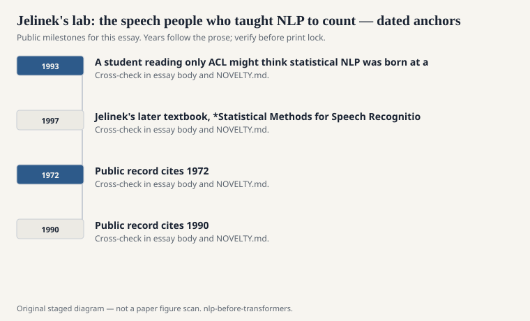
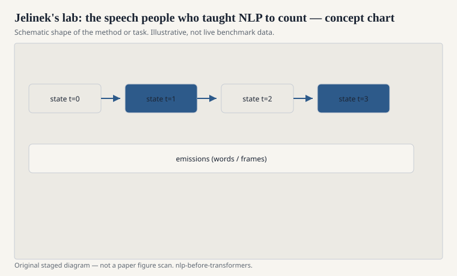

# Jelinek's lab: the speech people who taught NLP to count

Frederick Jelinek's group at IBM is one of the
reasons NLP became an empirical engineering
field instead of remaining a branch of
computational philosophy. Automatic speech
recognition is unforgiving. The audio does
not care about your competence grammar. Word
error rate is public. You either decode the
utterance or you do not.

<!-- graphics-pack:nlp-bt-v1 -->

<figure class="nlp-bt-figure">

<figcaption>Figure 1. Dated public anchors for this piece. Years follow the essay; verify against the prose before print.</figcaption>
</figure>

<!-- graphics-pack:nlp-bt-v1 -->

<figure class="nlp-bt-figure">

<figcaption>Figure 2. Schematic of the method or task — editorial diagram, not live scores.</figcaption>
</figure>

<!-- graphics-pack:nlp-bt-v1 -->

<figure class="nlp-bt-figure nlp-bt-figure--archival">

<figcaption>Figure 3. Speech spectrogram — acoustic evidence channel for HMM speech work. License: CC BY-SA (verify on Commons)</figcaption>
</figure>

The noisy-channel recipe they used — acoustic
model times language model, pick the word
string that makes the observation likely —
migrated into tagging, translation, and
optical character recognition. It is the same
recipe. Change the emission. Keep the prior.

Jelinek's reputation in linguistic circles is
the fired-linguist joke. I will not polish it
into something kinder than it was. It named a
real tension. Feature intuitions from
syntax did not always move WER. Counts from
more audio and a better n-gram often did.
A lab that lives on WER will follow WER. That
can look like contempt. It can also look like
an obligation to the user who is dictating a
letter.

The technical objects that left the lab are
ordinary now. N-gram language models with
serious smoothing. HMMs for acoustics.
Discriminative training later on. A culture
of held-out sets. None of that was ordinary
when they started in the 1970s.

I also want the other IBM in the picture: the
MT people in the same corporate weather. They
shared the channel metaphor and the comfort
with EM. A student reading only ACL might
think statistical NLP was born at a
university in 1993. A lot of it was born
where there were reels of speech and a
mandate to productize.

When you see a 1990s ACL paper that writes
P(tags) P(words|tags) and shrugs at deep
structure, you are seeing Jelinek's weather
system. The shrug is the point. Deep
structure can wait if the error rate is
moving.

This is not an argument against linguistics.
It is an argument about loss functions. Speech
gave NLP a loss function that a sponsor could
understand. The rest of the field borrowed it,
sometimes too eagerly, sometimes just in time.

Jelinek's later textbook, *Statistical Methods
for Speech Recognition* (1997), is the
document I would put in a care package next
to Manning and Schütze. It is not gentle. It
is clear about channel models, about
perplexity, about the fact that a language
model is a component with an interface. NLP
students who only read ACL can miss that
interface. Speech students who only read
WER can miss that language is more than a
prior. The 1970s lab sat in the middle on
purpose.
