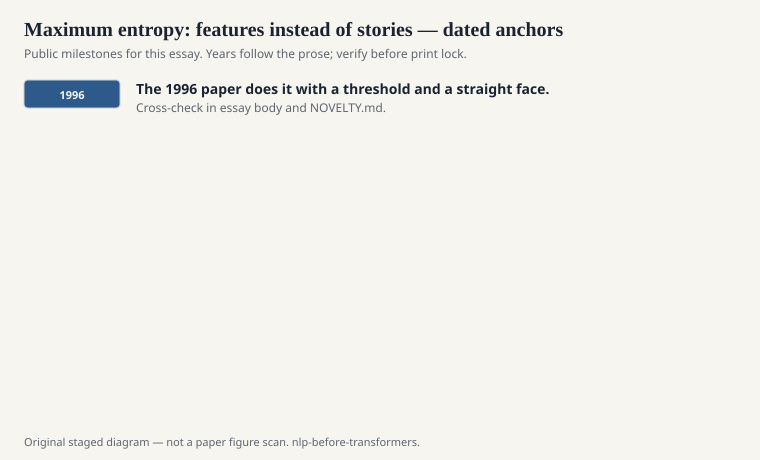
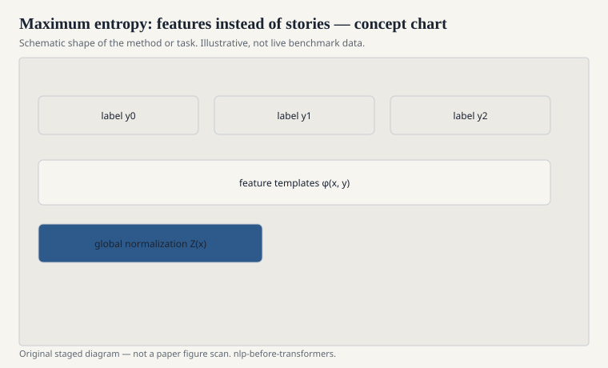

# Maximum entropy: features instead of stories

Adam Berger, Stephen Della Pietra, and Vincent
Della Pietra's 1996 paper on maximum entropy
models for natural language gave a lot of
people permission to stop pretending they had
a generative story for every correlation.
You write features. You ask for the
distribution that matches the expected
feature values and is otherwise as uniform
as possible. The math has a name. The
practice is logistic regression with a
linguistic feature dump.

<!-- graphics-pack:nlp-bt-v1 -->

<figure class="nlp-bt-figure">

<figcaption>Figure 1. Dated public anchors for this piece. Years follow the essay; verify against the prose before print.</figcaption>
</figure>

<!-- graphics-pack:nlp-bt-v1 -->

<figure class="nlp-bt-figure">

<figcaption>Figure 2. Schematic of the method or task — editorial diagram, not live scores.</figcaption>
</figure>

<!-- graphics-pack:nlp-bt-v1 -->

<figure class="nlp-bt-figure nlp-bt-figure--archival">

<figcaption>Figure 3. Alignment grid reused as feature-interaction sketch for structured prediction. License: See Commons</figcaption>
</figure>

That dump was the craft. Prefixes, suffixes,
word shape, "is the previous tag DT,"
gazetteer hits, a flag for all caps. A good
maxent tagger or a good maxent translation
distortion model was a person who knew which
flags moved the number. The model did not
invent the flags.

I like maxent because it made disagreement
empirical. Two linguists could argue about
whether a feature was "real." You added it,
you regularized, you looked at a held-out
likelihood or an F1. The argument had a
place to sit. HMMs made you smuggle the
same information into emissions and hope.

Training was the tax. Generalized iterative
scaling, improved iterative scaling, later
L-BFGS and gradient methods — the field
spent a lot of years on the optimizer
because the feature space was wide and
sparse. Overfitting was not theoretical.
A feature that fired once could become a
superstition.

The IBM lineage is visible again. Della
Pietra and Della Pietra sit on both the
Candide papers and this one. Statistical
MT and statistical classification were not
separate religions. They were the same
lab learning to put more of the world into
an exponential family.

If you only know neural nets, a maxent
model looks like a linear last layer with
homework in front. That is fair. It is
also the homework that taught the field
how to think about overlapping evidence.
Words are not independent. Features
overlap on purpose. The partition
function is the bill for that honesty.

When CRFs arrive, they will keep this
feature culture and change the
normalization. Remember the culture. The
1990s and 2000s were not "before
representation learning." They were
representation by hand, at industrial
scale, with a regularizer.

A concrete leftover: the feature cutoff.
Throw away anything that fired fewer
than *n* times. That is smoothing with a
human face. It is also how you keep a
model from worshipping a single
misspelling in the training set. Neural
nets do a version of this with
subwords and dropout. The 1996 paper
does it with a threshold and a
straight face. I prefer the straight
face.
