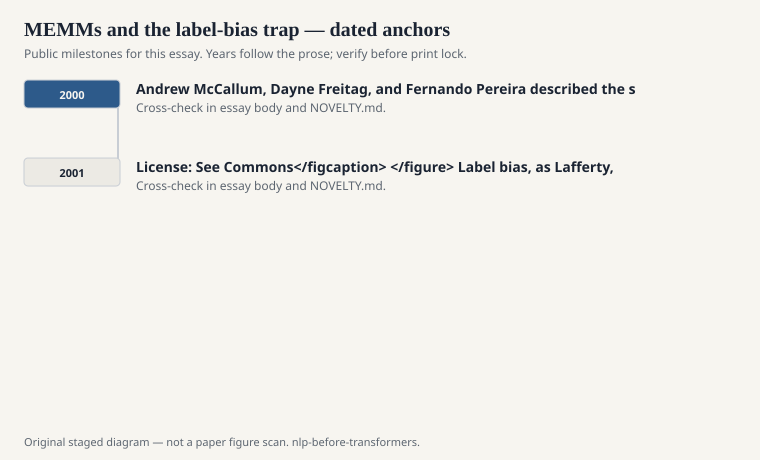
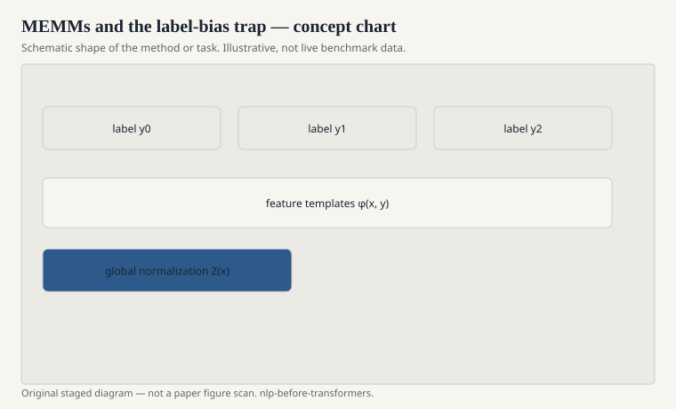

# MEMMs and the label-bias trap

A maximum-entropy Markov model is the
obvious hybrid. You want HMM-like
sequence structure. You want maxent-like
features of the observation. So you
make each next-state distribution a
maxent classifier that sees the previous
state and the current observations.
Andrew McCallum, Dayne Freitag, and
Fernando Pereira described the setup
around 2000. It worked. It also had a
failure mode with a name.

<!-- graphics-pack:nlp-bt-v1 -->

<figure class="nlp-bt-figure">

<figcaption>Figure 1. Dated public anchors for this piece. Years follow the essay; verify against the prose before print.</figcaption>
</figure>

<!-- graphics-pack:nlp-bt-v1 -->

<figure class="nlp-bt-figure">

<figcaption>Figure 2. Schematic of the method or task — editorial diagram, not live scores.</figcaption>
</figure>

<!-- graphics-pack:nlp-bt-v1 -->

<figure class="nlp-bt-figure nlp-bt-figure--archival">

<figcaption>Figure 3. Hierarchical HMM diagram for transition-bias discussion. License: See Commons</figcaption>
</figure>

Label bias, as Lafferty, McCallum, and
Pereira framed it in the 2001 CRF paper,
is about mass that cannot go anywhere.
If a state has only a few outgoing
transitions, it will pass probability
along those transitions even when the
observation is screaming that the whole
path is wrong. Local normalization at
each step makes the model conservative
in a bad way. It trusts the state too
much and the observation too little
when the state's fan-out is thin.

I have felt this in practice more than I
have proved it on a board. You build a
MEMM chunker. It gets addicted to its
own previous I-NP decision. A new token
that should start a new phrase cannot
break the streak because the transition
distribution from I-NP is peaked. You
add features. The peak remains. The
architecture is the peak.

The fix that stuck was to stop
normalizing locally. Conditional random
fields put one big normalization over
the whole path. That is computationally
ruder and statistically kinder. The
observation can veto a path even if
each local gate would have let it
through.

I do not tell this as "MEMMs were
foolish." They were the right next
attempt after HMMs and maxent
classifiers. A lot of software shipped
on them. The label-bias discussion is
one of the better examples of the field
doing criticism in public and then
changing the model class. That is rarer
than people think.

If you implement both a MEMM and a
linear-chain CRF on the same NER
feature set, do not only compare F1.
Watch the errors that start with a
wrong first tag and then coast. Coasting
is the trap. CRFs do not make you
immune. They make the coasting more
expensive.

I keep MEMMs in the series so the CRF
paper does not look like it arrived
from a cloud. It arrived from a
specific failure of a specific hybrid
that reasonable people had just
shipped. That is how a field is
supposed to move. Name the failure.
Change the normalization. Do not
pretend the previous tool was a
cartoon.
