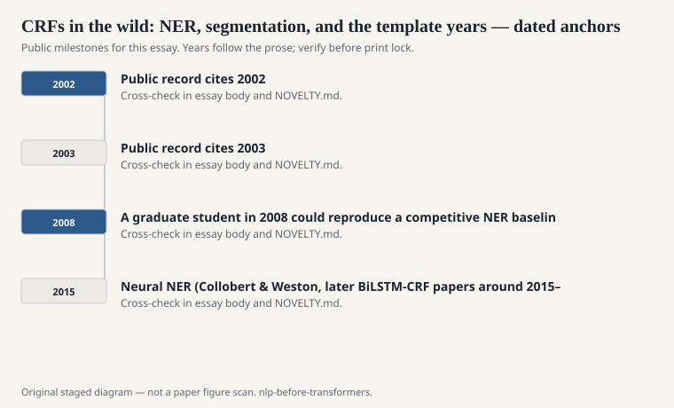
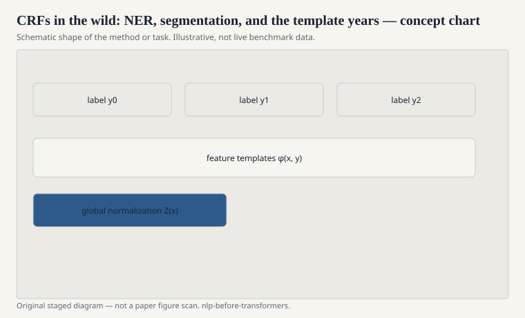

# CRFs in the wild: NER, segmentation, and the template years

The CoNLL-2002 and CoNLL-2003 shared
tasks on language-independent named
entity recognition did more to
standardize a workflow than a dozen
theory papers. You get a column file.
You invent features. You train a
sequence model. You report F1 on
PER, LOC, ORG, MISC. Everyone can
reproduce the split, which means
everyone can overfit the split.

<!-- graphics-pack:nlp-bt-v1 -->

<figure class="nlp-bt-figure">

<figcaption>Figure 1. Dated public anchors for this piece. Years follow the essay; verify against the prose before print.</figcaption>
</figure>

<!-- graphics-pack:nlp-bt-v1 -->

<figure class="nlp-bt-figure">

<figcaption>Figure 2. Schematic of the method or task — editorial diagram, not live scores.</figcaption>
</figure>

<!-- graphics-pack:nlp-bt-v1 -->

<figure class="nlp-bt-figure nlp-bt-figure--archival">

<figcaption>Figure 3. Alignment grid reused as feature-interaction sketch for structured prediction. License: See Commons</figcaption>
</figure>

CRFs won a lot of those years without
being mystical. A person who had
already done two shared tasks knew
that word shape (`Xx`, `XX`, `99`)
is worth more than another page of
philosophy. They knew a gazetteer is
cheating only in the sense that
knowledge is cheating. They knew
BIO encoding mistakes will haunt
you if you let I-ORG follow B-PER
without a transition constraint.

Chinese word segmentation and
Japanese morphological analysis
were even better CRF country.
Characters are the observations.
Boundaries are the labels. The
model can look at character n-grams
inside a window. You do not need a
Western space. You need a chart of
labels and a lot of patience.

I want to talk about the labor.
Feature engineering is talked about
now as if it were a dark age. Some
of it was ugly. Some of it was a
way of putting linguistic care into
a file another person could read.
When a template said "previous two
words plus their tags," that was a
claim about locality. You could
disagree by deleting a line.

The tools mattered. CRF++, Wapiti,
MALLET, later sklearn-crfsuite for
people who wanted Python. A
graduate student in 2008 could
reproduce a competitive NER
baseline on a laptop. That
accessibility is part of why the
method stuck. A method that needs
a cluster in 2008 does not become
a craft.

Neural NER (Collobert & Weston,
later BiLSTM-CRF papers around
2015–2016) started eating the
feature list. Character CNNs
replaced suffixes. Pretrained
embeddings replaced random
lexical weights. The CRF layer
often stayed. That is the tell.
The field did not fall out of
love with structured output. It
fell out of love with typing
features by hand.

If you want a historically honest
reimplementation, do not start
with a BiLSTM. Start with a
window of lexical features and a
linear-chain CRF on CoNLL-03
English. Get the score into the
high 80s F1 without heroics.
Then you will understand what
the neural papers were replacing,
and what they quietly kept.
