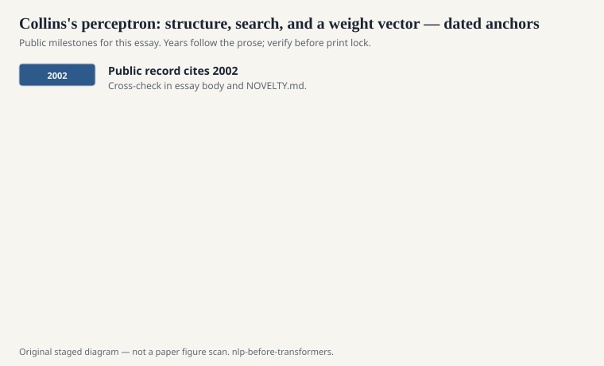
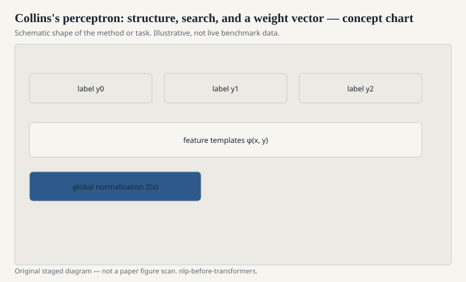

# Collins's perceptron: structure, search, and a weight vector

Michael Collins's 2002 paper on
discriminative training methods for
hidden Markov models — the structured
perceptron in the form most NLP
people met it — is a small algorithm
with a large attitude. Score a
structure with a dot product. Find
the best structure under the current
weights (or a good approximation).
If it is not the gold, add the gold
features and subtract the guessed
ones. Repeat.

<!-- graphics-pack:nlp-bt-v1 -->

<figure class="nlp-bt-figure">

<figcaption>Figure 1. Dated public anchors for this piece. Years follow the essay; verify against the prose before print.</figcaption>
</figure>

<!-- graphics-pack:nlp-bt-v1 -->

<figure class="nlp-bt-figure">

<figcaption>Figure 2. Schematic of the method or task — editorial diagram, not live scores.</figcaption>
</figure>

<!-- graphics-pack:nlp-bt-v1 -->

<figure class="nlp-bt-figure nlp-bt-figure--archival">

<figcaption>Figure 3. Phrase-structure tree used as CFG illustration. License: Public domain</figcaption>
</figure>

No partition function. No EM. The
cost of training is the cost of
decoding, again and again. That is
either a bargain or a nightmare,
depending on the decoder.

I like the perceptron in this history
because it made search first-class.
If your "argmax" is approximate —
beam search, a k-best list, a
cube-pruned decoder — the learning
algorithm is still willing to run.
It will learn around the search
errors if you let it, which is
sometimes what you want and
sometimes how you launder a bug.

Averaging the weight vectors (a
Freund and Schapire idea that
Collins used) was the difference
between a toy and a tool. The last
vector is jumpy. The average is
an adult. People who "tried the
perceptron and it was unstable"
often skipped the average.

The method wandered. POS tagging,
parsing (Collins had already been
a parser person), MT with MIRA and
related online updates in the Och
and Chiang orbit. Anywhere you
could define features of a
structure and a reasonably fast
search, someone pointed a
perceptron at it.

Compared with CRFs, you lose the
pretty likelihood. You gain speed
and a certain indifference to
global normalization. In the
2000s that trade was often
correct. In shared tasks, a
well-tuned perceptron and a
well-tuned CRF were sometimes
separated by pride more than by
F1.

The neural era did not kill this
object so much as rename it.
A lot of "we decode, we get a
loss, we take a gradient" is the
perceptron with a better score
function. Collins's paper is
still the clean copy: features,
search, update. If your modern
system cannot state those three,
it is not more advanced. It is
less housebroken.

MIRA and other large-margin
online updates sat in the same
hallway, especially in MT
tuning after Och. I will not
turn this draft into a catalog
of names. The family is: score
a structure, compare it to the
gold, move the weights so the
gold looks better next time.
Once you see the family, half
of the 2000s ACL anthology
stops looking like separate
religions.
