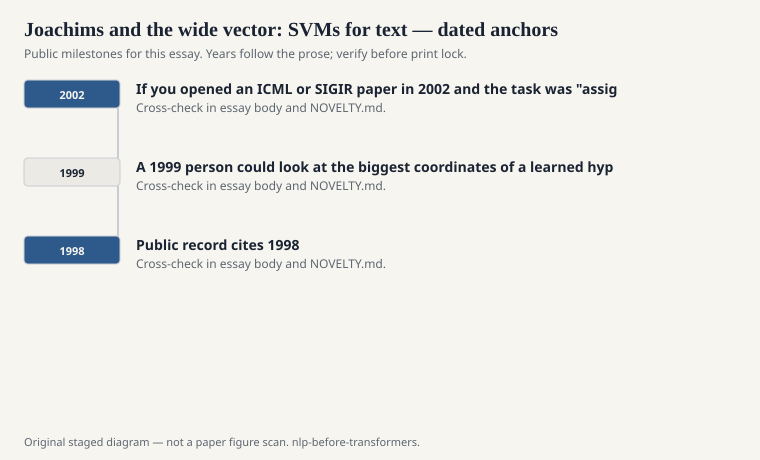
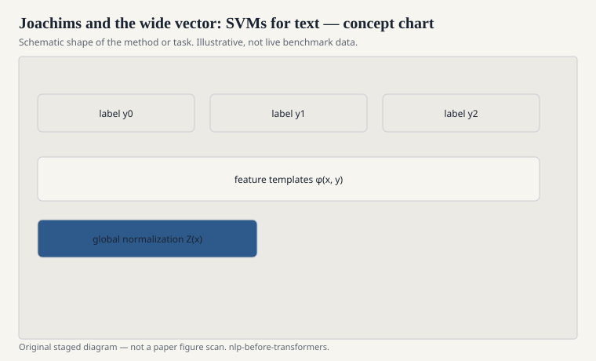

# Joachims and the wide vector: SVMs for text

Thorsten Joachims's late-1990s work on support vector machines
for text categorization, and the SVM-Light software that
traveled with it, gave the field a default classifier for
about a decade. The document is a sparse vector. The
dimensions are terms, maybe TF-IDF weighted, maybe with a
sublinear tf. The SVM finds a hyperplane with a margin. It
works.

<!-- graphics-pack:nlp-bt-v1 -->

<figure class="nlp-bt-figure">

<figcaption>Figure 1. Dated public anchors for this piece. Years follow the essay; verify against the prose before print.</figcaption>
</figure>

<!-- graphics-pack:nlp-bt-v1 -->

<figure class="nlp-bt-figure">

<figcaption>Figure 2. Schematic of the method or task — editorial diagram, not live scores.</figcaption>
</figure>

<!-- graphics-pack:nlp-bt-v1 -->

<figure class="nlp-bt-figure nlp-bt-figure--archival">

<figcaption>Figure 3. Lexical network plate for bag-of-words / vector essays. License: See Commons</figcaption>
</figure>

Why it worked was not a mystery even then. Text vectors are
wide and sparse. A margin method with regularization is a
good match for that geometry. Naive Bayes was faster and
usually worse once the features were serious. k-NN was
respectable and heavy at query time. Decision trees overfit
the head terms. Linear SVMs were the grown-up default. If
you opened an ICML or SIGIR paper in 2002 and the task was
"assign this newsgroup a label," you expected an SVM table.

I have a soft spot for the linear kernel debates. People
wanted RBF kernels because they sounded more like learning.
On bag-of-words they were often a way to wait longer for a
similar number. The linear SVM plus good term weighting was
the craft. Joachims also leaned into transductive and
ranking variants; the ranking work later mattered for
search, where a pairwise or listwise preference is a more
honest object than a binary "relevant."

This is not sequence labeling. I put it in the structured-
prediction hallway anyway because it trained a generation to
think "representation, then a convex model, then a hard
number on Reuters or 20 Newsgroups." That habit is the
statistical turn in a single workflow. It is also why so
many 2000s "NLP systems" were classifiers with a little
linguistics on the front.

When neural classifiers arrived with embeddings and a
softmax, they often beat linear SVMs on the same labels.
They also hid the term weights. A 1999 person could look at
the biggest coordinates of a learned hyperplane and say
"this newsgroup is about hockey because of these tokens."
That inspection is not a complete explanation. It is not
nothing. I still do it when a linear baseline is allowed
to exist.

If you reconstruct the era, take a public newsgroup set,
build TF-IDF unigrams, and train a linear SVM. Then ablate
the IDF. The drop is the lesson Salton already knew and
Joachims made unavoidable: the vector is the model, more
than the kernel is. Fancy kernels were a temptation. The
wide, weighted bag was the job.
