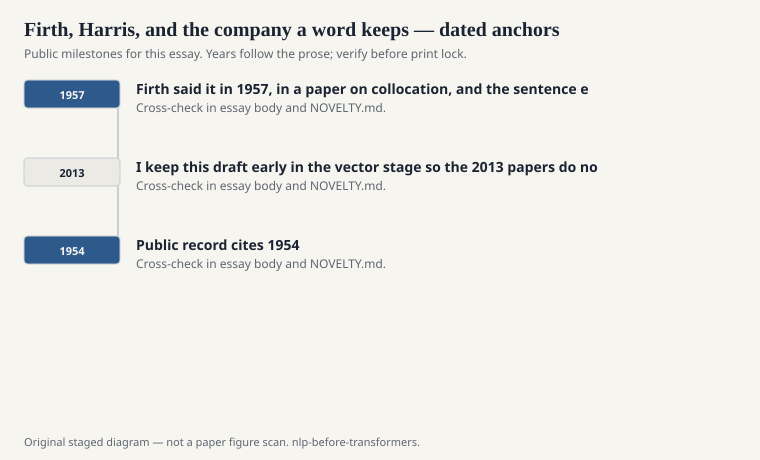
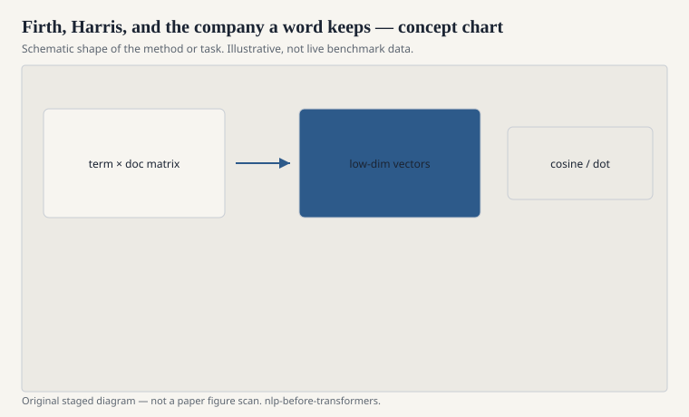

# Firth, Harris, and the company a word keeps

"You shall know a word by the company it
keeps." J. R. Firth said it in 1957, in
a paper on collocation, and the sentence
escaped. It is now the motto of every
embedding talk that wants a humanist
grandfather. Zellig Harris, a few years
around the same mid-century window,
pushed a harder version: distributional
sameness is the usable notion of
sameness. If two items occur in similar
environments, treat them as similar.

<!-- graphics-pack:nlp-bt-v1 -->

<figure class="nlp-bt-figure">

<figcaption>Figure 1. Dated public anchors for this piece. Years follow the essay; verify against the prose before print.</figcaption>
</figure>

<!-- graphics-pack:nlp-bt-v1 -->

<figure class="nlp-bt-figure">

<figcaption>Figure 2. Schematic of the method or task — editorial diagram, not live scores.</figcaption>
</figure>

<!-- graphics-pack:nlp-bt-v1 -->

<figure class="nlp-bt-figure nlp-bt-figure--archival">

<figcaption>Figure 3. Token alignment diagram for collocation / PMI essays. License: See Commons</figcaption>
</figure>

I like both men better when they are
not used as blessing-machines for a
300-dimensional vector. Firth cared
about collocation as a social and
situational fact. Harris cared about
procedures you could state. Neither
of them owed anyone a cosine.

The computational inheritance is
still real. If meaning is (partly)
distribution, then a matrix of
word-by-context counts is not a
category error. It is the object.
LSA, HAL, PMI vectors, Word2Vec,
GloVe — they argue about the
transformation, not about whether
the company of a word is worth
recording.

There is a limit the motto hides.
Some company is syntactic (a
transitive verb sits near noun
phrases). Some is topical (a
disease name sits near other
clinical tokens — I will not turn
that into advice). Some is
discourse. Collapsing all of that
into one similarity number is a
choice. Firth would have been
fussy about the choice. We are
often less fussy.

I keep this draft early in the
vector stage so the 2013 papers
do not look like a spontaneous
religion. They are a compression
scheme for a 1950s permission.
The permission said: stop waiting
for the perfect definition. Count
the neighbors. See what clusters.

If you want a historically honest
exercise, build a tiny
word-by-word co-occurrence matrix
on a public novel and look at the
nearest neighbors of a common
verb. Then do the same with a
window of size 2 and a window of
size 10. The neighbors change
character. Syntax versus topic
is not a neural discovery. It is
a window size, already visible
in the company the word keeps.

Harris is the harder grandfather
to romanticize, which is why I
keep him. Procedures, not mottoes.
If your distributional method
cannot be stated as a procedure
— count these environments,
compare these items — it is not
in his line even if you put his
name on slide two. Firth gave
the sentence everyone quotes.
Harris gave the stubbornness.
