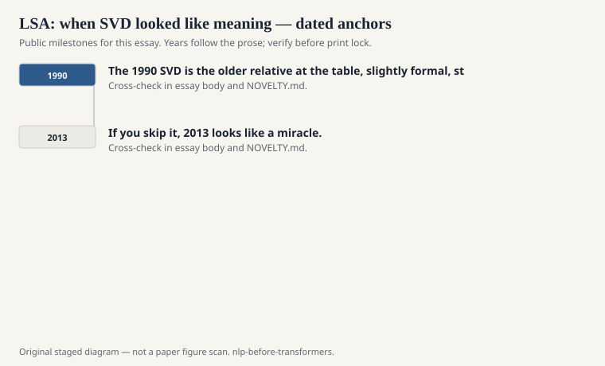
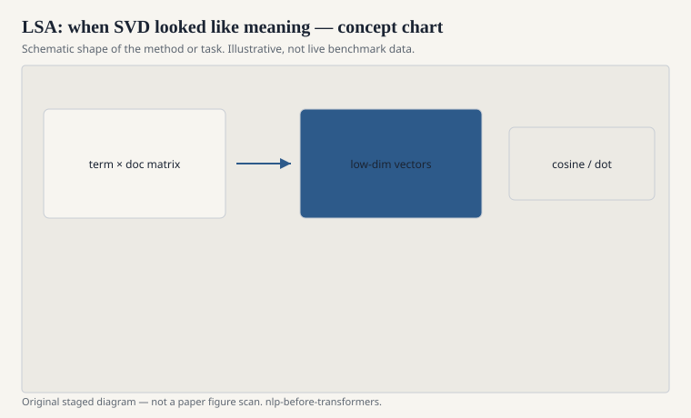

# LSA: when SVD looked like meaning

Deerwester, Dumais, Furnas, Landauer, and Harshman, 1990,
*Indexing by Latent Semantic Analysis*. The practical
problem was retrieval. Query words and document words often
refuse to match. A user says "car." The paper says
"automobile." Exact term match shrugs.

<!-- graphics-pack:nlp-bt-v1 -->

<figure class="nlp-bt-figure">

<figcaption>Figure 1. Dated public anchors for this piece. Years follow the essay; verify against the prose before print.</figcaption>
</figure>

<!-- graphics-pack:nlp-bt-v1 -->

<figure class="nlp-bt-figure">

<figcaption>Figure 2. Schematic of the method or task — editorial diagram, not live scores.</figcaption>
</figure>

<!-- graphics-pack:nlp-bt-v1 -->

<figure class="nlp-bt-figure nlp-bt-figure--archival">

<figcaption>Figure 3. Plate reused as matrix-factorization metaphor (verify caption in essay). License: CC BY-SA (verify on Commons)</figcaption>
</figure>

Latent semantic analysis takes a term-document matrix,
optionally weighted, and computes a truncated singular
value decomposition. Terms and documents land in a shared
lower-dimensional space. Inner products in that space are
the new match. Synonyms can meet even if they never
co-occurred in the same document, because they hung around
the same latent directions.

I remember the first time this looked like magic and the
first time it looked like a rotation. Both impressions are
true. SVD will pull out directions that explain variance.
If your variance is about topics, you get something
topic-like. If your variance is about formatting and a few
prolific authors, you get that instead. The algorithm does
not owe you semantics. It owes you a low-rank
approximation. People who called the dimensions "concepts"
were interpreting. Sometimes the interpretation held.
Sometimes it was a story about a singular vector that
liked headers.

Landauer and Dumais later leaned into psychological claims
— LSA as a theory of knowledge acquisition. The IR paper
is enough for this series. It showed a generation that a
linear algebra primitive could be a lexical resource. You
did not have to hand-build WordNet to get a similarity
number. You had to have a matrix and a rank. That was a
democratic move, in the limited sense that a graduate
student with a numerical library could join.

The weaknesses are public. Polysemy gets smashed into one
vector: "bank" is a smear of river and money. The space is
dense and a bit greasy; nearest neighbors can be plausible
and still wrong. Truncation is a hyperparameter dressed as
a philosophy. None of that stopped LSA from being the
default "semantic" baseline for a long time, especially
in education-tech and IR papers that needed a number
called similarity.

When Word2Vec arrived, people said neural nets had
invented distributional meaning. A kinder sentence:
prediction trained a cheaper, incrementally updatable
cousin of the same matrix-factorization family. Levy and
Goldberg would later make that kinship explicit in public
papers. The 1990 SVD is the older relative at the table,
slightly formal, still owed a plate. If you skip it, 2013
looks like a miracle. It was a faster kitchen.
