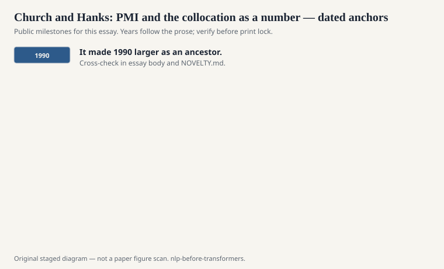
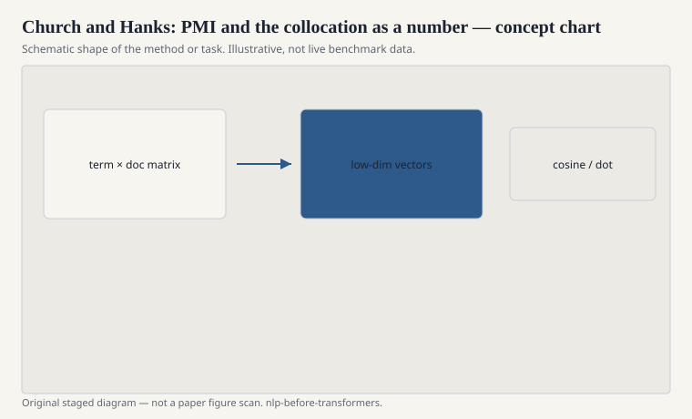

# Church and Hanks: PMI and the collocation as a number

Kenneth Church and Patrick Hanks, 1990, "Word Association Norms,
Mutual Information, and Lexicography." They took a simple
information-theoretic score — how much more do two words happen
together than chance would allow — and used it as a
lexicographer's tool. Pointwise mutual information. A number for
"this pair is not an accident."

<!-- graphics-pack:nlp-bt-v1 -->

<figure class="nlp-bt-figure">

<figcaption>Figure 1. Dated public anchors for this piece. Years follow the essay; verify against the prose before print.</figcaption>
</figure>

<!-- graphics-pack:nlp-bt-v1 -->

<figure class="nlp-bt-figure">

<figcaption>Figure 2. Schematic of the method or task — editorial diagram, not live scores.</figcaption>
</figure>

<!-- graphics-pack:nlp-bt-v1 -->

<figure class="nlp-bt-figure nlp-bt-figure--archival">

<figcaption>Figure 3. Token alignment diagram for collocation / PMI essays. License: See Commons</figcaption>
</figure>

The formula is a log of a ratio: joint probability over the
product of the marginals. If "San" and "Francisco" are almost
never apart, the ratio is large. If "the" and "of" are both
common and only sit together as grammar requires, the ratio
calms down. That is the hope. The vice is known. PMI loves
rare events. Two words that appear together twice in a huge
corpus can look like destiny because the denominator is tiny.
People later used positive PMI (clip the negatives), count
thresholds, and simple discounting to keep the vice in a box.

I used PMI tables the way I used WordNet: as a cheap oracle.
Is "strong tea" a collocation? The number says yes. "Powerful
tea" says no. Firth would have liked the example; he used tea
himself. The computational version lets you run the question
over a newswire dump instead of an armchair. It also lets you
discover that your dump thinks "New York" is the most
interesting fact in America, which is a property of the dump.

Church's broader 1980s and 1990s presence — statistical tagging,
the sense that a UNIX pipeline could be a linguistic instrument —
belongs with this paper. PMI is a one-liner. The culture is "we
will measure the association and then argue." That culture is
the statistical turn in a single habit. You do not need a
full parser to ask whether two words are glued.

Vector people absorbed PMI directly. A word-context matrix of
PMI values, sometimes shifted by a constant, is a strong
embedding before anyone says neural. Levy, Goldberg, and Dagan
showed in the mid-2010s that a lot of Word2Vec's glow is this
matrix plus a factorization. That result did not make Word2Vec
smaller as an event. It made 1990 larger as an ancestor. If
your history of embeddings starts at Mikolov, you skipped the
score that already knew about company-keeping.

If you teach only one pre-neural semantic score, teach PMI and
then immediately teach its rare-event mania. Show the pair that
occurred twice. Watch the number go insane. Then apply a
floor. Otherwise students will ship a thesaurus that thinks
every typo pair is profound, and they will call it meaning
because the formula has a logarithm in it.
