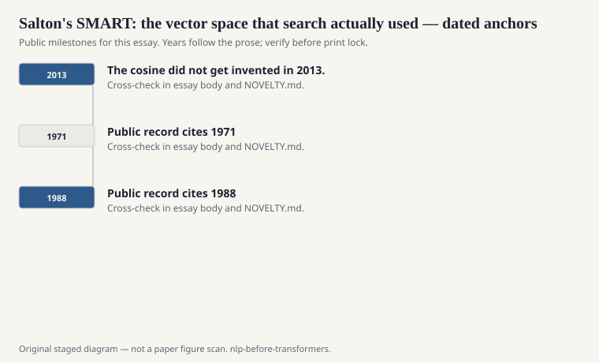
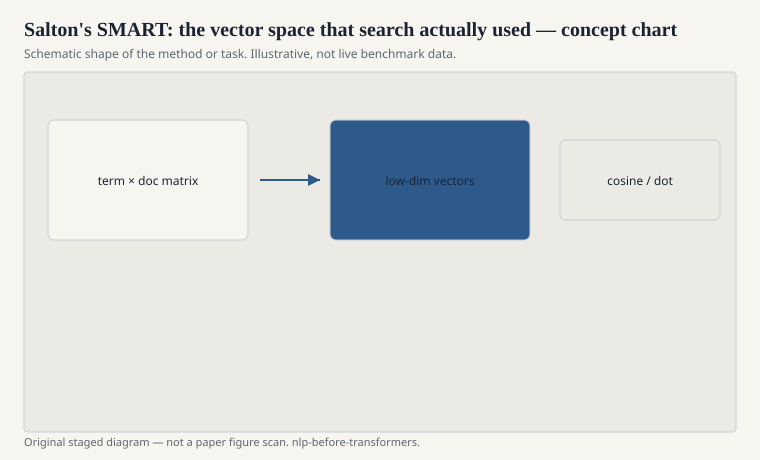

# Salton's SMART: the vector space that search actually used

Before embeddings were a lifestyle, Gerald Salton's SMART
system treated documents and queries as vectors and ranked
by cosine similarity. The work runs from the 1960s through
the 1980s. TF-IDF weighting — term frequency times inverse
document frequency — is the piece that escaped into every
stack-overflow answer and every first lecture on IR.

<!-- graphics-pack:nlp-bt-v1 -->

<figure class="nlp-bt-figure">

<figcaption>Figure 1. Dated public anchors for this piece. Years follow the essay; verify against the prose before print.</figcaption>
</figure>

<!-- graphics-pack:nlp-bt-v1 -->

<figure class="nlp-bt-figure">

<figcaption>Figure 2. Schematic of the method or task — editorial diagram, not live scores.</figcaption>
</figure>

<!-- graphics-pack:nlp-bt-v1 -->

<figure class="nlp-bt-figure nlp-bt-figure--archival">

<figcaption>Figure 3. Lexical hierarchy as stand-in for vector-space organization. License: See Commons</figcaption>
</figure>

IDF is the taste. A word that appears in every document
does not help you choose. A word that appears in two
documents might. The formula has variants (logarithms,
smoothed IDF, Okapi BM25 as a later, ruder cousin). The
attitude is stable. Not every token deserves the same
shout. "The" is not news. "Sparseness" might be.

I keep Salton in the vector stage, not only in the IR
annex, because a lot of people who think they are doing
NLP are doing SMART with extra steps. A linear classifier
on bag-of-words is a vector space model with a learned
direction. A dense embedding average is a vector space
model with a different basis. The cosine did not get
invented in 2013. The habit of asking "how close are
these two bags" is older than most of the conferences
we cite.

SMART also taught evaluation hygiene: test collections,
precision and recall, the idea that a retrieval method
is a public claim. Cranfield, later TREC, made that
claim enforceable. NLP borrowed the habit when it
finally got tired of demo transcripts. If your field
has a shared test set, some of the credit belongs to
the retrieval people who were embarrassed earlier.

BM25 (Robertson, Walker, and colleagues, with later
standardizations) is the 1990s refinement I still reach
for when a neural ranker is too much theater. It is not
the last chapter of this series, but it is the grown
form of Salton's object. If your history of "vectors
for language" skips BM25 and jumps to word2vec, you
skipped the part that sat in production search for
years and still sits there under a lot of "AI" paint.

The human remaining point: weighting is ideology.
TF-IDF says rare is informative. That is often right
for topical search and wrong for function words you
actually needed, or for a name that is common in the
collection because the collection is about that name.
A good system lets you see the weights. SMART did. A
pile of dense vectors often does not. If you cannot
say why a document ranked first, you have not replaced
Salton. You have hidden him.
