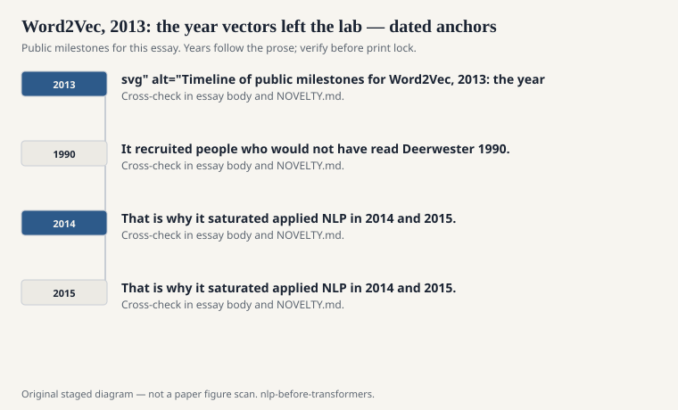
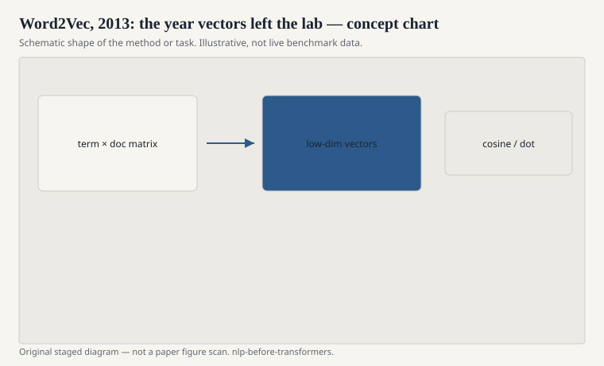

# Word2Vec, 2013: the year vectors left the lab

Tomas Mikolov and colleagues at Google published two
short papers in 2013 that did not look like they would
reorganize a field. Efficient estimation of word
representations. Then the follow-up on distributed
representations and analogical reasoning. The code went
out. The Google News vectors went out. Suddenly a
graduate student without a cluster had 300 numbers for
"king" and a party trick about queens.

<!-- graphics-pack:nlp-bt-v1 -->

<figure class="nlp-bt-figure">

<figcaption>Figure 1. Dated public anchors for this piece. Years follow the essay; verify against the prose before print.</figcaption>
</figure>

<!-- graphics-pack:nlp-bt-v1 -->

<figure class="nlp-bt-figure">

<figcaption>Figure 2. Schematic of the method or task — editorial diagram, not live scores.</figcaption>
</figure>

<!-- graphics-pack:nlp-bt-v1 -->

<figure class="nlp-bt-figure nlp-bt-figure--archival">

<figcaption>Figure 3. Encoder stack diagram as neural embedding-era hardware sketch. License: CC BY-SA (verify on Commons)</figcaption>
</figure>

The trick was not that words could be vectors. LSA had
vectors. Collobert and Weston had vectors. Bengio's
neural language model had vectors as a byproduct. The
trick was speed, software, and a demonstration that a
cheap predictive objective — skip-gram or CBOW, with
negative sampling or hierarchical softmax — produced
neighbors that looked, to a human, like meaning.

I was in rooms where people pasted
`vector('Paris') - vector('France') + vector('Italy')`
and waited. Sometimes "Rome" came back. The room would
make a sound. That sound is part of the history. It
recruited people who would not have read Deerwester
1990. Recruitment is not a crime. It is also not a
proof. Analogy tables are a genre. Genres can be
gamed, and they can flatter a space that is messy
everywhere else.

What I trust more than the analogy table is the boring
use. You replace a one-hot with a row from a matrix,
you feed a classifier or a CRF, your F1 moves,
especially when the training set is small. Word2Vec
was a pretrained feature. That is why it saturated
applied NLP in 2014 and 2015. It was plug-in
improvement. People who had been writing `word[-2]`
in a CRF template now wrote `embed[word]` and went
home earlier.

The papers are thin if you want theory. They are thick
if you want a recipe. Window size, negative samples,
subsampling frequent words, a learning-rate schedule —
the recipe is the contribution. Later analysis (Levy
and Goldberg again) showed how close the recipe sits
to factorizing a shifted PMI matrix. Good. The field
should know its linear algebra. It should also
remember that a recipe people can run is a kind of
scholarship.

One caution, public and ordinary: the neighbors encode
the crawl. Bias is not a 2018 discovery. It is a
property of company-keeping. Word2Vec made the
property downloadable. If your nearest neighbors for a
profession are a stereotype, that is the corpus
talking, at volume, with a cosine.

If this series has a popular object, this is it. I
will not pretend it arrived from nowhere. I also will
not pretend 2013 was just a repackaging. Shipping is
a technical act. The file went out. The field changed
its default representation in about a year. Defaults
are history.
