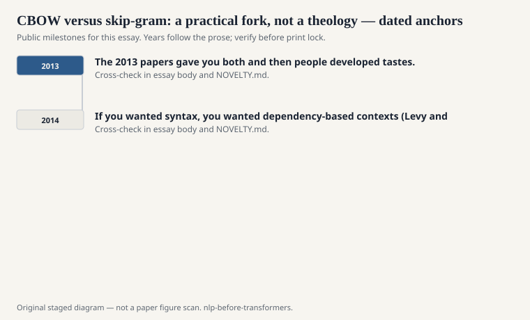
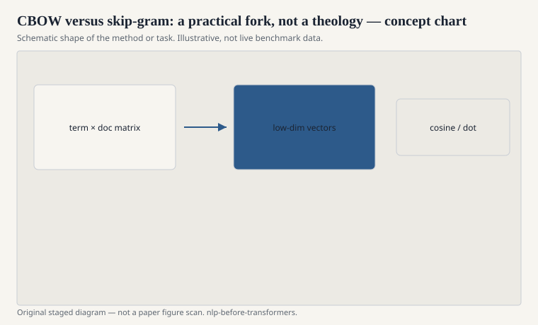

# CBOW versus skip-gram: a practical fork, not a theology

Continuous bag-of-words predicts a
word from the average of its
neighbors. Skip-gram predicts the
neighbors from the word. That is
the whole fork. The 2013 papers
gave you both and then people
developed tastes.

<!-- graphics-pack:nlp-bt-v1 -->

<figure class="nlp-bt-figure">

<figcaption>Figure 1. Dated public anchors for this piece. Years follow the essay; verify against the prose before print.</figcaption>
</figure>

<!-- graphics-pack:nlp-bt-v1 -->

<figure class="nlp-bt-figure">

<figcaption>Figure 2. Schematic of the method or task — editorial diagram, not live scores.</figcaption>
</figure>

<!-- graphics-pack:nlp-bt-v1 -->

<figure class="nlp-bt-figure nlp-bt-figure--archival">

<figcaption>Figure 3. Encoder stack diagram as neural embedding-era hardware sketch. License: CC BY-SA (verify on Commons)</figcaption>
</figure>

CBOW is faster. It smooths. It
tends to be decent on frequent
words and a bit mushy on rare
ones, because the averaged
context is a blur and the
objective does not force a rare
word to predict anything
distinctive as often. Skip-gram
is slower and, in a lot of
public comparisons from that
period, better on rare words
and on analogy tests. A rare
word still has to predict its
contexts. That is a kind of
attention, before we used the
word that way.

I do not treat this as a moral
choice. If you are pretraining
on a modest corpus to warm a
classifier, CBOW may be enough
and kinder to a laptop. If you
are publishing a general
embedding set, skip-gram plus
negative sampling became the
default for a reason.

The bag-of-words part of CBOW
is easy to miss. Order inside
the window is discarded. That
is a feature. It keeps the
model small. It also means
"dog bites man" and "man bites
dog" look more alike than a
syntactician wants. Skip-gram
does not really fix that; it
still uses a window, not a
tree. If you wanted syntax,
you wanted dependency-based
contexts (Levy and Goldberg,
2014) or an actual parser.

People later asked which
objective "is" Word2Vec. The
honest answer is: the
repository you cloned. The
name pointed at a family. The
family shared a culture of
fast negative contrast and
a refusal to do a full
softmax over a 100,000-word
vocab if they could avoid it.

When you read a 2014 applied
paper that says "we used
word2vec," ask which. Ask
window size. Ask whether they
threw out words below a count
of five. Those details move
neighbors more than the brand
name does. The fork is
practical. Keep it that way.

I will add one measurement
habit. Do not decide the fork
on the analogy table alone.
Look at a downstream tagger
or a rare-word neighbor list
in the domain you actually
have. CBOW can win on a
frequent-word classification
task and lose on a medical
or legal vocabulary I will
not specify here. The papers
already said this, quietly.
The brand name shouted louder.
