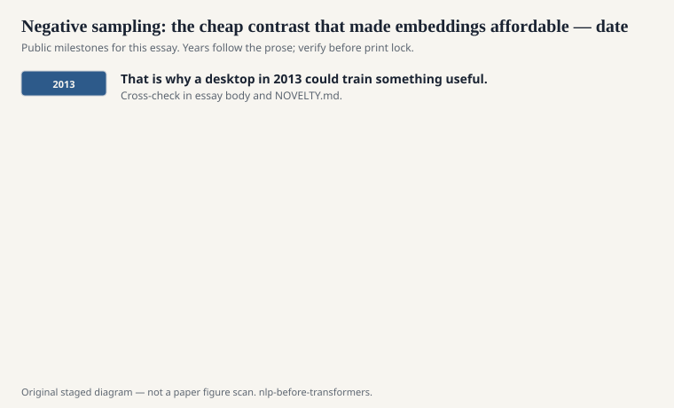
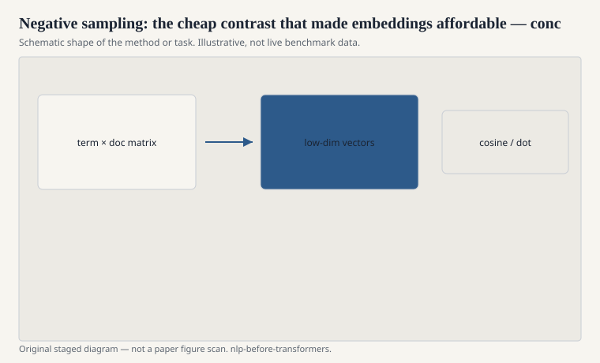

# Negative sampling: the cheap contrast that made embeddings affordable

A language-model softmax over a
large vocabulary is a bill. Every
training step, you normalize over
tens or hundreds of thousands of
words. Hierarchical softmax was
one way to dodge the bill: a
Huffman tree, a path of binary
decisions. Negative sampling was
the ruder dodge, and the one
that traveled.

<!-- graphics-pack:nlp-bt-v1 -->

<figure class="nlp-bt-figure">

<figcaption>Figure 1. Dated public anchors for this piece. Years follow the essay; verify against the prose before print.</figcaption>
</figure>

<!-- graphics-pack:nlp-bt-v1 -->

<figure class="nlp-bt-figure">

<figcaption>Figure 2. Schematic of the method or task — editorial diagram, not live scores.</figcaption>
</figure>

<!-- graphics-pack:nlp-bt-v1 -->

<figure class="nlp-bt-figure nlp-bt-figure--archival">

<figcaption>Figure 3. Encoder stack diagram as neural embedding-era hardware sketch. License: CC BY-SA (verify on Commons)</figcaption>
</figure>

Instead of asking the model to
assign a proper probability to
the true context word among all
words, you ask a binary
question a few times. Is this
the true pair? Are these k
noise pairs fake? The noise is
drawn from a unigram
distribution, often raised to
the 3/4 power because that
tweak, publicly reported,
worked. Mikolov et al. cited
the family of noise-contrastive
estimation (Gutmann and Hyvärinen;
Mnih and Teh) and then shipped
a simplified version.

I care about this because it is
a case where an approximation
became the object. People did
not treat negative sampling as
a regrettable hack they would
remove later. They treated it
as the training method. The
vectors are whatever that
contrast produces. That is
honest, if you keep it in the
open.

The 3/4 power is a good example
of craft versus myth. It
downweights the very head of
the unigram a bit and gives
the middle more chance to be
drawn as noise. You can
philosophize. You can also
just say: they tried it, the
neighbors looked better, the
note went into the paper.

Negative sampling also makes
the objective local. You can
stream a corpus. You do not
need a giant matrix in RAM if
you are careful. That is why
a desktop in 2013 could train
something useful. Accessibility
changed citation patterns.
Accessibility is part of
scientific success even when
theories are embarrassed by
it.

Later contrastive methods in
representation learning are
cousins. I will not drag this
series into that later weather.
The pre-transformer point is
smaller. Word2Vec was cheap
because it refused to be a
full language model at every
step. The refusal was the
invention users actually felt.

Hierarchical softmax is the
sibling I do not want forgotten.
A Huffman tree over the
vocabulary, a path of binary
decisions, no noise samples.
It is more of a real language
model than negative sampling
is. It was also fussier to
implement and, on many public
comparisons of that year,
slightly worse for the vectors
people wanted. The field chose
the ruder dodge. That choice
is the 2013 personality.
