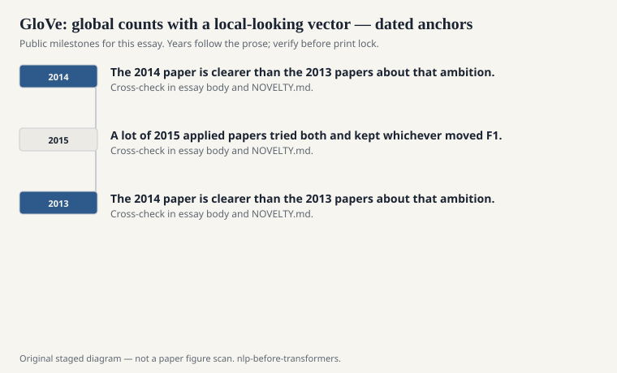
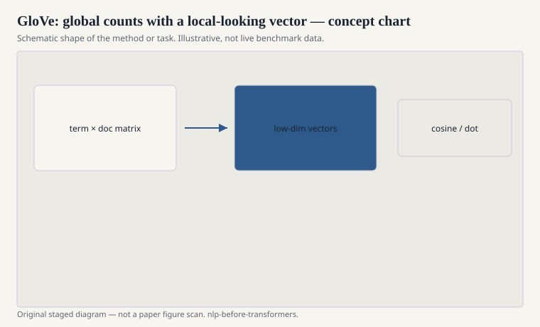

# GloVe: global counts with a local-looking vector

Jeffrey Pennington, Richard Socher, and Christopher Manning
released GloVe in 2014 from Stanford. The pitch was explicit.
Word2Vec streams local windows and never quite sees the whole
co-occurrence matrix. Count models see the whole matrix and then
often factorize it clumsily. GloVe would train on global counts
with a weighted least-squares objective that paid more attention
to reliable counts than to rare noise.

<!-- graphics-pack:nlp-bt-v1 -->

<figure class="nlp-bt-figure">

<figcaption>Figure 1. Dated public anchors for this piece. Years follow the essay; verify against the prose before print.</figcaption>
</figure>

<!-- graphics-pack:nlp-bt-v1 -->

<figure class="nlp-bt-figure">

<figcaption>Figure 2. Schematic of the method or task — editorial diagram, not live scores.</figcaption>
</figure>

<!-- graphics-pack:nlp-bt-v1 -->

<figure class="nlp-bt-figure nlp-bt-figure--archival">

<figcaption>Figure 3. Alignment grid as co-occurrence visual metaphor. License: See Commons</figcaption>
</figure>

The object you download still looks like Word2Vec: a vector per
word, analogies, nearest neighbors, a text file of floats. That
was wise. The adoption path was "swap the file." Researchers
compared GloVe and skip-gram the way people compare two coffees,
not two religions, which is the right energy. A lot of 2015
applied papers tried both and kept whichever moved F1.

I have always liked the weighting function more than the
branding. Very rare co-occurrences do not get to dominate the
loss. Very frequent ones are clipped so "the" cannot own the
fit. That is smoothing, again, wearing a neural-adjacent hat.
If you have been reading this series in order, you already know
the move. Steal from the head, protect the tail, do not let a
hapax run the country.

Did GloVe "beat" Word2Vec? Depends on the year, the corpus, the
analogy subset, and whether you trained both with comparable
care. The public pretrained GloVe sets — Wikipedia plus
Gigaword, later Common Crawl — were a gift. A lot of papers
that said GloVe was better were saying the Stanford dump was
better than the Google News dump. That is a data statement
dressed as a model statement. The field does this constantly.
It is not a crime if you say it out loud.

Theoretically, GloVe sits where Levy and Goldberg already
pointed: embeddings as factorization. The 2014 paper is clearer
than the 2013 papers about that ambition. Clearer is not always
more used. Skip-gram remained the thing you trained when you
had a weird domain corpus and one evening, because it streams
and does not ask you to build a giant co-occurrence matrix
first.

For this series, GloVe is the moment the vector file became a
standard commodity with a second supplier. Commodities change
engineering. They also reduce the urge to think. Both happened.
If you still open a GloVe file and look at the neighbors of a
word you care about before you train, you are using it the
right way. If you treat the filename as a citation, you are
using it the other way.
