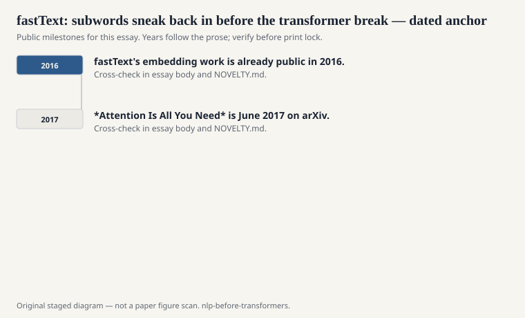
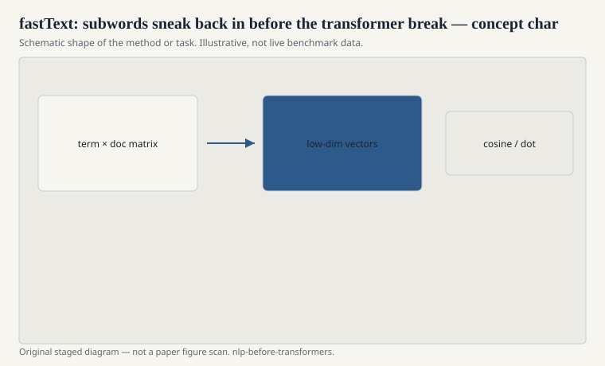

# fastText: subwords sneak back in before the transformer break

Piotr Bojanowski, Edouard Grave, Armand Joulin, and Tomas Mikolov
put character n-grams inside a Word2Vec-style model and called the
package fastText (arXiv 2016, *TACL* 2017). A word vector is the
sum of a vector for the word plus vectors for the pieces (`<wh`,
`whe`, `her`, `ere`, `re>`). An unseen word is no longer a zero.
It is a sum of pieces you have seen.

<!-- graphics-pack:nlp-bt-v1 -->

<figure class="nlp-bt-figure">

<figcaption>Figure 1. Dated public anchors for this piece. Years follow the essay; verify against the prose before print.</figcaption>
</figure>

<!-- graphics-pack:nlp-bt-v1 -->

<figure class="nlp-bt-figure">

<figcaption>Figure 2. Schematic of the method or task — editorial diagram, not live scores.</figcaption>
</figure>

<!-- graphics-pack:nlp-bt-v1 -->

<figure class="nlp-bt-figure nlp-bt-figure--archival">

<figcaption>Figure 3. Finite-state diagram for subword / morphology essays. License: See Commons</figcaption>
</figure>

This is older wisdom with a new binary. Morphology people and
spelling people had been saying for years that the atomic word is
a bad unit for Turkish and a mediocre unit for English.
Feature-based CRFs already used suffixes. Finite-state analyzers
already decomposed. fastText made the suffix a first-class citizen
of the embedding file you could download and average.

I treat the timing carefully. *Attention Is All You Need* is June
2017 on arXiv. fastText's embedding work is already public in 2016.
It is pre-transformer in the sense this series means: same problem,
older architecture, still in the window-and-predict family. It is
not a descendant of self-attention. Putting it in this folder is
not a sneak. It is a date.

The practical win was immediate on morphologically rich languages
and on noisy user text. Typos share character n-grams with the
intended word. That is not deep. It is why the neighbors of a
misspelling are not garbage. If your applied problem is search
over user queries, that one fact is worth more than an analogy
table about kings and queens.

Joulin, Grave, Bojanowski, and Mikolov also shipped a fast text
classifier under the same brand — a linear model on bags of
n-grams that embarrassed heavier networks on some benchmarks.
Different paper, same attitude: cheap, strong, slightly rude to
complexity. I keep the classifier in this paragraph because the
brand confused people. "We used fastText" can mean embeddings or
it can mean a supervised linear model. Ask.

If Word2Vec made vectors a commodity, fastText made out-of-vocabulary
a little less cursed. Byte-pair encoding and SentencePiece would
soon steal the subword story for neural MT and then for everything.
Those tokenizers are a different mechanism: they segment, they do
not sum character n-gram vectors. The motive is the same. Do not
let the vocabulary be a cliff. The older field had been saying
that since Koskenniemi. 2016 just made it a file you could wget.
