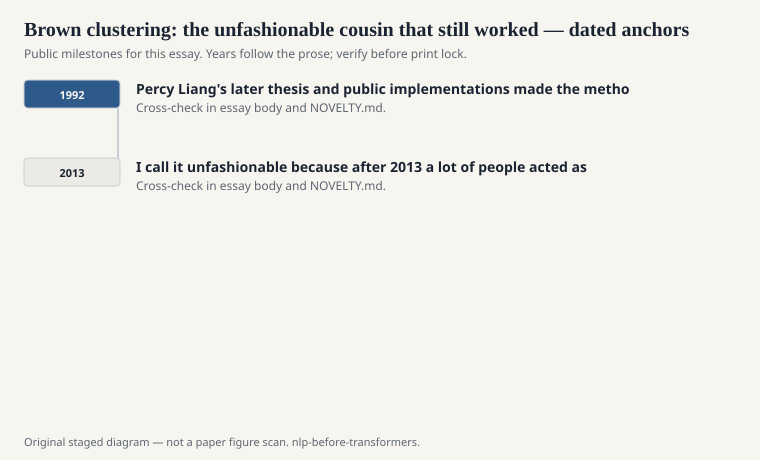
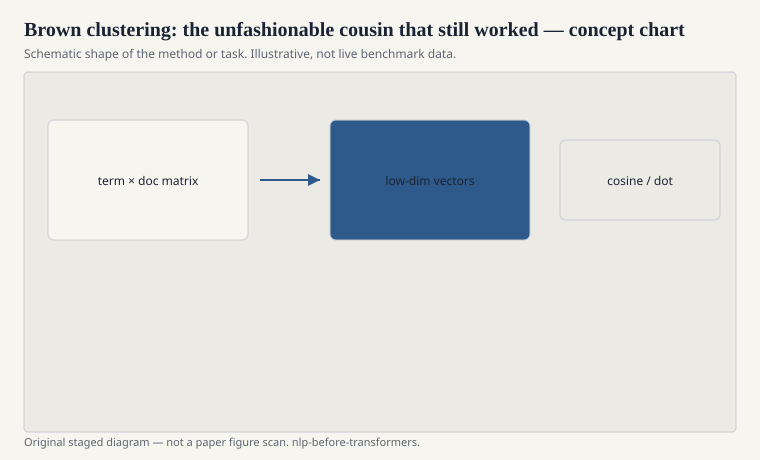

# Brown clustering: the unfashionable cousin that still worked

Peter Brown and colleagues at IBM (1992) clustered words by a
class-based n-gram criterion. Words that behave similarly in a
language model get similar bit-string prefixes. The output is
a hierarchy, not a dense vector. You can cut the tree at
different depths and get coarse or fine classes. Length 4 is
a neighborhood. Length 12 is almost a word.

<!-- graphics-pack:nlp-bt-v1 -->

<figure class="nlp-bt-figure">

<figcaption>Figure 1. Dated public anchors for this piece. Years follow the essay; verify against the prose before print.</figcaption>
</figure>

<!-- graphics-pack:nlp-bt-v1 -->

<figure class="nlp-bt-figure">

<figcaption>Figure 2. Schematic of the method or task — editorial diagram, not live scores.</figcaption>
</figure>

<!-- graphics-pack:nlp-bt-v1 -->

<figure class="nlp-bt-figure nlp-bt-figure--archival">

<figcaption>Figure 3. Tree diagram for hierarchical clustering essays. License: Public domain</figcaption>
</figure>

In the CRF years this was gold. A Brown cluster prefix of
length 4 or 6 was a feature that said "these words play
similar distributional roles" without costing you a
300-float row at every token. NER papers in particular loved
them. Rare names sit near other rare names if the clustering
was lucky. "Co." and "Inc." sit near each other because they
live in the same language-model world, not because anyone
wrote a gazetteer.

I call it unfashionable because after 2013 a lot of people
acted as if discrete classes were embarrassing. They are not
embarrassing. They are a different compression. A bit string
is inspectable. You can write `cluster[0:6]` in a template
file. You can also be wrong in a discrete way that is easy
to see. A dense vector is wrong in a smeared way. Both
wrongs have uses.

The algorithm is slow if you are naive, and the original
objective is a language-model likelihood, which means the
clusters care about predictive substitutability. That is
closer to syntax than to topic, often. Window embeddings can
be steered either way by changing the window. Brown clusters
have a more specific taste. If you wanted topics, you wanted
LDA or LSA. If you wanted a feature that behaves like a
super-tag, you wanted this tree.

Percy Liang's later thesis and public implementations made
the method usable for people who were not at IBM in 1992.
Like WordNet and like PMI, the resource became a file you
dropped into a feature extractor. I have seen shared-task
winners that were, in essence, a CRF plus Brown clusters
plus a gazetteer plus stubbornness. That is not a joke
about the 2000s. That is the 2000s.

When I see a modern paper reinvent "soft clusters" as if
discreteness had never been tried, I think of this tree.
The pre-transformer stack was allowed to have more than one
representation of the same word. A cluster id, a suffix, a
gazetteer bit, a GloVe row. The ensemble was the point.
Dense vectors did not make that idea false. They made it
easier to forget.
