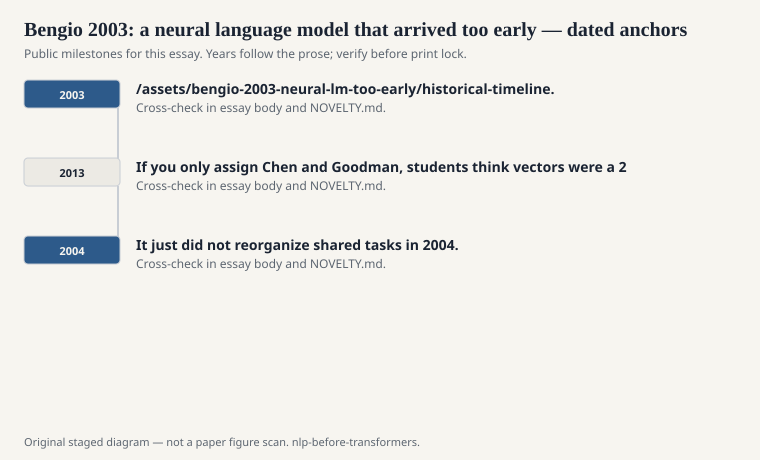
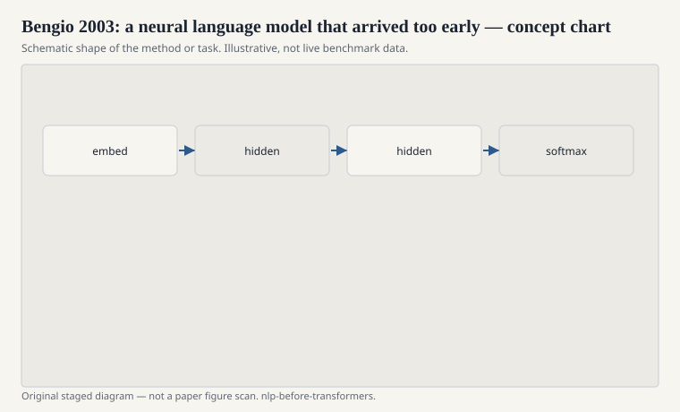

# Bengio 2003: a neural language model that arrived too early

Yoshua Bengio, Réjean Ducharme, Pascal Vincent, and Christian
Jauvin, 2003, "A Neural Probabilistic Language Model." The paper
does the thing people later acted surprised by. Each word is a
learned vector. A feed-forward net sees a concatenated window of
those vectors and predicts the next word. Distributed
representations share strength across similar words. The curse
of dimensionality, they argued, is why n-gram tables choke.

<!-- graphics-pack:nlp-bt-v1 -->

<figure class="nlp-bt-figure">

<figcaption>Figure 1. Dated public anchors for this piece. Years follow the essay; verify against the prose before print.</figcaption>
</figure>

<!-- graphics-pack:nlp-bt-v1 -->

<figure class="nlp-bt-figure">

<figcaption>Figure 2. Schematic of the method or task — editorial diagram, not live scores.</figcaption>
</figure>

<!-- graphics-pack:nlp-bt-v1 -->

<figure class="nlp-bt-figure nlp-bt-figure--archival">

<figcaption>Figure 3. Neural encoder stack illustration. License: See Commons</figcaption>
</figure>

It worked. It was also expensive for 2003. A softmax over a real
vocabulary on the hardware of that year is a lifestyle, not a
weekend. The paper is cited constantly now because it is an
origin. It was not a default tool then. N-grams still won on
cost and on the speech labs' comfort. A good interpolated
trigram, trained overnight, was a product. A neural LM was a
statement.

I like teaching this paper next to Chen and Goodman. Same
problem, opposite instincts. One group refines the table. The
other group refuses the table as the representation. Both are
right inside their budgets. If you only assign Bengio, students
think tables were stupid. If you only assign Chen and Goodman,
students think vectors were a 2013 fashion. They need the
argument.

The embedding table in Bengio 2003 is already "word2vec energy."
What Mikolov later changed was the objective's ambition. Bengio
wanted a language model — a real next-word distribution. Mikolov
was willing to want only vectors. That willingness, plus
negative sampling, is why 2013 scaled and 2003 remained a
prophetic experiment plus a citation. Ambition is not always
the friend of shipping.

There is a human timing lesson. Being early is not the same as
being ignored. The paper was read. It just did not reorganize
shared tasks in 2004. Hardware, software (automatic
differentiation you did not have to beg for), and a community
willing to pretrain and then throw away the softmax all had to
arrive. When they did, people rediscovered the 2003 figure and
nodded as if they had known all along.

If you reimplement a tiny Bengio LM on a small vocab, you will
feel the shape. The vectors will start to cluster. The training
will feel slow even now if you refuse tricks. The slowness is
historical information. It explains a decade of n-grams that
were not ignorance. They were a bill someone could pay.

One more public thread: the paper sits next to the 2003 LDA
paper in this series on purpose. Same year, opposite objects.
One is a next-word net. One is a bag-of-words mixture. Both
were latent-structure stories. Only one of them became a
default tool immediately. Defaults follow cost. That is not
cynicism. That is how a field with students and deadlines
behaves.
