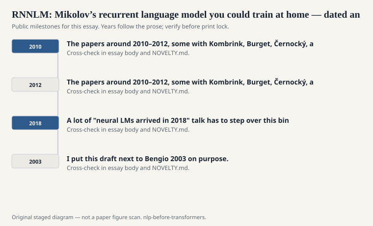
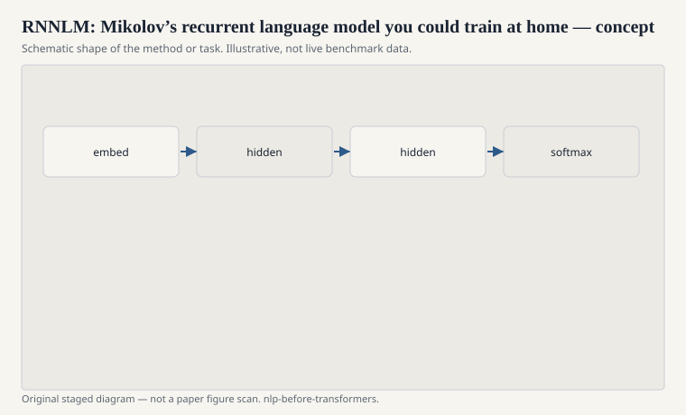

# RNNLM: Mikolov’s recurrent language model you could train at home

Before Word2Vec, Tomas Mikolov’s name was already on a recurrent
neural network language model and a piece of software called RNNLM.
The papers around 2010–2012, some with Kombrink, Burget, Černocký,
and Khudanpur, showed perplexity gains over n-grams and, more
importantly, a culture of interpolation: neural plus count model,
because they fail differently.

<!-- graphics-pack:nlp-bt-v1 -->

<figure class="nlp-bt-figure">

<figcaption>Figure 1. Dated public anchors for this piece. Years follow the essay; verify against the prose before print.</figcaption>
</figure>

<!-- graphics-pack:nlp-bt-v1 -->

<figure class="nlp-bt-figure">

<figcaption>Figure 2. Schematic of the method or task — editorial diagram, not live scores.</figcaption>
</figure>

<!-- graphics-pack:nlp-bt-v1 -->

<figure class="nlp-bt-figure nlp-bt-figure--archival">

<figcaption>Figure 3. Unrolled RNN encoder-decoder training diagram. License: See Commons</figcaption>
</figure>

The software mattered again. You could compile it. You could train
on a reasonable corpus. You could dump probabilities into a speech
decoder. This is the speech-people inheritance with a nonlinear
twist. A lot of "neural LMs arrived in 2018" talk has to step over
this binary.

I put this draft next to Bengio 2003 on purpose. Bengio's net was
feed-forward over a fixed window. RNNLM let the hidden state carry
an unbounded (in theory) past. In practice the past faded. In
practice it still beat a truncated window on a lot of data.
Unbounded in theory plus fading in practice is the recurrent story
in one line. LSTMs would later be sold as the fix for the fade.
They helped. They did not repeal time.

Speech groups listened because perplexity and word error rate still
talked to each other. NLP groups listened because a language model
is a universal component: translation, recognition, even tagging if
you squint. Once a component is universal, a better one is a
career. Mikolov's later skip-gram work looks, from here, like
someone who had spent years on a full language model deciding to
keep the vectors and throw away the expensive softmax. That is
interpretation, not a quotation. It is consistent with the public
trail.

If you want a tactile sense of the era, train a tiny RNNLM and a
trigram on the same held-out text and notice which sentences each
one prefers. The neural model will like some long agreements the
trigram misses. The trigram will be calmer on a rare proper name
it has actually seen. Interpolation is not cowardice. It is
listening to both errors. The 2011 speech papers that blended the
two were not hedging. They were engineering.

The other inheritance is cultural. RNNLM made it ordinary to say
"we trained a neural LM" without being a Toronto or Montreal lab
with a cluster. A student with a GPU, or even without one if the
corpus was small, could join. Accessibility changed who got to
be in the comparison table. That is as much of the 2010–2012
story as any recurrence equation.
