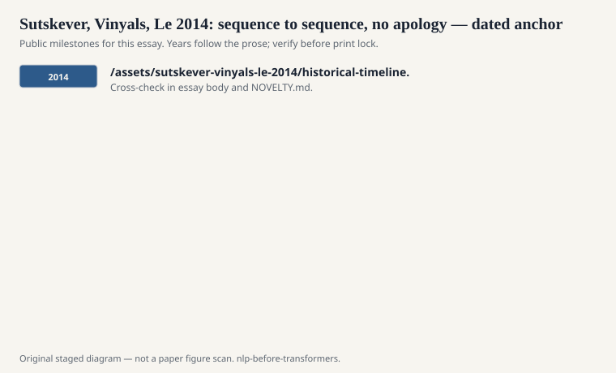
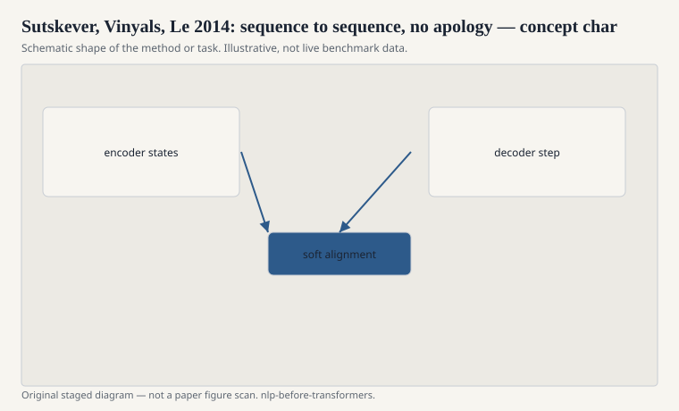

# Sutskever, Vinyals, Le 2014: sequence to sequence, no apology

The NIPS 2014 paper "Sequence to Sequence Learning with
Neural Networks" is a dare. Read a source sentence with
an LSTM. Take the last hidden state. Grow a target
sentence from that state, one token at a time, with
another LSTM. Train it on a lot of bitext. Decode with
a beam. No alignment table. No phrase pairs. No feature
template that says "German verb goes to the end."

<!-- graphics-pack:nlp-bt-v1 -->

<figure class="nlp-bt-figure">

<figcaption>Figure 1. Dated public anchors for this piece. Years follow the essay; verify against the prose before print.</figcaption>
</figure>

<!-- graphics-pack:nlp-bt-v1 -->

<figure class="nlp-bt-figure">

<figcaption>Figure 2. Schematic of the method or task — editorial diagram, not live scores.</figcaption>
</figure>

<!-- graphics-pack:nlp-bt-v1 -->

<figure class="nlp-bt-figure nlp-bt-figure--archival">

<figcaption>Figure 3. Encoder-decoder architecture for seq2seq essays. License: See Commons</figcaption>
</figure>

They reversed the source sentence. That detail is easy
to treat as trivia. It is not trivia. Reversing
shortened the path between early source words and early
target words on English–French. It was a hack that
admitted the real problem: a single vector is a narrow
doorway, and gradients have to walk a hallway to get
through it. When a paper's best trick is "read the
sentence backwards," the architecture is telling on
itself.

I was not calm about this paper when I first read it.
Statistical MT had spent twenty years accumulating
craft. Here was a model that looked under-specified and
still moved BLEU on WMT-sized English–French if you
gave it enough LSTM cells and enough machines.
Under-specified plus expensive is a different research
program than well-specified plus countable. A lot of
people in the Moses world felt insulted. A lot of
people in the neural world felt vindicated. Both
feelings are historical data.

Cho, van Merriënboer, Gulcehre, Bahdanau, Bougares,
Schwenk, and Bengio's encoder–decoder work in the same
season — the GRU paper, the RNNencdec line — belongs
in the same paragraph. The idea was in the water.
Sutskever, Vinyals, and Le's writeup is the one that
said "general sequences" without flinching:
translation, yes, but also any map from tokens to
tokens. That generality is why the name seq2seq stuck
to chat, summarization, and parsing-as-generation
later.

The limitation was public on day one if you looked. A
fixed-size thought vector does not want a thirty-word
sentence. The decoder's language model can drift. Rare
words suffer. Alignment, which IBM Model 1 had treated
as the object, was now an implicit ghost inside the
state. Ghosts are hard to debug. I have watched a
seq2seq model drop a negation and have no phrase table
to accuse.

The next draft is the patch. This draft is the dare.
You can throw away the phrase table if you are willing
to put the entire sentence through a funnel and hope.
For a year or two, a lot of people hoped. Then they
added attention and stopped calling it hope. The dare
still matters. It said the factory could be a pair of
LSTMs. Once someone says that in public, the factory
has to answer.
