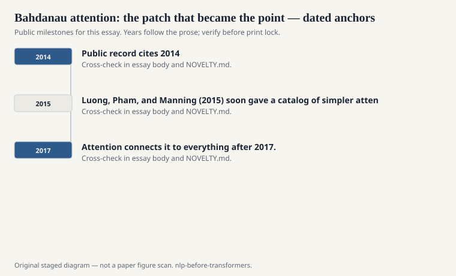
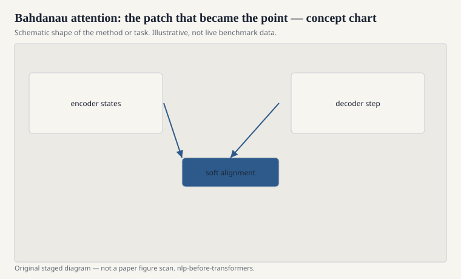

# Bahdanau attention: the patch that became the point

Dzmitry Bahdanau, Kyunghyun Cho, and Yoshua Bengio put the
2014/2015 paper on arXiv as "Neural Machine Translation by
Jointly Learning to Align and Translate." The encoder no
longer had to cram a sentence into one vector. It produced
a vector per source position. At each decoder step, a
small net scored those positions, softmaxed the scores,
and made a weighted sum. That sum was the context.

<!-- graphics-pack:nlp-bt-v1 -->

<figure class="nlp-bt-figure">

<figcaption>Figure 1. Dated public anchors for this piece. Years follow the essay; verify against the prose before print.</figcaption>
</figure>

<!-- graphics-pack:nlp-bt-v1 -->

<figure class="nlp-bt-figure">

<figcaption>Figure 2. Schematic of the method or task — editorial diagram, not live scores.</figcaption>
</figure>

<!-- graphics-pack:nlp-bt-v1 -->

<figure class="nlp-bt-figure nlp-bt-figure--archival">

<figcaption>Figure 3. Attention mechanism in encoder-decoder training. License: See Commons</figcaption>
</figure>

They called it aligning. The field later called it
attention. I try to keep both words. Aligning connects it
to IBM Model 1 and to GIZA++. Attention connects it to
everything after 2017. The mechanism is a soft,
differentiable alignment table learned from the same loss
as the translation. EM used to estimate alignments as a
latent. Here the latent is differentiable and does not
need its own E-step.

The qualitative pictures in that paper — a French
sentence, an English sentence, a heat map — did as much
work as the BLEU table. You could *see* the verb pick up
the verb. You could see the system look back.
Interpretability here is not a philosophy seminar. It is
a debugging tool that also happened to make slides. I
have used those heat maps to find a model that was
looking at the period. Looking at the period is a
confession.

I want to keep the motivation small. Seq2seq without
attention degraded on long sentences. Everyone who
trained one felt it. Bahdanau et al. measured it and
then removed the funnel. That is a conservative paper,
in the best sense. It does not announce a new age. It
fixes a bottleneck and shows the alignments you would
hope for. The new age happened anyway, because once
you can look, you start asking why the encoder itself
has to walk a chain to produce the things you look at.

Luong, Pham, and Manning (2015) soon gave a catalog of
simpler attention flavors. The catalog mattered because
it made the idea a module. Once a thing is a module, it
leaves translation. Summarization, image captions,
speech — the same softmax over memory.

This series stops before self-attention takes over the
encoder itself. That is a later plot. The
pre-transformer fact is already enough. By 2015 the
field had learned that a decoder should be allowed to
look, not only to remember. Looking turned out to be
the more scalable skill. Remembering was the older
virtue. The bruise in the last essay is what happens
when looking is still sitting on top of a hallway.
