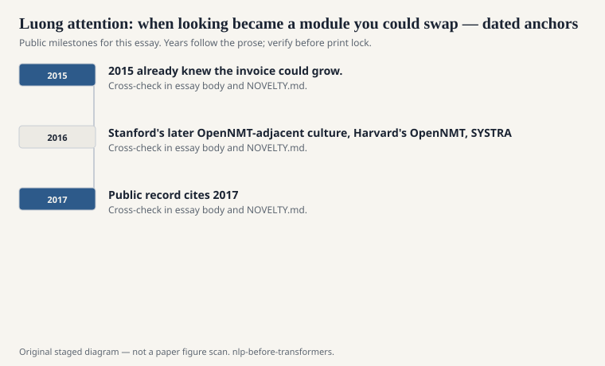
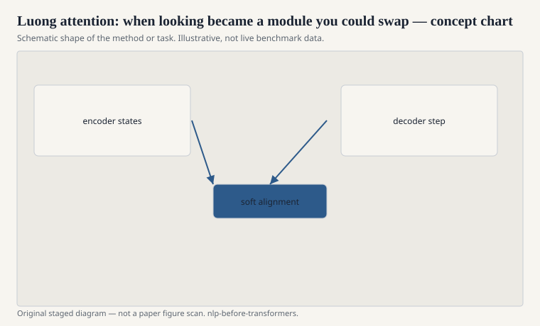

# Luong attention: when looking became a module you could swap

Minh-Thang Luong, Hieu Pham, and Christopher Manning's
2015 EMNLP paper is the one I hand people who want to
implement attention without drowning in the Bahdanau
notation. Score functions are listed: dot product,
general, concat. Global versus local is listed.
Input-feeding — letting the previous attention context
back into the next decoder state — is listed. The tone
is "here is the kit."

<!-- graphics-pack:nlp-bt-v1 -->

<figure class="nlp-bt-figure">

<figcaption>Figure 1. Dated public anchors for this piece. Years follow the essay; verify against the prose before print.</figcaption>
</figure>

<!-- graphics-pack:nlp-bt-v1 -->

<figure class="nlp-bt-figure">

<figcaption>Figure 2. Schematic of the method or task — editorial diagram, not live scores.</figcaption>
</figure>

<!-- graphics-pack:nlp-bt-v1 -->

<figure class="nlp-bt-figure nlp-bt-figure--archival">

<figcaption>Figure 3. Attention mechanism in encoder-decoder training. License: See Commons</figcaption>
</figure>

Local attention was an attempt to keep the cost from
growing with source length: predict a pivot, look in a
window. It is easy to skip in retrospect because full
attention won on the sentence lengths people actually
used in WMT. The impulse was right. Cost would come
back as a plot problem later, under a different
architecture, when the sequences got longer than a
newswire sentence. 2015 already knew the invoice could
grow.

Stanford's later OpenNMT-adjacent culture, Harvard's
OpenNMT, SYSTRAN's involvement, Google's production NMT
announcements in 2016 — I will not turn those into a
corporate scorecard. The public fact is that by 2016
you could download a seq2seq-with-attention trainer.
Moses no longer had the only serious open pipeline. A
student who had never written a phrase-extraction
script could train a translation model and get a BLEU
number. That changes who is in the room.

I like input-feeding as a historical tell. It admits
that the decoder state, by itself, forgets what it
just looked at. So you pass the look back in. A lot
of "architectural innovations" of that period are
memory aids for a recurrent core that is trying its
best. Once the core stops being recurrent, some of
the aids become unnecessary. Some become the core.
You can watch that migration if you keep the dates
straight.

If Bahdanau is the existence proof, Luong is the API.
APIs change fields. People who would not have derived
an alignment model from first principles could now
type a class name and join the comparison table on
WMT. That is not a lowering of standards. It is how
a method stops being a paper and becomes a default.

Keep the date. 2015 is not 2017. The models are still
recurrent. Training is still fiddly. Byte-pair
encoding (Sennrich, Haddow, Birch, 2016) is about to
make the vocabulary less cursed. The stack that later
architectures inherit is almost assembled: subwords,
attention, a generation loss, a beam. The missing
replacement is the recurrent hallway itself. This
draft is the kit on the table before someone removes
the hallway.
