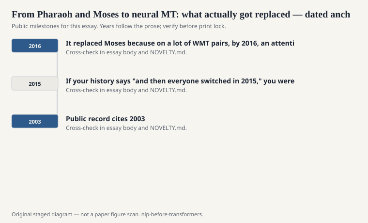
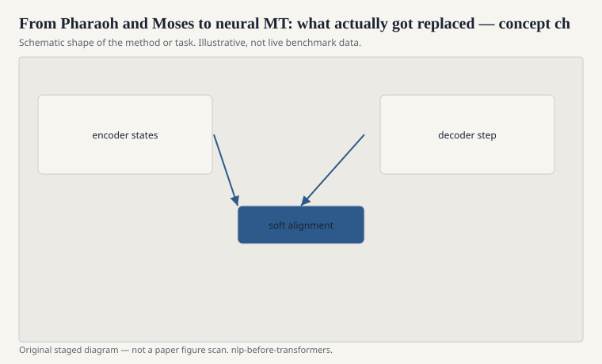

# From Pharaoh and Moses to neural MT: what actually got replaced

Philipp Koehn's Pharaoh decoder and then the Moses toolkit (with
Hieu Hoang, Alexandra Birch, Chris Callison-Burch, and a long
list of contributors) were the public factory of statistical
machine translation in the 2000s. You aligned with GIZA++. You
extracted phrase pairs. You built a target language model. You
tuned weights, often with Franz Josef Och's MERT, later with
kinder optimizers. You decoded. You shipped something a
government or a company could run.

<!-- graphics-pack:nlp-bt-v1 -->

<figure class="nlp-bt-figure">

<figcaption>Figure 1. Dated public anchors for this piece. Years follow the essay; verify against the prose before print.</figcaption>
</figure>

<!-- graphics-pack:nlp-bt-v1 -->

<figure class="nlp-bt-figure">

<figcaption>Figure 2. Schematic of the method or task — editorial diagram, not live scores.</figcaption>
</figure>

<!-- graphics-pack:nlp-bt-v1 -->

<figure class="nlp-bt-figure nlp-bt-figure--archival">

<figcaption>Figure 3. Phrase / word alignment for Moses-to-NMT essays. License: See Commons</figcaption>
</figure>

That factory had a smell. Phrase tables on disk. Tuning that
could overfit a small development set. A hundred knobs. Also:
you could open the phrase table and *see* that "maison blanche"
liked "White House" in a political corpus. The system was wrong
in a way you could pursue with grep. I miss that more than I
miss the BLEU scores.

Neural MT did not replace Moses because Moses was unserious. It
replaced Moses because on a lot of WMT pairs, by 2016, an
attentional seq2seq model scored higher and needed less feature
engineering from you, provided you had GPUs and a subword
recipe. Google's 2016 production NMT paper (Wu and many
colleagues) is the industrial public marker. Research had
already been leaning. The marker matters because it told
everyone the factory had a successor, not just a workshop
rival.

What got lost, for a while, was intervenability. You cannot
grep a 512-dimensional state for a bad idiom. What got gained
was fluency, especially on morphology and on reordering that
phrase pairs had to memorize the hard way. German verbs, Czech
agreement, Japanese honorifics — SMT could do them with enough
table. NMT did them with enough data and a prayer about rare
words.

I do not tell this as a morality play. Plenty of production MT
in 2016 was still a hybrid: neural language models in a
statistical decoder, or SMT lattices rescored by an LSTM.
Hybrids are how factories actually change. Overnight
replacements are how keynotes change. If your history says
"and then everyone switched in 2015," you were at the keynote.

If you want the pre-transformer ending in one workshop memory:
a Moses baseline, a seq2seq-plus-attention challenger, a BLEU
table, an argument about whether BLEU was allowed to decide
the argument. That workshop *is* the field in 2015. The next
year the challenger was the baseline. The phrase table went
from being the system to being the thing you used to debug
the system, and then, too often, to being nothing at all.
