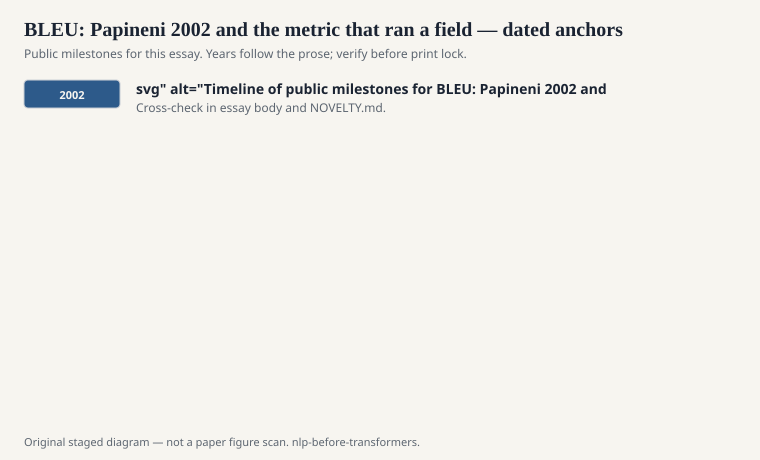
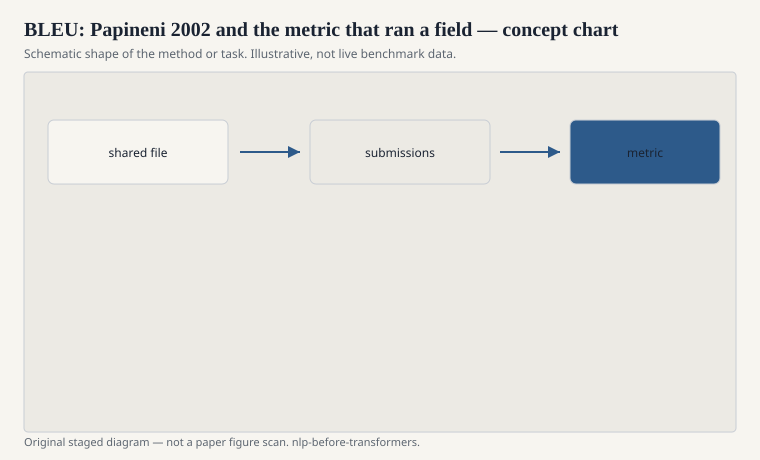

# BLEU: Papineni 2002 and the metric that ran a field

Kishore Papineni, Salim Roukos, Todd Ward, and Wei-Jing Zhu,
ACL 2002. BLEU is a modified n-gram precision against one or
more references, plus a brevity penalty so you cannot win by
emitting nothing but safe unigrams. That is the whole object.
It is cheap. It correlated decently with human judgments on
the conditions they tested. It became a king.

<!-- graphics-pack:nlp-bt-v1 -->

<figure class="nlp-bt-figure">

<figcaption>Figure 1. Dated public anchors for this piece. Years follow the essay; verify against the prose before print.</figcaption>
</figure>

<!-- graphics-pack:nlp-bt-v1 -->

<figure class="nlp-bt-figure">

<figcaption>Figure 2. Schematic of the method or task — editorial diagram, not live scores.</figcaption>
</figure>

<!-- graphics-pack:nlp-bt-v1 -->

<figure class="nlp-bt-figure nlp-bt-figure--archival">

<figcaption>Figure 3. N-gram overlap metaphor via aligned tokens. License: See Commons</figcaption>
</figure>

I have a split mind. Without a cheap automatic metric,
statistical MT cannot tune. MERT needs a number. Shared
tasks need a ranking. BLEU gave the 2000s a scoreboard, and
scoreboards create fields. With BLEU as king, systems learned
to game n-gram overlap. Fluent wrong translations that missed
a synonym could look worse than awkward right ones that
shared words with the reference. A metric trains the field
that uses it.

The original paper is more careful than its later users.
Multiple references. A warning that the metric is for
system-level comparison, not for trusting a single sentence.
The later users needed a single number for a table. The
warning lost. I have seen people report BLEU to two decimal
places on a test set of a few hundred sentences and argue
about the second decimal. That is numerology.

Other metrics tried to help. TER, METEOR (with stemming and
synonyms), later chrF, later still learned metrics I will
not drag into this pre-transformer box as if they were
settled. Human evaluation never went away. It just could
not sit in every optimizer loop. A loop wants something
cheap and differentiable, or at least something you can
call a hundred times overnight.

When neural MT started winning BLEU, some people said the
problem was solved. Some people said BLEU was now favoring
fluency the way it once favored phrase overlap. Both
complaints can be true at once. A metric is not a court of
appeal. It is a compressed agreement about what "closer to
the reference" means. References are themselves a sample.

If you write about pre-transformer NLP and you skip BLEU,
you skip the loss function of a decade of MT. Shannon gave
perplexity. Papineni gave a translation score a sponsor
could read. The sponsor part is not cynical. It is how
ALPAC's ghost gets answered: here is a number, here is a
test set, argue with those. Just remember that the ghost
can also possess the number.
