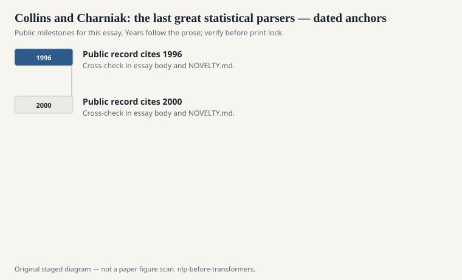
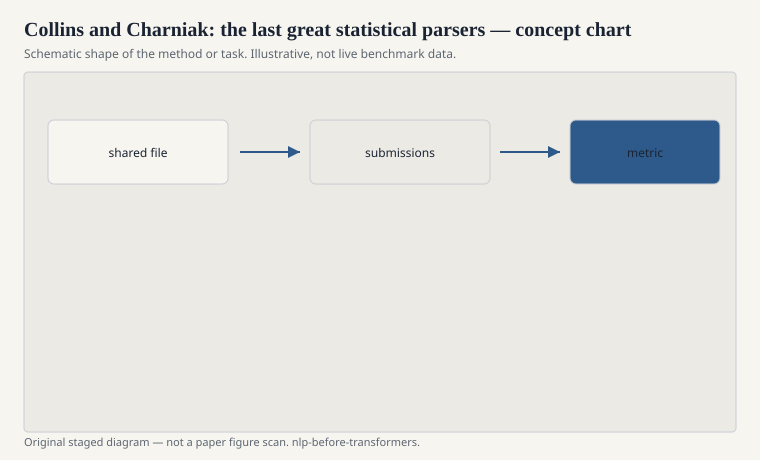

# Collins and Charniak: the last great statistical parsers

Once the Penn Treebank existed, parsing became a likelihood. Eugene
Charniak and Michael Collins, in different styles through the late
1990s, built parsers that treated trees as things you could score
with carefully factored probabilities: head-word dependencies,
lexicalized PCFGs, features that a pure context-free grammar would
have called cheating.

<!-- graphics-pack:nlp-bt-v1 -->

<figure class="nlp-bt-figure">

<figcaption>Figure 1. Dated public anchors for this piece. Years follow the essay; verify against the prose before print.</figcaption>
</figure>

<!-- graphics-pack:nlp-bt-v1 -->

<figure class="nlp-bt-figure">

<figcaption>Figure 2. Schematic of the method or task — editorial diagram, not live scores.</figcaption>
</figure>

<!-- graphics-pack:nlp-bt-v1 -->

<figure class="nlp-bt-figure nlp-bt-figure--archival">

<figcaption>Figure 3. Phrase-structure tree for treebank / parser essays. License: Public domain</figcaption>
</figure>

Lexicalization is the heart. A vanilla PCFG says an NP can expand
to DT NN and does not care which NN. That is why vanilla PCFGs are
mediocre on real text. A lexicalized model says this NP is headed
by "company" or "stock" and the attachments change. The grammar
wakes up. The parameter space also explodes, so smoothing — that
word again — becomes the craft. Unseen head-argument pairs are the
whole job, just as unseen n-grams were the whole job for language
models.

I have a fondness for these parsers that is not nostalgia. They
made linguistic structure compatible with the speech people's
religion of likelihood without giving up the tree. You could still
draw a constituent. You could also train. Collins's models, in
particular, factored the generation of a tree into a sequence of
decisions about heads and modifiers that you can read as a story
if you sit still. Charniak's parser had a different engineering
smell — a bit more "throw a good generative model at WSJ and then
rerank" — and it moved the number.

The numbers moved into the high eighties F1 on WSJ sections
everyone memorized (23 for test, 22 for development, in the
culture). Those numbers became a ceiling people chased with
rerankers and self-training (Charniak and Johnson; later McClosky,
Charniak, and Johnson). The chase was real science. It was also a
closed room. Improve a point on section 23, write a paper, do not
ask whether the next genre would move the same way.

Dependency parsers offered another sport: arcs instead of
constituents, sometimes faster, sometimes closer to what a
downstream extraction system wanted. The last great statistical
constituency parsers did not lose because they were foolish. They
lost the spotlight when neural parsers, and then later encoder
stacks, made the feature engineering look optional. Optional is
not the same as wrong. A head-factored generative story is still
a way to think when a black-box parse comes back implausible.

Read Collins's thesis-era papers if you want to see care. The
factorizations are not arbitrary. They are a person trying to put
heads and arguments into a generative story that will not starve
on unseen word pairs. That is the same dignity as Kneser–Ney,
applied to trees. The field should remember it as craft, not as
a discarded fashion.
