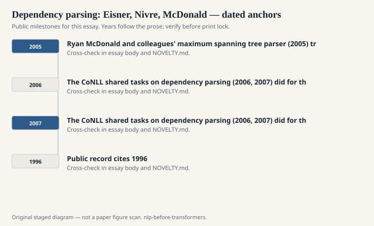
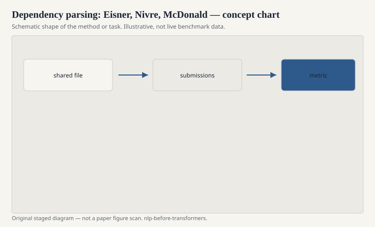

# Dependency parsing: Eisner, Nivre, McDonald

A dependency tree is a set of arcs from heads to dependents. There is no
internal NP node unless you decide you want one. For a lot of languages,
and for a lot of information extraction, that is the structure you
actually use. "Who did what to whom" is an arc, not a constituent
bracket.

<!-- graphics-pack:nlp-bt-v1 -->

<figure class="nlp-bt-figure">

<figcaption>Figure 1. Dated public anchors for this piece. Years follow the essay; verify against the prose before print.</figcaption>
</figure>

<!-- graphics-pack:nlp-bt-v1 -->

<figure class="nlp-bt-figure">

<figcaption>Figure 2. Schematic of the method or task — editorial diagram, not live scores.</figcaption>
</figure>

<!-- graphics-pack:nlp-bt-v1 -->

<figure class="nlp-bt-figure nlp-bt-figure--archival">

<figcaption>Figure 3. Tree diagram as dependency-parsing visual shorthand. License: Public domain</figcaption>
</figure>

Jason Eisner's 1990s dynamic programs gave projective dependency parsing
a cubic method with a clean recurrence. The projectivity assumption —
arcs do not cross — is true enough for English newspaper text and false
enough for languages with freer word order that you cannot treat it as
nature. Eisner made the projective case computable without apology.

Joakim Nivre's transition systems (arc-standard, arc-eager, and the
later family) made parsing look like a sequence of stack operations you
could learn with a classifier. Shift. Left-arc. Right-arc. The sentence
is a buffer. The stack is a workbench. A linear classifier, later a
feed-forward net, picks the next action from features of the top of the
stack and the front of the buffer. MaltParser shipped this attitude.
It was fast. It was greedy unless you added a beam. It made mistakes
that started early and never recovered, which is the honest cost of
greed.

Ryan McDonald and colleagues' maximum spanning tree parser (2005)
treated the sentence as a directed graph and found the best tree under
arc scores. Chu–Liu/Edmonds for the non-projective case. The model
could draw a crossing arc if the scores wanted one. That is not a
bug for Czech. It is the point.

I like this trio because they disagree usefully. Eisner is exactness
under assumptions. Nivre is linear-time craft you can put in a pipeline
that already has ten other stages. McDonald is global scoring of arcs.
In the 2000s you could pick a personality and still be in the same
sport.

The CoNLL shared tasks on dependency parsing (2006, 2007) did for this
sport what CoNLL-03 did for NER. Many languages. A standard column
format that still haunts files. A ranking. MaltParser and MSTParser
became verbs. People argued about labeled attachment score the way MT
people argued about BLEU: too much, and still the number you needed
to exist in the room.

Feature templates for transition parsers were a craft of their own.
The top two stack words, their POS tags, a Brown cluster, a distance,
whether the arc would create a cycle — you can feel the CRF years in
that list. Neural transition-based and graph-based parsers later
replaced the templates with BiLSTM states. The objects remained. A
stack, a buffer, an arc score. When a modern system emits a dependency
tree, it is speaking this dialect whether or not the citation is polite.

There is a conversion industry I will only name. Constituency trees
can be turned into dependencies by taking heads. Dependencies can be
turned into something constituent-like if you are willing to invent
nodes. The conversions leak. A shared task that scores dependencies
is not secretly scoring Penn Treebank F1. Do not pretend they are
the same gold.

The pre-transformer lesson is practical. If your downstream task wants
arguments of a verb, constituents are a lovely intermediate and
dependencies are often the interface. The 2000s figured that out in
public, with scores, and with three algorithms that refused to be
the same algorithm.
