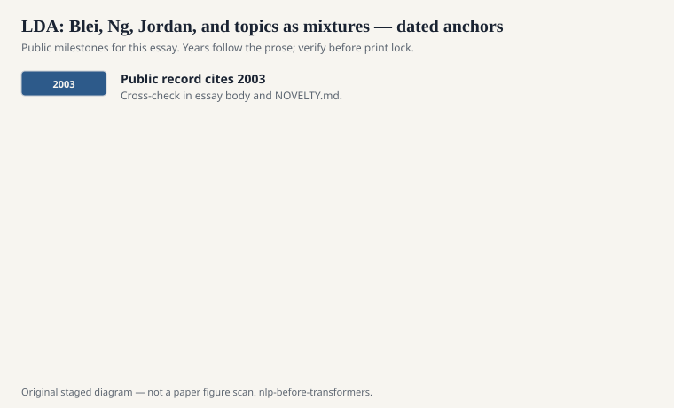
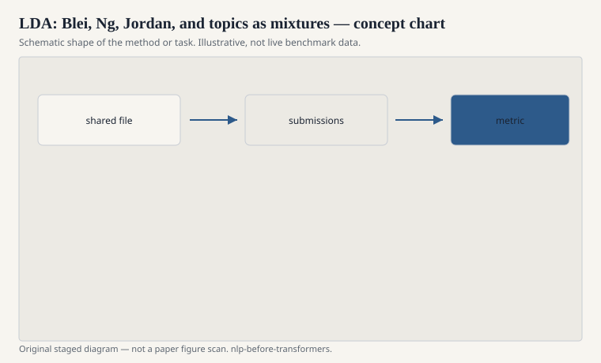

# LDA: Blei, Ng, Jordan, and topics as mixtures

Latent Dirichlet Allocation (David Blei, Andrew Ng, Michael Jordan,
*Journal of Machine Learning Research*, 2003) gave the 2000s a default
way to say "what is this collection about" without a label set. A
document is a mixture of topics. A topic is a distribution over words.
The Dirichlet priors keep the mixtures from going uniform and sloppy.
You infer with variational methods or Gibbs sampling, then you stare
at the top words.

<!-- graphics-pack:nlp-bt-v1 -->

<figure class="nlp-bt-figure">

<figcaption>Figure 1. Dated public anchors for this piece. Years follow the essay; verify against the prose before print.</figcaption>
</figure>

<!-- graphics-pack:nlp-bt-v1 -->

<figure class="nlp-bt-figure">

<figcaption>Figure 2. Schematic of the method or task — editorial diagram, not live scores.</figcaption>
</figure>

<!-- graphics-pack:nlp-bt-v1 -->

<figure class="nlp-bt-figure nlp-bt-figure--archival">

<figcaption>Figure 3. Latent Dirichlet allocation generative plate. License: See Commons</figcaption>
</figure>

I have stared at a lot of top words. Sometimes you get a clean
"sports" column and a clean "finance" column. Sometimes you get a
topic that is just the footer boilerplate of a web crawl, or the
month names, or a pile of function words you forgot to stop-list.
The model is not trying to please your ontology. It is trying to
explain counts. If the counts are garbage, the topics will be
eloquent garbage.

LDA sits next to LSA in this history and disagrees with it. LSA's
latent directions are not distributions and do not generate words in
a proper probabilistic story. LDA's do. That story made the model
extendable: author-topic, dynamic topic models, correlated topic
models, supervised variants. The Blei lineage became a workshop
economy. A new plate diagram was a paper. Some of those papers
earned their plates. Some of them were the same stew with a new
side dish.

NLP people used LDA as a feature factory more than as a theory of
meaning. Topic proportions went into classifiers, into browsing
interfaces, into a "what changed this month" dashboard. Political
science and digital humanities used it as a measurement instrument,
which is a heavier claim and not one I will adjudicate here. The
public caution is the same as with Word2Vec neighbors: the topics
are a compression of your corpus's habits, including its OCR errors
and its house style.

Hyperparameters were not a footnote. The Dirichlet concentration
changes whether documents look like one topic or like soup. The
topic count *K* is a knob people treated as a discovery. It is a
resolution choice. Run *K*=20 and *K*=100 on the same corpus and
you have not found two truths. You have chosen two print sizes.

Why include this in a before-transformers series? Because
unsupervised structure over bags of words was a major 2000s sport,
and because a lot of later "the model discovered concepts" talk has
an older, more honest cousin in a list of top words you can laugh
at. Laughter is a validity check. If you cannot laugh at a topic
that came out as "said, mr, would, new, also," you are not looking.

The other honest cousin is this: LDA does not read order. "Dog
bites man" and "man bites dog" are the same bag. For topical
browsing that is often fine. For anything that cares who did the
biting, you wanted a parser, not a mixture. The 2000s had both
tools on the same belt. Mixing them up was the mistake, not
building either one.
