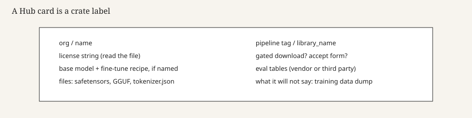

# The Hub as a distribution system

By 2020–2021 the Hugging Face website was no longer a landing page for a library. It was a CDN, a git server for large files (Git-LFS), a card renderer, a permissions layer, and a search box. `huggingface_hub` as a standalone client arrived in that window. `from_pretrained` stopped meaning “fetch our S3 dict” and started meaning “resolve a repo id.” The Hub is a distribution system. Treat it like one.

*Figure 5. The card is the crate label. The git repo is the crate.*

## Git for weights

A model repo is a git repo with LFS pointers. That decision is why versions exist, why a commit hash is a pin, why a broken upload can be reverted, and why people still blow disk on `.git`. It is also why a card and a set of `safetensors` shards can travel together. The alternative — a faculty URL, a Google Drive, a Discord link — is how 2016 Caffe and 2023 LLaMA leaks circulated. The Hub is the legal, boring version of that circulation.

`safetensors` (Hugging Face, Apache 2.0) later made the file itself less of a pickle bomb. Distribution and safety met in a format. PyTorch pickle checkpoints still exist. Serious cards prefer the new noun.

## Gates, orgs, and the landlord

A gated repo asks you to accept a license and, sometimes, to be logged in. Meta’s Llama cards are the famous gates. Plenty of smaller gates exist. The click is not a download. It is a record. Shops that automate the click should know what they are automating.

Organizations — `meta-llama`, `mistralai`, `Qwen`, `deepseek-ai`, `google` — are the modern model zoos. The Hub did not invent orgs. It made them the namespace people type.

The landlord can take a repo down. The landlord can be compelled. “It’s on the Hub” is not an archival plan. Hugging Face is a company with a legal department. A serious shop mirrors what it depends on (`what-a-license-actually-permits`).

## Spaces, inference widgets, and the social layer

Spaces (Gradio / Streamlit apps) made a model a demo. The inference widget made a model a text box. Likes and downloads made a model a popularity contest. Those features are why the Hub won and why the Hub is noisy. A distribution system that is also a social network will promote a GGUF remix over a careful base card. Search is a skill.

## What the Hub is not

It is not a license. It is not a peer-review venue. It is not TensorFlow Hub, which still exists and is not this. It is not PyTorch Hub, which still exists and is not this. It is not the training data. It is a website plus a client plus a lot of disks.

## 2026 look

`huggingface.co/org/name` is the citation format of the open-weight years. Papers write it in footnotes. Blogs write it in monospace. A GGUF mirror under a different org is a different crate with a different trust story, even if the architecture matches.

Read a card the way you read a shipping manifest: license file, gated?, base model, file list, commit. Then pin the commit in your trainer. Floating `latest` is how a shop wakes up to a new tokenizer and a silent regression.

The `huggingface_hub` docs and the git-LFS layout of any large model repo are the primary objects. Marketing posts about “the GitHub of ML” are optional and usually skip the gate.

## LFS, forks, and the cost of a social git

A model repo that is also a git repo means forks duplicate LFS pointers and sometimes the blobs. People fork to fix a card and accidentally fork 70 GB. The Hub has mitigations. The mitigation is not perfect. Treat a model fork as a serious act.

`revision="main"` is how a trainer changes under you. Pin a commit. Write the commit in the paper. If the card moves to `safetensors` and deletes the pickle, your unpinned job dies. That death is earned.

## Rate limits and the mirror

Anonymous downloads, authenticated downloads, enterprise. A CI that pulls a 70B on every commit will meet a limit. A mirror in your object store is not a luxury. It is how a company keeps training when a website blinks. The 2018 S3 dict was already a CDN. The Hub is a CDN with a login.

## Widgets as a quality theater

An inference widget that uses a different template, a shorter context, or a hosted quantized copy is not the model you will serve. Demos are useful. They are not evals. A like count is not a bench. The social layer is why the Hub won. It is also why the Hub is a noisy crate store. Learn to search by org and by `library_name`. Learn to ignore the rest.

## Gating as a UX for a PDF

A gate that makes you click “I agree” is a UX for a license the field would not otherwise open. It is also a database of who agreed. Meta’s Llama gates are the famous ones. Smaller gates exist for medical and for vanity. If your CI clicks the gate with a token, you have automated an agreement. Write down who authorized that.

A public card with no gate is a different crate. Do not assume the next generation of the same brand stays ungated.

## Sources

Hugging Face Hub and `huggingface_hub` documentation. `safetensors` README. Mitchell et al. 2019 (card genre). Llama, Mistral, Qwen org pages as examples of gated vs ungated.

See: `bert-gpt2-model-cards`, `transformers-library-2018`, `licenses-that-are-not-open`, `llama-february-2023`.
