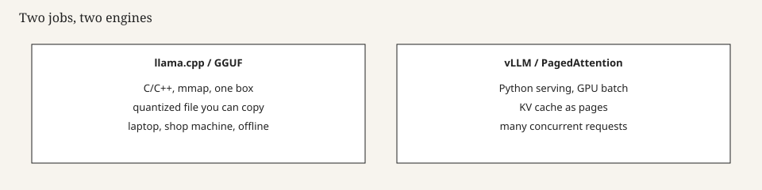

# llama.cpp and GGUF

Georgi Gerganov’s first `llama.cpp` commit, titled “Initial release,” is 10 March 2023 — a week after the LLaMA torrent (`llama-february-2023`). The tree that day is a Makefile, `ggml.c`, `main.cpp`, a quantizer, and `convert-pth-to-ggml.py`. Minimal dependencies, 4-bit weights, a bias toward machines you already owned. The first weeks were a CPU and then a MacBook story: Metal, then CUDA, then everything. `whisper.cpp` had already shown the habit: take a popular model, write a small engine, ignore the Python cathedral. `llama.cpp` did it at the moment the weights were suddenly everywhere. The convert script’s job — PyTorch `.pth` to a ggml file you could quantize — is the joint that later became a pile of `convert-*-to-gguf.py` helpers and then a single convert path. The joint stayed. The filenames changed.

On 21 August 2023 pull request 2398 landed GGUF — a single-file container for tensors and key–value metadata, magic `GGUF`, a replacement for the moving-target GGML / GGMF / GGJT files. You could copy one file. You could `mmap` it. You could version it by filename. Architecture flags and tokenizer tables lived in the file instead of in the loader. That is why adding Mistral, Falcon, and later everybody did not require a new binary for every new hyperparameter.

*Figure 4. Two jobs. This chapter is the left box.*

## Why C++ was the intervention

PyTorch can run LLaMA. It wants a Python env, a CUDA stack, and more RAM than a quantized file wants. Gerganov’s runner made inference a binary. ggml, the tensor library underneath, became a company story (ggml.ai, pre-seed from Nat Friedman and Daniel Gross, per the project’s own site). The engine stayed public. Funding did not make the file format a product SKU. It made the maintainer less of a nights-and-weekends accident.

Quantization names — `Q4_K_M`, `Q5_K_M`, `Q8_0` — became shop slang. Quality loss is real, especially on code and arithmetic. People who compare a GGUF chat to an API chat without naming the quant are comparing two different objects. `Q4_K_M` is the folklore default. `F16` is a GGUF that is barely a quant. The format made the quant a filename. Use the filename.

## GGUF as a crate

A GGUF carries what TFLite’s flatbuffer carries for a different era: enough metadata to run without the training repo. Hugging Face filled with `*Q4_K_M.gguf` uploads. The Hub became a GGUF CDN (`hub-as-distribution`). `TheBloke` (and later other quant orgs) became a distribution system inside the distribution system. Trust the org, or re-convert yourself from official `safetensors`. The convert scripts live in the repo. Use them if the card matters.

mmap is why a USB-shaped workflow exists. You can run off a disk without a full RAM copy of the weights. It is also why a slow disk makes a slow first token. People who blame the model for a USB 2.0 stick should blame the stick. Directories of JSON plus shards are better for training. A single file is better for a bag. Know which you are packing.

## What llama.cpp is not

It is not a trainer. It is not a high-concurrency server, though people have tried. It is not vLLM (`vllm-paged-attention`). It is not a license grant. A GGUF of Llama 2 is still Llama 2. The convert script does not wash the PDF.

Ollama (`ollama-local-box`) sits on this engine. LM Studio sits on this engine. A lot of “I run local models” sentences are this engine with a coat of paint. The project’s habit is to run on what you have — CUDA, Metal, Vulkan, CPU. That habit is why it beat PyTorch for the laptop job. It is also why a bug can be backend-specific. File the issue with the backend name.

## 2026 look

Red Hat’s 2025–2026 developer notes still use the same split: `llama.cpp` for a box, vLLM for a queue. The star-count folklore is optional. The file on disk is not. If you find a `.gguf` in a tree, you are looking at the 2023 intervention, even if the weights inside are Gemma 4 or gpt-oss.

Read the 10 March 2023 commit, the 21 August 2023 GGUF merge, and the current README. Gerganov’s changelog podcast (2024) is secondary color. The binary is the primary source.

## Sources

ggerganov/llama.cpp `26c0846`, 10 March 2023. llama.cpp #2398 / commit `6381d4e`, 21 August 2023 (GGUF). ggml.ai company page (funding claim). Red Hat Developer, llama.cpp vs vLLM, 2025–2026.

See: `llama-february-2023`, `ollama-local-box`, `vllm-paged-attention`, `hub-as-distribution`.
