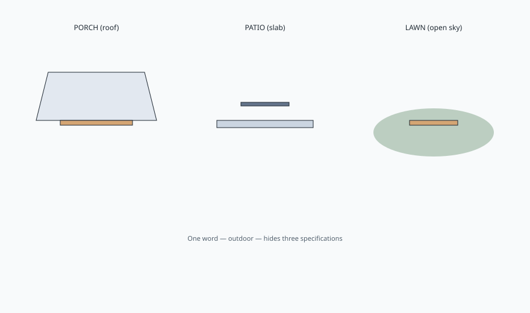

<!-- ogfh-figure:v1 -->
<figure class="ogfh-figure ogfh-figure--diagram">
  
  <figcaption><strong>Fig. 1.</strong> Porch, patio, and open lawn are three assignments of roof, splash, and ultraviolet. Using one word — outdoor — for all three is how a room gets the wrong object. <em>Rights:</em> Original editorial schematic; Keith Fritz / BBF outdoor-garden-furniture-history pack (see RIGHTS.md).</figcaption>
</figure>

Call the place by its roof, or admit it has none.

A porch is a room that kept a ceiling and gave up two or three walls. It still has a floor that can be wood. It still has shade. Rain arrives as splash and blow, not as a vertical argument all day. Ultraviolet is partial. A rocking chair can live there for decades if the paint is honest and the floor is not a swamp. I have sat on porches in southern Indiana that were doing parlor work with a draft. That is a climate.

A patio is a floor. Flagstone, brick, poured concrete, sometimes a deck pretending to be a patio because the word photographs better. There is sky. There may be an umbrella, which is a textile with a pole, not a roof. Water sits. Sun sits. The chair sits in both. A patio is closer to a ship deck than to a living room. If you furnish it like a living room, you will own a living-room finish that failed outdoors.

An open lawn is worse and older. The English bench on a rise, the stone slab under an oak, the cast-iron seat that stained a Sunday dress in 1870 and will stain one now. No drip edge. No porch board. Dew in the morning, heat at noon, a mower that throws a stone at the stretcher. Lawn furniture is landscape furniture. It has to look like it belongs to the grass or it looks like a dining set that got lost.

Those three climates keep getting one catalog word: outdoor. Outdoor is a department. It is not a specification. I can build you a mahogany dining table that will live a century indoors if you do not abuse it. I cannot take that same film system, that same hide-glue habit, that same padded seat, and wish it onto a patio because the photograph had hydrangeas.

The shop questions follow the climate.

Does it have a roof.
How much of the day is the sun a vertical hit.
Where does water sit after it rains — on the seat, in the cup of a slat, against a post.
What is the winter, really. A cover is not a climate. A garage is a climate. A porch that still leaks is a porch that still leaks.

I have seen "outdoor living rooms" specified with indoor depths and indoor woods and a note that says the client entertains. Entertaining does not waterproof a mortise. If the evening is a covered porch, you are closer to Stickley than to a pool distributor. If the evening is a slab by a grill, you are in metal, teak, sling, or a wood that already voted for rot resistance. If the evening is a view on a hill, you are in stone or a bench that can be left, because carrying a seven-foot teak table up a wet lawn twice a year is how pieces get abandoned in November.

BBF collections can show a bench, a table, a chair. Those pages sit beside this distinction. They cannot erase it. A collection photograph taken under a porch roof is not evidence that the same object will live on a south slab in Missouri. Adjacent history only helps if the climate word stays attached to the object.

I will ask the climate question twice because people answer with a zip code. A zip code is not a roof. Two houses on the same street can have a porch and a slab. The furniture does not care that they share a mail route. It cares whether the sky is a ceiling. Say the ceiling. Then say the zip if you want the freeze and the pollen. Both matter. The ceiling matters first.

Three climates. Three assignments. One lazy word that keeps trying to do all three jobs. Take the word away. Name the roof. Then we can talk about teak.

The next draft is who is talking, because a shop that builds indoor work has to say what it will not invent about the garden.
