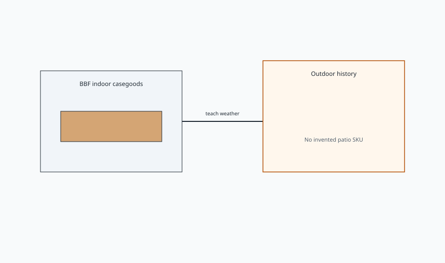

<!-- ogfh-figure:v1 -->
<figure class="ogfh-figure ogfh-figure--diagram">
  
  <figcaption><strong>Fig. 1.</strong> A custom indoor shop can teach outdoor furniture as weather, wood, metal, and honesty. It cannot narrate a patio line it does not build or a chemical warranty it does not print. <em>Rights:</em> Original editorial schematic; Keith Fritz / BBF outdoor-garden-furniture-history pack (see RIGHTS.md).</figcaption>
</figure>

I should tell you who is talking, because garden copy has a habit of putting a linen shirt on a script and calling it a craftsman.

My name is on the door. Keith Fritz Fine Furniture. We started in 1999. The first shop was a storefront on Capitol Hill in Washington. I lived above it. I still live above the shop. The building is different. It is a nineteenth-century factory in Ferdinand, Indiana, about thirty-three thousand square feet, and the wood comes in the back and the finished work leaves the front on our own trucks. We make indoor pieces to order — tables, casegoods, the work a designer can put a hand on in a showroom two states away.

I am the son of a carpenter. I grew up in Siberia, Indiana, which is a real place. I made a bombé Chippendale secretary at sixteen because I did not yet know how long a complicated piece takes when you refuse to stop. I went to seminary and graduate school and then I opened a shop anyway. In 2001 we built a dining table for President Clinton. I mention that once so we can put it down. It is a true job. It is not a thesis about teak.

Here is what I will not do in this series.

I will not invent a Keith Fritz garden collection. We do not run a patio SKU list. If a BBF collection page sits next to these drafts, it sits as a neighbor — indoor forms, indoor finishes, indoor honesty — not as proof we pour aluminum chairs in the back bay.

I will not invent a named outdoor suite we built for a celebrity lawn. Public history is public. Our private benches stay private unless they are already on the record.

I will not read you a chemical warranty as if this shop printed it. Pressure-treated tags, powder-coat data sheets, sling-fabric UV hours — those belong to the companies that bake and weave them. I can tell you what a film does in sun because I have watched films die indoors, and sun is a harsher version of the same argument. I cannot be the EPA, the foundry, or the resin mill.

I will not talk like a pool catalog. Stackable is a real virtue. "Resort-inspired" is a mood. Moods do not specify a fastener.

What I can teach is the map this shop is paid to know. Wood movement. Joinery that either takes water or hides a future split. Finish as a system, not a color. The difference between a piece that can leave on a truck and a thing that is architecture. Those duties do not stop at the threshold. They get louder. Outdoor is indoor's exam.

Southern Indiana is a useful teacher. We have humidity that swells a door in July and a dry January that shrinks it. We have freeze. We have a sun that is not Arizona and is still enough to chalk a cheap film on a south face. I have walked porches here that were doing fine with paint and a roof, and I have seen patio sets two counties over that were white metal ghosts by year four. That is not a brand story. That is a climate I live in.

We sell through designer showrooms. That sentence still does a lot of work. It means an interior designer is often the person who writes the indoor order. It means a homeowner who wants a garden bench may never walk our floor, and that is fine. This channel is not a back door around the showroom. It is a place where the words get their jobs back so that when someone does ask for "something outdoor," the room can say porch or patio, teak or aluminum, film or oil, and not smile through a lie.

If you came here for a tour of pretty lawns, there will be pretty lawns. They will show up as evidence. The product is the history and the material. I want a younger maker to stop sending an indoor varnish into a job built for a ship deck. I want a buyer to stop calling a silvered teak bench neglected before they know silver is what teak does when you leave it alone. I want the channel to be a place where weather is allowed to be the client.

That is who is talking. A shop. A door. A person who has been paid to make the quiet indoors, and who is tired of watching the garden get furnished with words that do not have to winter here.
