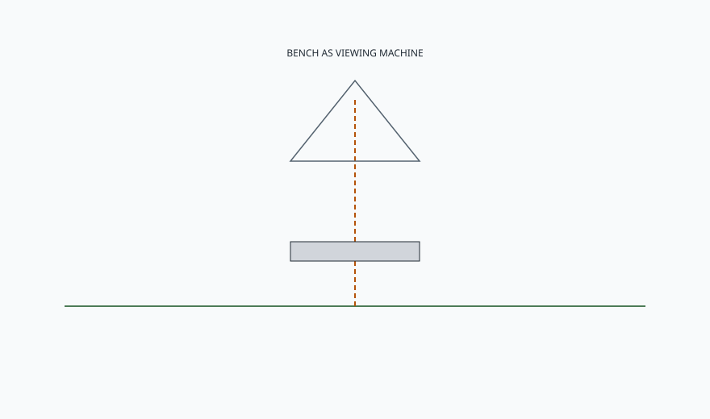

<!-- ogfh-figure:v1 -->
<figure class="ogfh-figure ogfh-figure--diagram">
  
  <figcaption><strong>Fig. 1.</strong> Italian Renaissance garden seating is placed for prospect and pause — stone, often architectural, aimed at a view. A bench that faces a blank fence is using the silhouette and refusing the job. <em>Rights:</em> Original editorial schematic; Keith Fritz / BBF outdoor-garden-furniture-history pack (see RIGHTS.md).</figcaption>
</figure>

Put the bench where the land already made a sentence.

Renaissance and later Italian villas — the ones the English later envied and the Americans later photocopied — treat a seat as a period in a walk. You climb, you turn, you are offered a stone slab or an exedra or a balustrade you can lean on, and the offer is a view: the farm, the city, the axis of cypress. The bench is not the living room. It is punctuation. If you take that silhouette — a heavy stone seat with carved arms — and you aim it at a privacy fence six feet away, you have bought a period and thrown away the sentence.

I care about this because "garden bench" in a carton is usually a product that wants to sit anywhere. Anywhere is how you get a bench on the wrong side of the shade, facing the neighbors' bins, too long for the landing, too cold for the morning coffee the client swore was the point. The villa tradition says: the site designs the bench. The shop only supplies the weight.

Stone again, because Tuscany is not being romantic. Stone is local, it is leftover from the house, it can be left. Pietra serena, marble, brick seats built into a wall. The carved arms you see in photographs are the expensive version. The common version is a slab on blocks. Both are architecture-adjacent. Both will be cold in April. Both will be honest in April.

Wood existed in the loggia. A loggia is a porch that went to architecture school. Cushions came out and went back in. That ritual is not Victorian fussiness. It is the same ritual I want from anyone who puts textile on an Indiana patio. The villa had staff. You may not. Design for the staff you have. If the staff is you on a Sunday night, the cushion has to have a home that is not "draped over the stone to get a mildew map."

Prospect is a specification. I write it down like a dimension. What does the sitter look at. How long will they sit. Is this a two-minute pause or a two-hour talk. A two-minute pause can be stone without a back. A two-hour talk wants a back, or at least a wall, and shade. The villa often cheats by putting the long sit under the loggia and the short sit in the sun as a dare.

I will not pretend this shop carves pietra. We do not. Adjacent means we understand placement the way we understand a dining table's relationship to a window. Indoor, I will fight a table that blinds the host. Outdoor, I will fight a bench that faces nothing, or faces the grill exhaust, or sits in a low spot that becomes a pond. Those fights are the same fight: the object has to serve the room, and the garden is a room only if you let the land talk.

If you make furniture, stop drawing benches in plan as if they were sofas. Draw the arrow of the gaze. If you buy furniture, walk the walk before you click the bench. Sit on a bucket where you think it goes. Stay five minutes. If you get up because there is nothing to look at, do not buy a more expensive nothing. If you are a designer, put the view on the drawing. A blank arrow labeled "hedge" is a confession.

We have enough old-world climate now to move. France will try to turn the garden into theater. England will try to turn it into a painting you can sit down in. Both will still need a material that can be left, and both will eventually hire iron.
