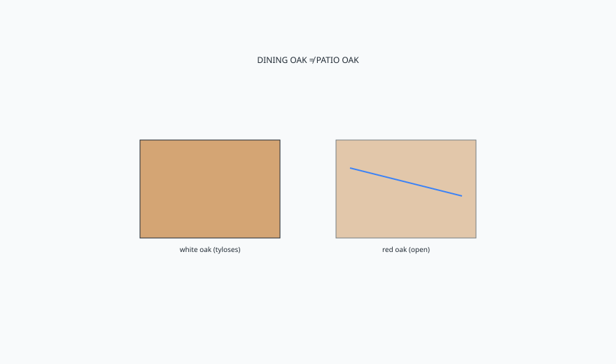

<!-- ogfh-figure:v1 -->
<figure class="ogfh-figure ogfh-figure--diagram">
  
  <figcaption><strong>Fig. 1.</strong> White oak heartwood, with tyloses, has a better outdoor chance than red oak. English park benches used oak with detailing and paint or patience. An indoor quartersawn dining oak left on a patio is a dining table in trouble. <em>Rights:</em> Original editorial schematic; Keith Fritz / BBF outdoor-garden-furniture-history pack (see RIGHTS.md).</figcaption>
</figure>

The pores are the plot.

Red oak is a bundle of straws. Blow through a red oak end and you can often make a joke of it. White oak grows tyloses — plugs in the vessels — that made it a barrel wood and a boat wood and a better outdoor heartwood. That is the distinction I want on the tape. Not "oak is oak." Indoor, I will argue with you about red oak for a dining table on taste and tannin and a stain that goes green. Outdoor, I will refuse red oak for a garden bench the way I refuse hide glue for a cutting board. The job changed.

English and northern European benches used oak because they had oak. Heartwood. Sometimes painted. Sometimes left to go silver-black and get maintained like a gate. The ones that lived were detailed: water off, feet up, joints that could move a little without opening a cistern. The ones that died are not in the photograph. Survival bias again.

Tannin and iron are a chemistry set. Oak plus a steel fastener plus weather is how you get black stains that look like a leak from a wound. Use stainless or a metal that does not want that reaction, or own the stains as a look. I have seen people sand those stains every spring as if they were dirt. They are ink. The tree and the screw wrote them.

Quartersawn indoor oak — the ray flake people love in a Mission table — is not a raincoat. It is a sawing choice. It can still be white oak and still fail if the foot stands in a saucer. I will build you that flake indoors all day. I will not let a showroom photograph of flake authorize a patio dining top in the same species with the same film. The film will go first. The open end grain will go next.

Green oak and garden structures are a different craft — coppiced, sometimes riven, sometimes meant to last a generation and be replaced. That is closer to agricultural carpentry than to furniture. Fine if you meant it. Not fine if you invoiced furniture prices for a stake.

Painted oak outdoors is an old honest answer. The paint is the raincoat. The oak is the structure. When the paint fails, you paint again. That is a gate, a sash, a bench. I have more respect for a scuffed painted oak seat than for a bare red-oak "natural" picnic table that is already inking around every screw. Natural is not a finish. Natural is a refusal to choose.

This shop lives in oak indoors. Adjacent is dangerous here because we are fluent. Fluency is how you get overconfident. I am harder on oak outdoors than on cedar precisely because I like oak. Preference is not a climate. BBF collections that show oak casegoods are indoor neighbors. The garden bench in oak has to earn a different paragraph.

English park oak and American white oak are not a single romance. Growth rings, quartersawn vs flatsawn, heart vs sap — the shop already knows this indoors. Outdoors the flatsawn board cups harder in a seat. I would rather see narrower slats of decent heartwood than a wide romantic plank that becomes a canoe. The canoe holds the rain. The rain writes the next chapter.

If you make furniture, specify white oak heartwood and the fastener metal in the same breath. If you buy furniture, do not trust the word oak on a tag that also says rustic red. If you are a designer, write *Quercus* and which one, or write a different tree.

Pressure-treated pine is the chemical chapter. It kept a lot of American decks from collapsing and it taught a lot of furniture to smell like a lumberyard after rain.
