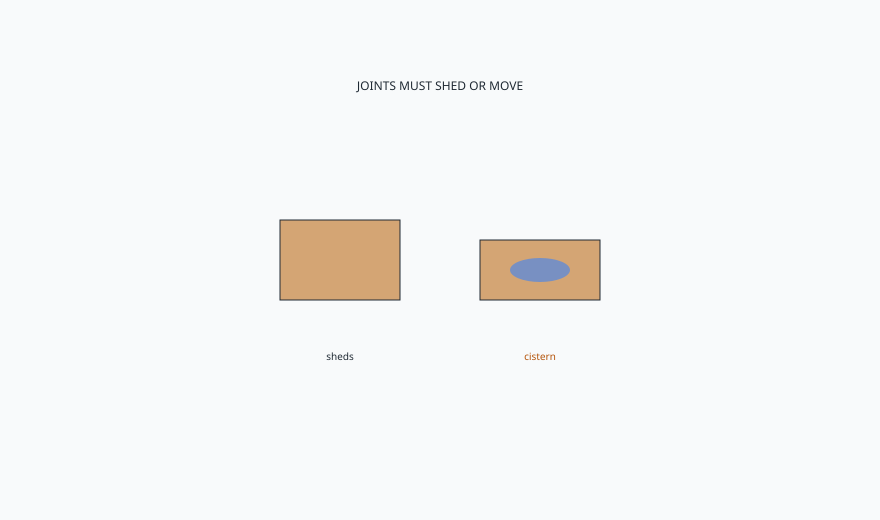

<!-- ogfh-figure:v1 -->
<figure class="ogfh-figure ogfh-figure--diagram">
  
  <figcaption><strong>Fig. 1.</strong> Outdoor wood joinery has to shed water, allow movement, and fail in a way you can maintain. Indoor brag joints — tight shoulders, trapped end grain, film inside a mortise — can become cisterns in the rain. <em>Rights:</em> Original editorial schematic; Keith Fritz / BBF outdoor-garden-furniture-history pack (see RIGHTS.md).</figcaption>
</figure>

The prettiest shoulder I cut indoors can be a fool outdoors.

Indoor joinery is a conversation about tightness, glue, and a climate that changes slowly. Outdoor joinery is a conversation about water's talent for sitting where you were proudest. A mortise that traps rain is a cistern. A breadboard that cannot move is a split waiting for August. A dowel in end grain is a peg in a straw. I have spent a career making joints that disappear in a dining room. I have to invert some of that pride when the sky is the other party.

Shed. Every horizontal should have a way off. Slats with a gap. A seat that is not a tray. Tops with a slight pitch or a drip. End grain that is not a foot standing in a saucer. The old camp wisdom — paint the end grain, raise the foot — is still wiser than a CNC pattern that looks like a river stone and holds water like one.

Movement. A wide outdoor top wants to be slats or a well-relieved glue-up, not a 42-inch indoor slab vanity. Breadboards outdoors need a method that can take weather — mechanical, not only glue on the long grain hoping. I would rather see through-bolts with elongated holes than a glued breadboard that wins for six months and then detonates.

Metal in the joint. Outdoor wood often wants a mechanical fastener you can retighten. That is not a moral failure. It is a climate. Indoor, I will fight a confirmat in a showpiece. Outdoor, I will take a well-bedded stainless bolt over a hide-glue fantasy. The bolt should not make tannin ink if the species is oak. The bolt should not be drywall screws from a bucket.

Glue. Some modern outdoor adhesives are real. Some interior PVA is a rumor in a joint that cooks. I am not going to name a brand as a sacrament. I will say: if the joint is structural and wet, ask what the adhesive is rated for, and design as if the adhesive will one day be tired. Mechanical backup is adult.

Finish inside the joint. Indoor, we sometimes glue on bare wood and finish after. Outdoor, a raw mortise that drinks is a problem. People also flood finish into a joint and then cannot close it. Think like a boat. Think like a window. Do not think like a jewelry box.

This is the draft where BBF indoor fluency is most adjacent and most dangerous. We know how to cut a tight joint. The garden asks us to cut a smart joint. Smart can look slightly looser, slightly more mechanical, slightly less like a contest. Collections that show indoor joinery as a brag should not be captioned as outdoor-ready. The essay is the caption.

I have mocked up outdoor seats with a garden hose. It is not theatrical. It is cheap. The water tells you which proud shoulder you loved is a dam. It tells you which slat gap is a rumor. Do the hose before the finish. Finish will not save a cistern. Finish will hide the cistern until August, which is worse, because then the household thinks they ruined a perfect object. They did not. The drawing did.

If you make furniture, pour a glass of water on the mockup and walk away for an hour. Where it sits is your homework. If you buy furniture, look under the seat. If you see a tray, keep walking. If you are a designer, specify gaps. A dimensioned gap is a design. A hopeful tight sit is a puddle.

Metal next. Iron that remembers a foundry, steel that stole a name, aluminum we already met, and a powder coat that is only a film.
