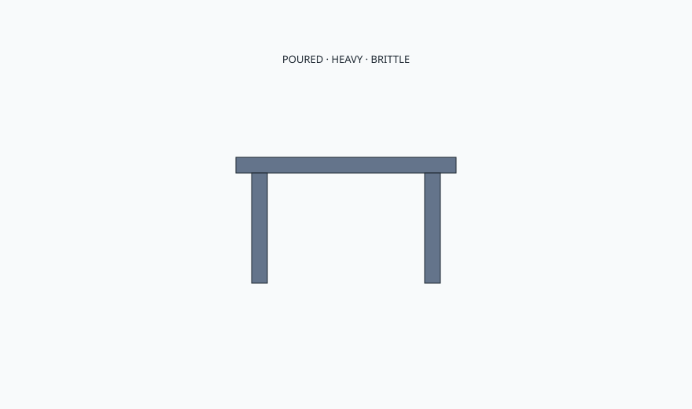

<!-- ogfh-figure:v1 -->
<figure class="ogfh-figure ogfh-figure--diagram">
  
  <figcaption><strong>Fig. 1.</strong> Cast iron is poured, heavy, brittle relative to bar stock, and honest about rust if the film fails. Garden seating from Coalbrookdale onward is a foundry product. Weight is the virtue. Snap is the vice. <em>Rights:</em> Original editorial schematic; Keith Fritz / BBF outdoor-garden-furniture-history pack (see RIGHTS.md).</figcaption>
</figure>

You can hear the pour in the object if you stop decorating it with ferns.

Cast iron is iron poured into a mold. The grain is not the grain of a bar that was rolled and worked. It is a casting: good in compression, heavy, capable of ornament that would bankrupt a carver, willing to snap if you treat a long thin section like a spring. Garden history used those traits. Ornament cheap enough to leave outside. Weight enough that the wind lost. A bench that stayed where the terrace put it.

Rust is iron's outdoor autobiography. It is not a style until you decide to let it be. Historically the benches were painted. The "living finish" rust look is often a later taste and a clothing tax. Rust also occupies volume. It jams bolts. It welds a nut in place with oxide. It stains the stone pad. If you want cast iron, you want a paint cycle or a rust marriage. I will not let a client have both "never touch it" and "never stain a dress."

Brittleness shows up when someone uses a cast bench as a step, or when a casting has a cold shut the foundry should have caught, or when freeze pops a puddle in a hollow. Hollow castings can hold water. Drill, drain, or do not buy a vase that is pretending to be a post.

Repair is welding with knowledge or cold mechanical work. I am not a foundry. I will not pretend a furniture shop can casually TIG a historic fern back and match the moral. Adjacent means I can tell you when an object is architecture-heavy and should stay in the metal trade. We can build a wood slat to replace a rotten one in an iron-ended bench. We cannot pour you 1851 again.

Reproductions are most of what you will be offered. Some are decent iron. Some are thin and ring like a toy. Lift them. Look at the back of the ornament — crisp or mushy. Mushy means a tired pattern or a tired pour. Look at the slats if there are slats. Wood slats in an iron frame are a hybrid with two calendars. The iron will outlast a cheap slat. Plan on the slat.

Bolted slats on iron ends are the maintainable hybrid I actually like. You can replace a slat. You can paint the iron on a different calendar than the wood. You cannot do that if the whole sit is one tired casting with a hairline you will not see until someone sits hard. Ask for a piece you can maintain in parts.

This shop does not pour. BBF collections do not get a fake Coalbrookdale in walnut captioned as garden iron. If we ever put a cast object next to our work, it is a neighbor, not a finish sample.

Hollow urns and table bases that are cousins to these benches will hold water if nobody drilled them. I have tipped more than one "solid" looking cast and heard the slosh. The slosh is winter waiting. Drill, or do not leave it, or both. A foundry object that sloshes is a cistern with ornament. We already refused cisterns in wood. We refuse them in iron too.

If you make furniture, design the wood-to-iron meeting as a place you can maintain. If you buy furniture, tap it. A dead thud and real weight are clues. A tinny ring and a wobble are clues. If you are a designer, specify the pad. Cast iron on a roof deck is an engineering conversation, not a style conversation.

Wrought is the word everyone still wants. The metal they want is usually gone. The metal they get is mild steel with a story.
