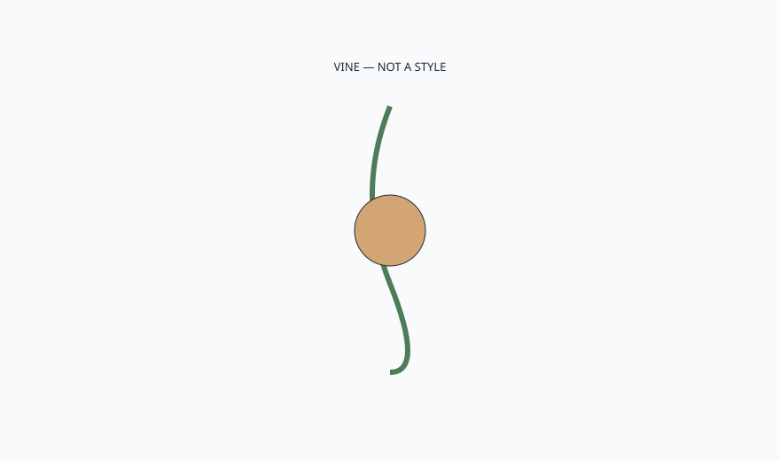

<!-- ogfh-figure:v1 -->
<figure class="ogfh-figure ogfh-figure--diagram">
  
  <figcaption><strong>Fig. 1.</strong> Rattan is a climbing palm used as poles and peel. It is strong for its weight and thirsty in weather. Porch history used it. Patio weather, untreated, will take it apart at the crossings. <em>Rights:</em> Original editorial schematic; Keith Fritz / BBF outdoor-garden-furniture-history pack (see RIGHTS.md).</figcaption>
</figure>

It grew by climbing, and it still wants to move.

Rattan is not wicker. Rattan is the plant — a climbing palm from tropical Asia, long internodes, a skin you can peel into cane, a core you can use as a pole. Furniture makers steam it, bend it, tack it, wrap it. The pole frame of a porch chair is often rattan. The shiny binding is often rattan peel. The open weave might be rattan or a cousin. If you say you bought rattan, you bought a vine's body.

The vine is strong for its weight. That is why it furnished porches and why it still furnishes indoor rooms that want a light chair. It is also a bundle of vessels. It drinks. It swells. It mildews. A crossing that stays wet is a crossing that darkens and then fails. Indoor cane seats fail from wet wiping and from sitting in sunrooms. Outdoor rattan fails faster because the sky is not a careful waiter.

Cane — the peel — is a skin used as a woven sheet or a binding. People say cane when they mean the seat of a dining chair. That seat is indoor furniture. I will fight a client who wants a fine cane seat on a patio for the same reason I will fight silk on a bar top. The material already told you its climate.

Paint and sealers try to turn rattan into a closed object. They help on a porch. They do not make a vine into a resin. Every tack hole is a drink. Every split in a pole is a drink. Storage is still the historic answer.

Tacks and wraps are the attachments. A rusted tack saws the peel. A wrap that was only decorative will slide when the pole shrinks. I look at the wrap as structure or as costume. Costume fails first and then people blame the vine. The vine was doing vine work. The costume was doing catalog work.

Sun fades the outer skin and cooks the binding. A south porch with no screen still has a UV exam. Rattan is not exempt because it is "natural." Natural means it was alive. Alive things bleach. If you want the honey color forever, you want a ritual or an indoor room. If you want the porch, you want paint or you want gray.

I will not run a rattan factory in Ferdinand. Adjacent indoor work uses cane as a craft I respect. BBF collections can show a cane panel as an indoor decision. This draft sits beside that so we do not let a patio tag steal the vine. If the object is resin, say resin. If the object is rattan, give it a roof or an attic.

A wet sit on rattan is how you get a permanent sag in a seat that was never a sling. The pole frame can still be true while the woven sit is a hammock. That mismatch is a repair if you can find the craft. Most towns cannot. Design for the town you have. If you cannot reweave, do not buy a weave you will destroy with a hose and a summer of wet bathing suits.

If you make furniture, keep poles off standing water and do not stretch a wet cane. If you buy furniture, flex a pole. A tired rattan pole has a wrinkle, not a spring. If you are a designer, write porch or indoor next to rattan every time. If you cannot, change the material.

A wrinkle in a pole is a hinge the plant did not ask for. Once it is there, the chair has a memory. You can wrap it. You cannot unteach it. Buy the spring while it is still a spring.

Wicker is the word that ate the method. Next draft we take the method back.
