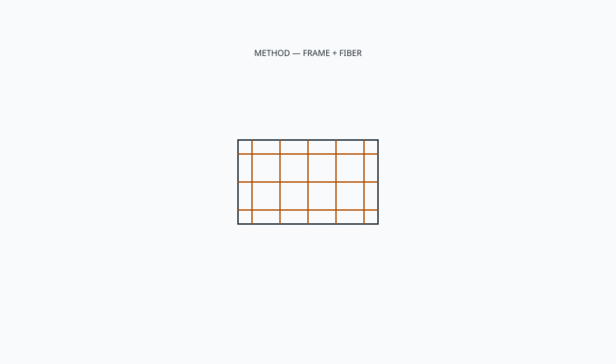

<!-- ogfh-figure:v1 -->
<figure class="ogfh-figure ogfh-figure--diagram">
  
  <figcaption><strong>Fig. 1.</strong> Wicker means weaving a seat or a skin around a frame — rattan, willow, reed, paper, or resin. The method is old. The frame and the fiber decide the climate, not the department-store syllable. <em>Rights:</em> Original editorial schematic; Keith Fritz / BBF outdoor-garden-furniture-history pack (see RIGHTS.md).</figcaption>
</figure>

Say weaving, then say of what, then say around what.

Wicker is the work. Baskets were wicker before porches were. Willow, reed, rattan, rush, later paper, later plastic. The American porch made the syllable famous. The patio department made it meaningless. If I cannot tell you the fiber and the frame, I cannot tell you the winter.

Willow and some reeds are the older European garden and indoor story — country chairs, painted, sometimes outdoor under a roof. They have their own drink and their own insects. I will not mash them into rattan for convenience. A willow chair is not a Heywood rattan just because both photograph as "natural texture."

The frame is half the object. Hidden hardwood. Hidden rattan poles. Hidden cheap plywood in a modern piece. Hidden aluminum in an "all-weather wicker." The weave is a skin. Skins fail at attachments — tacks, staples, wraps. I look there first. A beautiful weave on a rotten frame is a costume. A perfect aluminum frame with a tired weave is a reskin if the weave was designed to be one. Ask.

Painted wicker, again, is a textured film. I said it on the porch. I will say it as a material: you are finishing a mountain range. The valleys stay pale or stay dirty. Cleaning is a brush, not a blade of water.

Repair is possible and rarely cheap. Reweaving is a craft. Most households will not pay for it on a patio chair. That economic fact is why resin won. I do not resent the win. I resent the caption that says the resin is wicker in the same sense as a 1910 porch chair. It is wicker only if we are talking method in the abstract. In the shop we talk fiber.

A household that inherits a porch set should price the repair before they price a replacement carton. Sometimes the frame is still a good machine and the skin is tired. That is a win if you can find the craft. Sometimes the frame is plywood that already took a drink. Then the weave is a dress on a corpse. I have seen people pay to reweave a corpse. I would rather they flip it first, with me if they want, and spend the money on a climate that matches the next decade.

A painted willow chair from a European garden tradition and a Heywood rattan rocker can sit on the same porch and still be different objects. One is a country basketry habit. One is an industrial tropical vine habit. They share a method syllable. They do not share a repair person. If you mash them for a caption, you will call the wrong craft when something breaks.

This shop does not invoice wicker as a line. Adjacent means we already police stolen words. Handmade. Custom. Wicker belongs on that list. BBF collections should not use wicker as a texture name on an indoor carved panel. Carve is carve. Weave is weave.

I have been sent photographs labeled wicker that were printed resin, paper loom, true rattan, and once a painted hog-wire fantasy. Four winters. Four bids. One syllable. This is why I am tedious. Tedious is cheaper than a container of the wrong skin. If a designer is tired of my tedium, they can write the fiber on the first page and we can both rest.

If you make furniture, draw the attachment as a maintainable thing. If you buy furniture, flip it. The underside is the truth of the frame. If you are a designer, put fiber and frame on two lines. If they do not fit, the specification was a mood.

I flip chairs in showrooms until someone looks at me. The underside is where the staple gun confessed. A clean weave on top and a rash of rusted staples below is a one-year object wearing a ten-year photograph. Believe the underside. The top is dressed for the camera. The camera does not sit.

All-weather weave is the plastic that learned the method and then asked to be left in the sun. It can be honest. It can also be a fade map.
