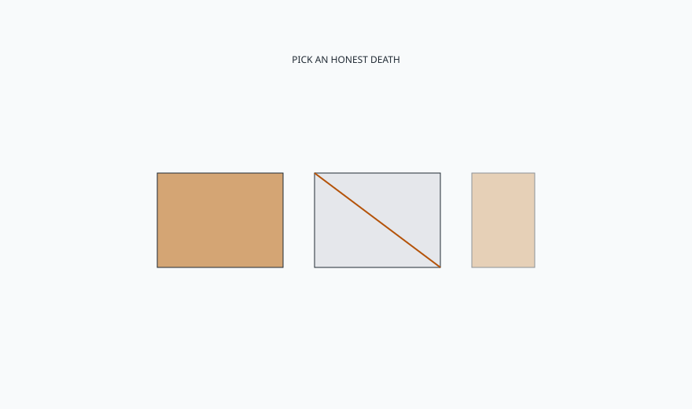

<!-- ogfh-figure:v1 -->
<figure class="ogfh-figure ogfh-figure--diagram">
  
  <figcaption><strong>Fig. 1.</strong> Films chalk, peel, and map in sun. Oils go sticky or disappear. Paint is a sacrificial skin. Bare teak silvers. The specification is which failure the household will maintain, not which color the screen liked. <em>Rights:</em> Original editorial schematic; Keith Fritz / BBF outdoor-garden-furniture-history pack (see RIGHTS.md).</figcaption>
</figure>

Sun is a critic that does not care about your favorite sheen.

Indoor, I will argue about a film system for a dining table because a dining table lives in a room and the room is the exam. Outdoor, the exam is ultraviolet, water, and abrasion from grit. The finishes that look richest on day one — high-build varnishes, fat oils, dark stains — are often the finishes that fail as maps. Maps look like neglect even when they are physics. I would rather specify a death the household understands.

Paint. Sacrificial. Recoatable. Honest on cedar, pine, iron, wicker. The historic porch answer. The historic iron answer. If you hate painting, do not specify paint and also specify perfection. Specify a metal coat or a wood you can leave.

Penetrating oil. Can be honest on teak and ipe if the product is actually penetrating and the ritual is real. Can be a pollen glue. I have a short temper for sticky tabletops that were "just oiled." Wipe off what the wood does not take. The tree is not a bucket.

Film on wood outdoors. Possible on a porch. Foolish on a south slab unless the film was built for it and the household will sand. Marine systems exist. They are jobs. A furniture-store lacquer is not a marine system because the tag said outdoor.

Powder coat we already called a film. Same death: chalk, chip, edge wear. Plan the chip.

Bare. Silver teak. Gray cedar. Rusted iron if you own the stain. Bare is a finish choice. It is not the absence of a decision. Clean mildew. Keep joints sane. Do not call gray a defect when you refused a ritual.

Color. Dark cooks the sit and the film. Light shows dirt and can still chalk. Sample in the sun. I said that about powder. I will say it about stain. The finishing room is not the patio.

Undersides. I keep saying it because people keep finishing the camera face and leaving the slat bottom raw. The raw face drinks. The finished face cannot move the same way. Cup. Crack. Banana. Finish both or finish neither with a species that can take neither. There is no third religion.

This shop's indoor finishes are not patio finishes. That is the BBF boundary in one line. We can teach the idea of a system. We will not drag a showroom sheen onto a slab and call it adjacent-friendly. Adjacent means the honesty transfers, not the sheen. Collections stay indoor unless a page admits a porch and a different system.

A failed outdoor film looks like shame in a photograph. I want that shame attached to the specification, not to the household. If we wrote "no ritual, forever brown, south slab," we wrote a fantasy. If we wrote "silver teak, clean in spring," we wrote a job a person can do. Jobs can be kept. Fantasies become reviews. I would rather be the shop that sounded rude in September than the shop that sounded kind and then hid.

If you make furniture, finish the end grain and the underside, not only the camera face. If you buy furniture, look at the underside. If it is raw and the top is glass-smooth, you bought a banana kit. If you are a designer, write the death: silver, paint cycle, film maintenance, or metal coat. If you cannot write it, you do not have a finish. You have a rendering.

End grain is a hundred little mouths. I said it on the Adirondack. I will say it on a table apron and a bench foot. Seal the mouths or raise them out of the saucer. Those are the choices. Hoping the sun only hits the pretty face is not a choice. The rain does not respect faces.

Winter is the last climate machine. It is not a surprise. It is a brief you can draw in September.
