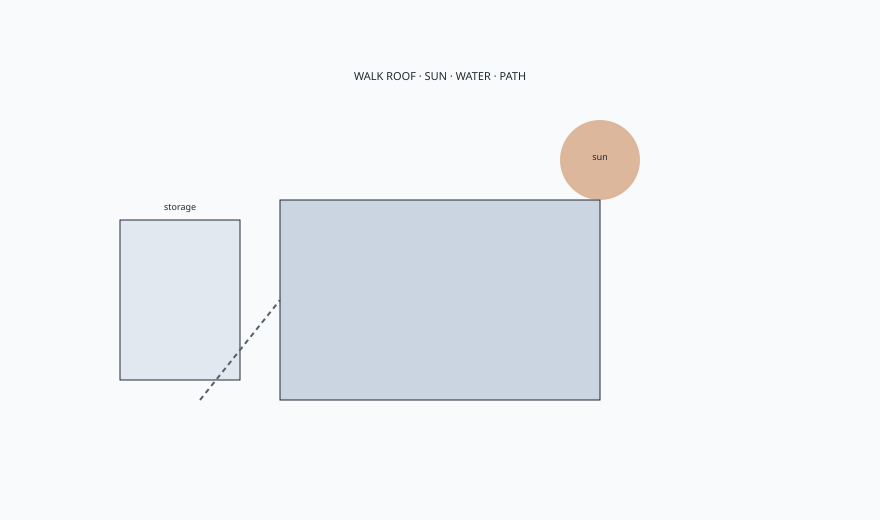

<!-- ogfh-figure:v1 -->
<figure class="ogfh-figure ogfh-figure--diagram">
  
  <figcaption><strong>Fig. 1.</strong> Before a carton, walk the roof, the sun, the water, the path, and the January storage. The history was a map of objects. The materials were a map of duties. The site decides which object is honest. <em>Rights:</em> Original editorial schematic; Keith Fritz / BBF outdoor-garden-furniture-history pack (see RIGHTS.md).</figcaption>
</figure>

Walk out with a tape and the tallest glass.

I do not start at a carton. I start at the ceiling — or the lack of one — and the door you actually use, and the place the water sits after it rains. If those three facts do not match the photograph in your hand, the photograph is already in trouble.

This series gave you a map of rooms. A peristyle that owned its columns. A courtyard that treated heat as law. A porch that kept a draft on purpose. A patio that is a floor under sky. A conservatory that is glass. An open lawn that is landscape. You do not need all of them. You need the one you already have.

Then a map of objects. Stone you can leave. Iron that remembers a foundry. Aluminum that means light. Teak that silvers. Cedar that dents. A vine that drinks. A polymer that remembers a vine. A sling that drains. A cushion that is not the chair.

Ask until it bores you.

Is there a roof.
Where does the sun sit at 2 p.m. in July.
Where does water sit at 2 p.m. after a storm.
What is the path from the kitchen with a wet plate.
Where do the textiles sleep in January.
What fails first — film, fastener, foam, or frame — and who will be there when it does.

If the evening is a porch, you are closer to a rocker and a painted wood than to a sectional. If the evening is a slab by a grill, you are in drain and grease and a metal or a teak that can be wiped. If the evening is a view, you are in a bench that is a camera, and the camera needs a picture. If the evening is a photograph, wait until you have an evening.

I opened a shop in 1999. I live above it in Ferdinand. I am the son of a carpenter. I will not invent a garden line we built for a famous lawn. I will stand behind the difference between a piece that can take weather and a piece that can take a room. That is the whole channel, in this series and in the others. The words get their jobs back. The object gets its duties. The photograph comes last.

History was not a costume trunk. The peristyle, the drum stool, Coalbrookdale, Westport in 1903, Heywood on a porch, Brown Jordan after the war — those are reasons the duties exist. You can skip a date if you keep the duty. I would rather you keep both. Dates keep a salesperson honest.

If you make furniture, pour water on the mockup and walk away. If you buy furniture, sit in the real sun and then try to stand. If you are a designer, write roof or no roof at the top of the page and do not let a nickname move it.

If you want a single homework assignment before anyone draws a set, do this. Put two chairs you already own — even ugly ones — where you think the set will live. Leave them a week. Watch the water. Watch whether anyone sits. Watch the path. Then take a picture of the wet patch and the empty sit with a tape in the frame. Send that. Do not send a hotel terrace in another climate.

We will not end with a coupon. We will end with the weather.

The lemons can go back on the indoor table. The seat has to be able to live here, on this floor, in this sun, in this January, when nobody is photographing anything.

That is outdoor furniture. Call the climate the right name, and we can talk about a piece.
