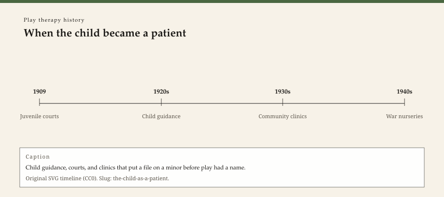

**Educational note.** This is history for a general reader. It is not a diagnosis, not a treatment plan, and not a substitute for care with a licensed clinician.

<!-- figure-id: the-child-as-a-patient.lead-timeline -->
<figure class="wow-figure wow-figure--era">
  
  <figcaption>
    <strong>When the child became a patient</strong> — Child guidance, courts, and clinics that put a file on a minor before play had a name.
    Original editorial timeline (CC0). No AI-generated faces.
  </figcaption>
</figure>

Play therapy needs a patient who is allowed to be a child and a clinic that is allowed to keep a file. Both permissions are modern. A medieval household could punish, pray, or apprentice. It did not open a chart labeled with a developmental complaint and an appointment time. This essay is about the waiting room that made the later playroom possible: juvenile courts, child-guidance clinics, hospital wards, and the first analysts who agreed to see someone who could not free-associate on a couch.

It is not a method. It is a change in who counted as a case.

## Courts, "problem children," and the Commonwealth Fund

American child-guidance clinics in the 1920s did not grow out of a toy catalog. They grew out of courts and philanthropy. The Juvenile Psychopathic Institute in Chicago (William Healy, 1909) put a medical-psychological team next to a juvenile court. The Commonwealth Fund's program in the 1920s seeded clinics that promised to catch trouble *before* the reformatory. Margo Horn's *Before It's Too Late* (1989) and Kathleen Jones's *Taming the Troublesome Child* (1999) are the books to argue with. They describe a movement that mixed social work, psychiatry, and testing — and that often saw the mother as the real patient.

A child who arrived at such a clinic might draw, might talk, might be measured. Play was present the way magazines are present in a waiting room: as something that happens while adults decide. The file was the product. The file is why later play therapists could write notes that a school or an insurer would recognize as clinical.

British child guidance, after the First World War, had its own patrons and its own argument with psychoanalysis. The Tavistock, the London Clinic of Psycho-Analysis, and later the Institute of Child Psychology (Lowenfeld, 1928) did not share a single theory. They shared a new social fact: a child could be referred.

## Hospitals and the child who stayed overnight

Pediatric wards already had children who could not go home at dusk. Emma Plank's later book *Working with Children in Hospitals* (1962) belongs to a staff-role history. The earlier fact is simpler. A hospitalized child is a captive audience. Toys appear. So do boredom, terror, and the adult who decides when the game stops for a dressing change.

Hospital play is not automatically psychotherapy. It can be humane nursing. It can be a way to keep a ward quieter. When it becomes a named specialty — hospital play staff in Britain, child-life work in the United States — it still is not APT credentialing. The later essay on Plank keeps the jobs apart. Here the point is only that confinement made play visible to medicine.

## The analytic problem: a patient who will not lie still

Adult psychoanalysis, as Freud's circle practiced it, counted on speech, a couch, and a person who could be asked to say everything. A six-year-old does not keep that contract. The first generation of child analysts had to decide whether that meant children were unanalyzable or whether the method had to change.

Hermine Hug-Hellmuth said, in print in 1921, that technique had to meet the child. Anna Freud, in 1927, said the child was not a miniature adult and that the analyst might need a preparatory period, an alliance with the parents, and a more cautious use of play. Melanie Klein, by 1932, treated play as the equivalent of free association and went earlier, deeper, and with less apology. Those three sentences are the next three essays. They only make sense if you already believe a child can be a *patient* — not a pupil, not a sinner, not a small offender.

The Controversial Discussions in London (1941–45) were, among other things, a fight about that belief. King and Steiner's 1991 volume is the document. This series will not re-litigate the whole British Society. It will stay with the play quarrel: what the toys were allowed to mean, and who was allowed to say so.

## Testing rooms and the other file

While analysts argued about play, psychologists built another childhood: the IQ room, the achievement battery, the nursery observation with a clipboard. Arnold Gesell filmed infants. Later, Mary Ainsworth's Strange Situation (sister pack) would turn a brief separation into a code. Those rooms used play as a *stimulus*. A toy was a prompt for a score.

Play therapists later inherited both files — the analytic note and the test protocol — and sometimes pretended they had invented a third thing. Historically, they inherited a child who was already a case. The toys were already in the building.

## What a small city inherited

A Southeast Arkansas clinic in 2026 does not run a 1925 Commonwealth Fund shop. It still lives with the invention: a child can be referred, a note can be written, a school can ask for a letter. Play therapy, when it arrives as a *named* service, arrives into that invention. It does not replace it.

If you came here to learn how to open a playroom, this page will not help you. If you came here to understand why a child sits on a waiting-room chair with a parent who is already filling out a form, the form is the older object. The toys came after the form, even when the brochure says otherwise.

The next essay names the first analyst who tried, in a journal, to say how a child analysis might be done — and whose death made later writers nervous about citing her.

## The child-guidance team as a three-headed animal

American clinics in the Commonwealth Fund years liked a triad: psychiatrist, psychologist, social worker. The child sat in the middle and was talked *about*. Play, if it happened, happened while the triad wrote. Later play therapists inherited the triad's file even when they sat on the floor. The floor changed the posture. It did not abolish the file.

Healy's 1909 Chicago institute next to a juvenile court is the American date this pack will keep printing. It is not a play-therapy date. It is the date a city agreed that a child's trouble could be a medical-psychological object instead of only a legal one. Without that agreement, Axline's 1947 book has no waiting room.

British child guidance after 1918 had the Child Guidance Council and a different argument with psychoanalysis. The names differ. The invention is cousin: a referral, a team, a mother in the hallway. Horn and Jones are American books. A later pass that wants the London Council minutes should open them and mark the year.

## What a file made possible, and what it forbade

A file made it possible to say "this child was seen on Tuesday." It forbade the older village habit of treating the trouble as a family's private weather. Privacy became a professional promise instead of a neighbor's discretion. Play therapy later wrote that promise onto a door with a lock. The lock is younger than the file.

## Claims box

This essay is educational history for a general reader. It is not medical advice, not a diagnosis, and not a treatment plan. It does not teach a session, a toy list, or a skill. Reading it is not therapy and is not a substitute for care with a licensed clinician. WOW Therapies does not claim, by publishing this history, to offer play therapy or any named play protocol as a service.

If you are in danger, call local emergency services.

## Sources

Horn 1989; Jones 1999; Hug-Hellmuth 1921; Anna Freud 1927; Klein 1932; King and Steiner 1991; Plank 1962 as a later marker. Healy 1909 as a court-clinic date. Commonwealth Fund program as treated in Horn.

*WOW Therapies educational series. Complementary to `content/wowtherapies-therapy-history/` and to the SLPWOW speech-pathology history pack. This lane is play-therapy history only. Staged: do not write these files onto the live wowtherapies.com sitemap from this folder.*
