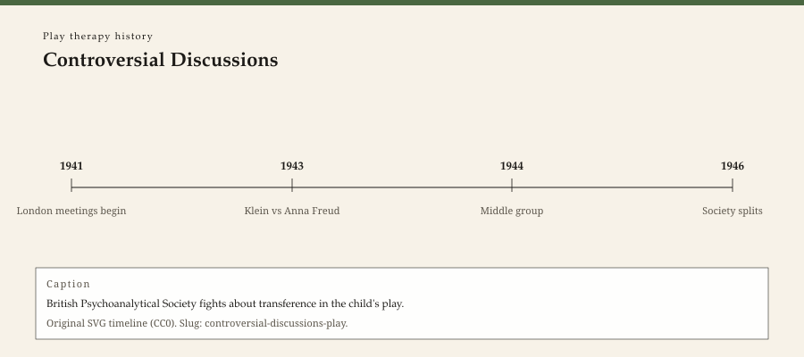

**Educational note.** This is history for a general reader. It is not a diagnosis, not a treatment plan, and not a substitute for care with a licensed clinician.

<!-- figure-id: controversial-discussions-play.lead-timeline -->
<figure class="wow-figure wow-figure--era">
  
  <figcaption>
    <strong>Controversial Discussions</strong> — British Psychoanalytical Society fights about transference in the child's play.
    Original editorial timeline (CC0). No AI-generated faces.
  </figcaption>
</figure>

Between 1941 and 1945 the British Psychoanalytical Society held a series of scientific meetings that later editors named the Controversial Discussions. Pearl King and Riccardo Steiner published the documents in 1991. The fight was about training standards, about who could claim Freud after Vienna fell, and about Melanie Klein's picture of the infant. It was also, in a way American counseling textbooks still underplay, a fight about play.

If a toy can be treated as speech, then a training program must teach people to hear that speech. If a toy cannot, then a training program that treats play as association is teaching a guess. The minutes are long. The play quarrel is the part this series keeps.

## A society with two techniques in one building

Anna Freud arrived in London in 1938 with a method already written (1927) and a famous name. Klein had been in the Society since the 1920s with a method already written (1932) and a growing group. The war made the building smaller. Evacuations, night meetings, and the death of colleagues did not make anyone kinder about theory.

Edward Glover, Susan Isaacs, Paula Heimann, and others take up pages in King and Steiner. This essay will not roll-call the whole Society. It will name the technical fork. Klein's camp treated early interpretation of play as the work. Anna Freud's camp treated play as material among other materials, and treated early deep interpretation as a risk to the child's relationship with a needed adult.

The Society did not pick a winner in the sense a branding agency would recognize. It invented a training compromise — A group, B group, Middle group — that let people qualify without pretending the play technique was one object. Winnicott sat in the middle. The next essay takes his 1971 book and leaves the rest of his life next door.

## Why a later American "play therapy" could ignore the minutes

By 1947 Virginia Axline was publishing in Boston, not in Maresfield Gardens. She did not have to vote in the British Society. She had Rogers, a playroom, and a trade publisher. The London minutes were not her problem.

That independence has a cost. American play therapy could later advertise itself as a single field — APT, 1982 — while quietly containing Kleinian hours, child-centered hours, and sandplay hours that would not have shared a training committee in 1944. The Association did not resolve the Controversial Discussions. It changed the subject to membership, conferences, and, later, a journal (1992).

A history that starts in Denton or Fresno without London will sound cleaner. It will also be false about how many different jobs the word *play* was already doing.

## What the documents are not

They are not a protocol. They are not a reason to pick a side on a blog. They are not proof that "the British" own play therapy. Lowenfeld's Institute of Child Psychology (1928) was already a third London room, not identical with either analytic camp. Hospital play would be a fourth. The Discussions are one archive. They are a very well-edited archive. That is why they get an essay.

They are also not a story about who was nicer to children. Both camps saw children. Both camps wrote notes. Both camps could be wrong. The ethical question for this series is smaller: do not turn 1943 interpretations into 2026 homework.

## Why a small-city clinic still meets this quarrel

A counselor in Southeast Arkansas who takes a weekend workshop titled "play therapy" may be taught to reflect feelings and not to interpret the doll. Another weekend, another flyer, may teach a sand scene as a psyche. Those two flyers are the Controversial Discussions without the minutes. The Association for Play Therapy can host both on a conference grid. A history page should at least say they are not the same hour.

If you want the full British Society, read King and Steiner. If you want the lives, use the sister slugs. If you want the play fork, this is the fork.

The next essay leaves the committee and sits with Winnicott's claim that playing is the thing — not the interpretation of the thing, and not the refusal to know anything.

## Minutes, not mythology

King and Steiner's 1991 volume is thick because the Society was thick. People spoke at length. They quoted Freud. They accused each other of not quoting Freud. A later American reader who wants a two-sentence summary will be tempted to say "Klein won play" or "Anna Freud won caution." The minutes do not sell either trophy. They sell a training compromise and a paper trail.

Susan Isaacs's contributions, in those meetings, treated children's play and phantasy as evidence that could be argued in a scientific society, not only in a nursery. Paula Heimann's later work on countertransference belongs to a different essay and a different decade. This page only needs the 1941–45 fact: play was admissible as *scientific* material in a vote about the Society's future.

Wartime London also meant evacuated children, night meetings, and deaths. The weather of the minutes is a city under bombs. That weather does not make the theory true. It makes the sharpness of the fight less mysterious. People were training the next generation while the current one was being killed. A technique quarrel in that weather is not a luxury. It is a claim about what must be handed on.

The Middle group — later Independents — is where Winnicott's play theory could sit without joining a camp. The next essay takes his 1971 book. The Discussions are why that book had a third place to sit.

## A training vote that outlived the bombs

After the meetings, the Society still had to qualify people. The A / B / Middle arrangement is the social form of an unsolved play quarrel. Students learned whose seminar they were in. Patients did not get a brochure explaining the vote. American play therapy later hosted the descendants without the vote. That is why a 1982 conference grid can look peaceful. The peace is an American convenience, not a 1944 conclusion.

If a later editor wants a single page number from King and Steiner, they should open the volume and put it in `BIBLIOGRAPHY.md`. This draft used the book as a dated archive, not as a quote farm.

## Claims box

This essay is educational history for a general reader. It is not medical advice, not a diagnosis, and not a treatment plan. It does not teach a session, a toy list, or a skill. Reading it is not therapy and is not a substitute for care with a licensed clinician. WOW Therapies does not claim, by publishing this history, to offer play therapy, child analysis, or any named play protocol as a service.

If you are in danger, call local emergency services.

## Sources

King and Steiner 1991; Klein 1932; Anna Freud 1927. Sister slugs `anna-freud`, `melanie-klein`, `donald-winnicott`.

*WOW Therapies educational series. Complementary to `content/wowtherapies-therapy-history/` and to the SLPWOW speech-pathology history pack. This lane is play-therapy history only. Staged: do not write these files onto the live wowtherapies.com sitemap from this folder.*
