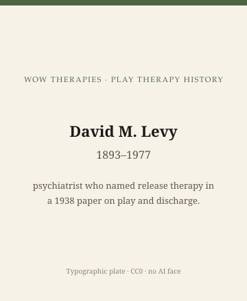

**Educational note.** This is history for a general reader. It is not a diagnosis, not a treatment plan, and not a substitute for care with a licensed clinician.

<!-- figure-id: david-levy-release-therapy.lead-plate -->
<figure class="wow-figure wow-figure--portrait wow-figure--portrait-typographic">
  
  <figcaption>
    <strong>David M. Levy</strong> (1893–1977) — psychiatrist who named release therapy in a 1938 paper on play and discharge.
    <em>Typographic plate — no likeness embedded.</em>
    Original editorial plate (CC0). See <code>plates/david-levy-release-therapy/RIGHTS.md</code>.
  </figcaption>
</figure>

David M. Levy (1892–1977) was an American child psychiatrist and psychoanalyst who liked a short name for a short job. In 1938 the *American Journal of Orthopsychiatry* printed "Release Therapy." The claim was not that all play is analysis. The claim was that a child who had been through a specific event — a surgery, a sibling's arrival, a shock the household could name — might use play to discharge that event if the adult structured the materials toward it.

That sentence is why later historians put him on a timeline between Klein and Axline. It is also why this series will not teach the hour. Structured play toward a named trauma is a method. Methods leak.

## New York, sibling rivalry, and a research habit

Levy had already been writing about sibling rivalry and about maternal overprotection. He used dolls and experimental setups in ways a later ethics board would want to read twice. The 1930s American child-guidance world allowed a psychiatrist to be both a tester and a therapist. The file and the toy table were in the same building.

"Release therapy" belongs to that building. It assumes the adult already knows what needs releasing. Klein assumed the play would tell you what you did not know. Axline, later, assumed the child would get there without the adult's plot. Levy assumed a plot: this operation, this new baby, this fear. The play was a valve.

American "structured" and "directive" play therapies of the late twentieth century — some of Schaefer's prescriptive mood, some trauma work that uses play as a delivery device — are not Levy's 1938 paper. They rhyme. Rhyme is not identity. The 1938 paper is the early, short, named version of the idea that play can be aimed.

## What the paper is not

It is not child-centered play therapy. It is not sandplay. It is not a reason to stage a medical procedure with a doll in your living room. Hospital child-life staff later developed their own, carefully bounded practices for preparing a child for a dressing change. Those practices have their own history (see the Plank essay). They are not "release therapy" with a smile.

It is also not proof that "getting it out" is always the job. Later trauma research argued, in public, about whether retelling and reenactment help, when they help, and who they harm. This series will not settle that argument with a 1938 citation. It will only say the citation exists, and that "release" is a metaphor with a body in it.

## Portrait

No clean licensed photograph. Type: "David M. Levy, 1892–1977." The 1938 journal citation as a graphic is enough.

## Why a later field kept the word and dropped the man

APT history slides sometimes include Levy as a checkpoint between the analysts and Axline. The checkpoint is useful if it stays a date. It becomes propaganda if it implies a smooth American progress: first release, then relationship, then evidence. The 1938 paper did not make Axline inevitable. It named a fork.

A clinician who hears a parent say "he just needs to get it out" is hearing Levy's metaphor without Levy's clinic. Naming the metaphor is allowed. Building a home program around it is not.

The next essay takes another American who used toys as a thinking tool: Erik Erikson, who wanted reasons, not only release.

## Sibling-rivalry dolls, and an ethics that arrived later

Levy's mid-1930s sibling-rivalry work used dolls and setups that later readers, correctly, want an ethics board to see. A child psychiatrist in that decade could be an experimenter and a therapist in one afternoon. The 1938 "release" paper sits on that afternoon. It assumes the adult may arrange the materials toward a known event.

American orthopsychiatry — the journal, the association, the word — was a meeting ground for people who did not all want to be analysts. Levy could speak there without waiting for London's vote. That is why he appears on American timelines between the Europeans and Axline. He is the short, named, aimed version of play as treatment.

Later "medical play" in child-life programs sometimes cites a cousin logic: rehearse the dressing change so the fear has somewhere to go. Cousin is the honest word. Identity is not. Child-life has infection control and a surgical team. Levy had a psychiatrist's office. A parent with a doll and a syringe has neither. This series will not close the distance with a smile.

The 1938 pagination in circulating citations is 627–636. If a later pass opens the issue and finds a different run, mark the file. The year and the journal are the load-bearing facts.

## Orthopsychiatry as a room that was not Vienna

The American Orthopsychiatric Association let psychiatrists, social workers, and psychologists talk in one journal. Levy's 1938 paper is an orthopsychiatry object. That is why it can sit on an American timeline without a British Society membership. It is also why "release" traveled into later structured-play talk that never read Klein.

This pack will keep the journal name visible. Dropping it makes 1938 look like a timeless parenting metaphor. It was a paper with pages.

## Claims box

This essay is educational history for a general reader. It is not medical advice, not a diagnosis, and not a treatment plan. It does not teach a session, a toy list, a medical-play rehearsal, or a skill. Reading it is not therapy and is not a substitute for care with a licensed clinician. WOW Therapies does not claim, by publishing this history, to offer play therapy or any named play protocol as a service.

If you are in danger, call local emergency services.

## Sources

Levy 1938; sibling-rivalry papers of the mid-1930s as a research line. Later structured-play histories should cite Schaefer or trauma manuals as *their* objects, not as Levy.

*WOW Therapies educational series. Complementary to `content/wowtherapies-therapy-history/` and to the SLPWOW speech-pathology history pack. This lane is play-therapy history only. Staged: do not write these files onto the live wowtherapies.com sitemap from this folder.*
