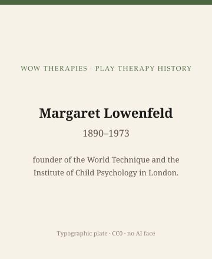

**Educational note.** This is history for a general reader. It is not a diagnosis, not a treatment plan, and not a substitute for care with a licensed clinician.

<!-- figure-id: margaret-lowenfeld.lead-plate -->
<figure class="wow-figure wow-figure--portrait wow-figure--portrait-typographic">
  
  <figcaption>
    <strong>Margaret Lowenfeld</strong> (1890–1973) — founder of the World Technique and the Institute of Child Psychology in London.
    <em>Typographic plate — no likeness embedded.</em>
    Original editorial plate (CC0). See <code>plates/margaret-lowenfeld/RIGHTS.md</code>.
  </figcaption>
</figure>

Margaret Lowenfeld (1890–1973) was a British physician who treated play as a way a child could think without first borrowing an adult's words. In 1928 she founded the Institute of Child Psychology in London. In 1935 Gollancz published *Play in Childhood*. The World Technique — sand, water, miniatures, a tray that could hold a "world" — is the object later sandplay trainings either honor or quietly rename.

She is easy to lose between Klein and Axline. She was not running an IPA training. She was not writing a Houghton Mifflin trade book for American teachers. She was building a clinic with a method that looked, from across a room, like a game, and from across a decade, like a school.

## A world, not a free association

Lowenfeld asked children to make a world in a tray. The instruction, in the historical record, is simpler than later manuals make it. The child builds. The adult attends. The world can be photographed, discussed, rebuilt. What the world *means* is a later argument. Lowenfeld's own writing treats the making as a form of thought — a non-verbal thinking she did not want to reduce too quickly to a psychoanalytic dictionary.

That is why the next essay, on Dora Kalff, has to work. Kalff saw Lowenfeld's work, then took the tray into a Jungian vocabulary. The tray is not the vocabulary. Histories that say "sandplay begins with Jung" skip 1928. Histories that say "Lowenfeld invented sandplay" skip Kalff's later naming and the societies that formed around *her* word. This series will keep both names and refuse the merger.

*Play in Childhood* (1935) is readable as a general book and as a clinic's apologia. Read both ways. Do not read it as a 2026 setup guide. The Institute of Child Psychology had staff, rooms, and a London referral world this page will not reconstruct as a franchise.

## Medicine, not only "play"

She trained in medicine. The Institute sat in a city that also held the Tavistock and the analytic societies. Lowenfeld's independence is the historical fact. She did not become a footnote to Anna Freud, and she did not become a preface to APT. British play-therapy later had its own association (BAPT, 1992) and its own registration fights. Those fights sometimes reach back to Lowenfeld as an ancestor. Ancestor is a political word. The 1928 date is a quieter one.

## Portrait

No clean licensed photograph. Died 1973. Type: "Margaret Lowenfeld, 1890–1973."

## What not to do with her

Do not publish a miniature shopping list. Do not teach a world-reading. Do not generate a tray "in her style." Do not collapse her into Kalff or into "the British Axline." She was earlier than Axline's book and differently trained.

Do not skip her because the American exam prefers 1947 and 1982. A tray in a London clinic in the 1930s is why a tray in a California workshop in the 1980s could look traditional.

The next essay is Kalff. The essay after that is the tray itself, as an object that outlived both women.

## A physician in a city of institutes

London in the late 1920s already had analytic societies and the beginnings of a Tavistock weather. Lowenfeld opened a different door: a physician's institute that treated play as a way a child could think. The Institute of Child Psychology (1928) is the institutional date. *Play in Childhood* (1935) is the book date. The World Technique is the method name later sandplay trainings either honor or quietly replace.

She used sand, water, and miniatures. The instruction, in the historical record, is to make a world. The adult attends. Meaning is not a dictionary applied in the first minute. That refusal is why Kalff's later Jungian vocabulary has to be a *translation*, not a discovery of the tray.

British play-therapy organizations in the 1990s sometimes reached back to her as an ancestor. Ancestor is a political word in a registration fight. The 1928 date is quieter. It is also why this pack will not let APT 1982 look like year zero for a tray.

Photographs of worlds, if they exist in archives, are not clip art. This pack's photo rules already said so. Type: "Margaret Lowenfeld, 1890–1973."

## Water, sand, and a method that looked like a game from the corridor

A visitor to the Institute could see a tray and think: play. Lowenfeld's writing treated the making as thought. The corridor mistake is the same mistake later sandplay workshops invite when they put a pretty world on a slide. This pack keeps the 1928 institute and the 1935 book so the corridor cannot rename the method as "just sand." Britain did not wait for 1982 to have a play clinic. That is the load-bearing sentence.

## Why a 1935 Gollancz book still gets mis-shelved

Libraries sometimes file *Play in Childhood* next to developmental surveys. The filing is half right. The other half is a clinic's self-description. This pack keeps both jobs on the table so a reader does not take a 1935 title as a 2026 setup guide. The Institute had staff and a London referral world this page will not reconstruct as a franchise. Staff and referral are the difference between a book and a method.

## Claims box

This essay is educational history for a general reader. It is not medical advice, not a diagnosis, and not a treatment plan. It does not teach a session, a world-building exercise, or a skill. Reading it is not therapy and is not a substitute for care with a licensed clinician. WOW Therapies does not claim, by publishing this history, to offer play therapy, the World Technique, sandplay, or any named play protocol as a service.

If you are in danger, call local emergency services.

## Sources

Lowenfeld 1935; Institute of Child Psychology 1928 as an institutional date. For the later Kalff relationship, Kalff 1980 and the sand-tray era essay.

*WOW Therapies educational series. Complementary to `content/wowtherapies-therapy-history/` and to the SLPWOW speech-pathology history pack. This lane is play-therapy history only. Staged: do not write these files onto the live wowtherapies.com sitemap from this folder.*
