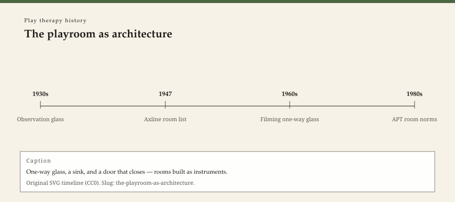

**Educational note.** This is history for a general reader. It is not a diagnosis, not a treatment plan, and not a substitute for care with a licensed clinician.

<!-- figure-id: the-playroom-as-architecture.lead-timeline -->
<figure class="wow-figure wow-figure--era">
  
  <figcaption>
    <strong>The playroom as architecture</strong> — One-way glass, a sink, and a door that closes — rooms built as instruments.
    Original editorial timeline (CC0). No AI-generated faces.
  </figcaption>
</figure>

A playroom is a room. It has a lease, a lock, a fire code, and a neighbor who can hear. Clinical literature treats it as a method. Architects treat it as square footage. This essay stays with the second view long enough to keep the first from becoming a catalog.

Axline's 1947 book already assumes a place where a child can play while an adult stays. Landreth's 1991 textbook made the place famous in American counseling programs: shelves, categories of toys, a sink if you can get one, a door that closes. University training clinics added one-way glass and a supervisor's booth. Schools added a converted storage closet and called it a playroom because the word would fit on a grant.

Those are different buildings. A history that publishes "the" playroom has already started a protocol. We will name the types and stop.

## Glass, and the person behind it

One-way glass is a mid-century training technology. It turns play into a scene that can be watched without sitting on the floor. It also turns the child into someone who may or may not know about the watchers. Consent, signage, and recording laws changed. The glass stayed in a lot of university clinics because it is how you teach a roomful of students at once.

A private-practice room in a small city often has no glass. The supervisor, if there is one, hears a tape or a story later. The architecture changed the ethics and the pedagogy. APT's later credential hours assume supervision. They do not assume a booth. Confusing the Denton training clinic with a rented office over a pharmacy is how brochures lie.

## Categories, and the list we will not reprint

Textbooks like to sort toys: family, aggressive, nurturing, expressive. The sort is a theory. It is also a purchase order. This series will not reprint the purchase order. It will say that a 1991 book *published* a room theory, and that later programs copied the theory because it is teachable.

Copying a room theory is how a field starts to look like a franchise. It is also how a field becomes researchable: if the rooms are similar, a study can claim it studied "CCPT." Similarity is a methodological hope. It is not a child's need.

The later essay on toys and class will say who could afford the full shelf. Here the architectural fact is enough. A closet with a tub of animals is not a university clinic. Both have been called play therapy. The floor plan knows the difference.

## Schools, churches, and the room that is also something else

School-based play therapy, in the American counselor-education literature from the 1960s on, often happens in a room that is also a storage room, a stage, or a borrowed classroom. The architecture teaches the child what the hour is worth. A church-basement practice in a county seat teaches another lesson. Neither is a moral failing. Both are historical.

Hospital playrooms, child-life spaces, have sinks and infection rules the outpatient hour does not. See the Plank essay. Do not draw one floor plan for all.

## Why a Southeast Arkansas lease matters

WOW Therapies does not, by hosting this history, claim a playroom. If a later service page ever photographs a room, that photograph needs consent and a different review. This folder's graphics are type and period objects. No stock child on a rug. No implied floor plan of a clinic you have not measured.

The next stage leaves architecture for a 1947 book that made the American non-directive room famous without drawing the plumbing.

## Sinks, toilets, and the room that can survive paint

A sink in a playroom is a theory of mess. Landreth's 1991 course-shaped book wanted one if you could get one. A school closet rarely has one. A church basement may have one down the hall. Architecture decides what "expressive" play is allowed to cost in cleanup.

One-way glass, in university clinics, made a pedagogy: many students, one hour, a booth. Consent and recording law changed around the glass. The glass stayed because it is efficient. Private offices in county seats usually have no glass. Supervision happens later, on a tape or a story. APT hours assume supervision. They do not assume a booth. Brochures that show a glassed Denton room as "the" playroom are selling a campus.

Fire codes, square footage, and a neighbor who can hear: these are why a playroom is a lease problem and not only a method problem. This pack will not draw a floor plan. A floor plan is a build list. Type is enough: "a room with a door that closes."

## Church basements, grant closets, and the word that fits on a form

A grant application can call a storage room a playroom because the word releases money. Architecture knows the difference. So does a child who has to walk past a copier to get to the tub of animals. This pack will not moralize the closet. It will not bless the glassed university room as the real one. It will say both exist, and that Landreth 1991 described a course-shaped room many leases cannot hold.

## Consent on the glass, and the office over a pharmacy

One-way glass is efficient pedagogy and a consent problem. Recording laws changed. The booth stayed in a lot of university clinics. A rented office over a pharmacy usually has no booth. APT hours assume a supervisor, not a booth. Brochures that show only Denton glass are selling a campus. This pack will not draw plumbing. A sink is a theory of mess. A closet is a theory of budget. Both are architecture.

A lease, a lock, a fire code, and a neighbor who can hear remain the four facts a method paper likes to skip. This pack will keep all four. Square footage is not a soul. It is why a grant closet and a glassed clinic cannot share a floor plan without lying.

The next stage of this series leaves architecture for a 1947 book that made the American non-directive room famous without drawing the plumbing. Plumbing remains a lease problem. A method paper that skips the lease has already started a catalog.

## Claims box

This essay is educational history for a general reader. It is not medical advice, not a diagnosis, and not a treatment plan. It does not teach a session, a room build, a toy list, or a skill. Reading it is not therapy and is not a substitute for care with a licensed clinician. WOW Therapies does not claim, by publishing this history, to offer play therapy or any named play protocol as a service.

If you are in danger, call local emergency services.

## Sources

Axline 1947; Landreth 1991; APT training-site language as a dated membership object. School-counselor articles of the 1960s (Alexander, Muro, Waterland — see Wikipedia-as-lead, then open the paper) for the closet-room problem.

*WOW Therapies educational series. Complementary to `content/wowtherapies-therapy-history/` and to the SLPWOW speech-pathology history pack. This lane is play-therapy history only. Staged: do not write these files onto the live wowtherapies.com sitemap from this folder.*
