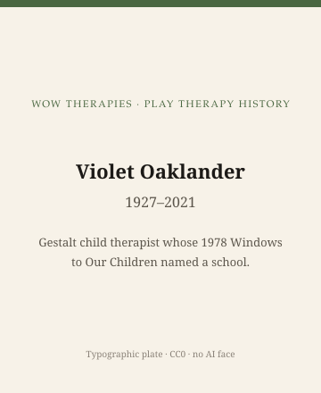

**Educational note.** This is history for a general reader. It is not a diagnosis, not a treatment plan, and not a substitute for care with a licensed clinician.

<!-- figure-id: violet-oaklander.lead-plate -->
<figure class="wow-figure wow-figure--portrait wow-figure--portrait-typographic">
  
  <figcaption>
    <strong>Violet Oaklander</strong> (1927–2021) — Gestalt child therapist whose 1978 Windows to Our Children named a school.
    <em>Typographic plate — no likeness embedded.</em>
    Original editorial plate (CC0). See <code>plates/violet-oaklander/RIGHTS.md</code>.
  </figcaption>
</figure>

Violet Oaklander (1927–2021) published *Windows to Our Children: A Gestalt Therapy Approach to Children and Adolescents* with Real People Press in 1978. The press is part of the history. This is not Houghton Mifflin and not Hogarth. It is a humanistic, West-Coast, workshop-adjacent publisher that could get a Gestalt book into the same bookstores that sold Perls and other encounter-culture objects.

The book gave American play therapists a third vocabulary when they were tired of only Rogers or only analysis: contact, awareness, unfinished business, the body in the room. Those words can become exercises. This page will not become an exercise book.

## Gestalt, already a school, entering a child's hour

Gestalt therapy had adult rooms, institutes, and a reputation before 1978. Oaklander's contribution was to write, at book length, how that reputation might meet a child without simply shrinking an empty-chair demonstration. She used drawing, clay, and play as *contact* work. Later trainings named "Oaklander model" as if it were a franchise. The 1978 book is the object. The franchise is a later economy.

She lived and taught in California and elsewhere; the Violet Solomon Oaklander Foundation is a later public organization. Foundations are historical. They are not this website's service. Living teachers in that lineage are living people. Public documents only.

## What she is not

She is not Axline with art supplies. She is not Lowenfeld. She is not a sandplay analyst. She is not a 1947 non-directive purist. Readers who want a single "play therapy" will be annoyed. The annoyance is the point of a history series.

## Portrait

No clean licensed photograph. Died 2021. Type: "Violet Oaklander, 1927–2021."

## What not to do with her

Do not reprint a Gestalt experiment. Do not "empty-chair" a child on a history page. Do not scrape foundation photos. Do not treat 1978 as a protocol year.

## Why the 1978 book still shows up in mixed trainings

APT conferences can host a Gestalt play slot next to a CCPT slot. That grid is the Association's job. A reader who wants to know why clay appears in one flyer and not another has a 1978 date. Clay is older than 1978. The *Gestalt claim* about clay is not.

The next essay is Ann Jernberg, who put the adult's body back into the hour with a 1979 name that still startles people who thought play therapy meant sitting still.

## Real People Press, and a West-Coast catalog

*Windows to Our Children* (1978) came from Real People Press, a humanistic house that could put a Gestalt book next to other encounter-culture objects. The press is part of the history. This is not Houghton Mifflin and not Hogarth.

Gestalt therapy already had adult rooms and institutes. Oaklander's book-length claim was that contact, awareness, and the body could meet a child without shrinking an empty-chair demonstration into a stunt. Drawing, clay, and play appear as contact work. Later trainings said "Oaklander model" as if it were a franchise. The 1978 book is the object. The franchise is a later economy.

The Violet Solomon Oaklander Foundation is a later public organization. Foundations are historical. Living teachers in that lineage are living people. Public documents only. Died 2021. Type: "Violet Oaklander, 1927–2021."

She is not Axline with art supplies, not Lowenfeld, not a sandplay analyst, not a 1947 purist. APT can host a Gestalt slot next to a CCPT slot. The grid is the Association's job. Clay is older than 1978. The Gestalt *claim* about clay is not.

## Clay as a claim, not as a craft table

A flyer that lists clay next to "play therapy" may be naming Oaklander, or a rainy-day bin, or an OT sensory tool. This pack's job is to keep 1978 as a Gestalt *claim* about contact. Real People Press is the imprint. 1927–2021 are the dates. The Foundation is a later organization. No empty-chair script. No foundation photo scrape.

## Encounter culture's publisher, and a 1978 door into mixed trainings

Real People Press could get a Gestalt book into bookstores that already sold other contact-culture objects. That is why 1978 shows up in mixed APT grids next to CCPT. The grid is not a merger. Oaklander is not Axline with clay. Died 2021. No experiment reprint. No empty chair. The Foundation is later. The book is 1978. Keep the imprint in the sentence so it cannot look like Guilford or Houghton Mifflin.

Gestalt institutes already existed. The 1978 book is a child's-hour door, not the founding of Gestalt. Mixed trainings like clay because clay photographs well. Photographing clay is not a contact claim. This pack will keep the claim in 1978 and the craft table in the classroom where it belongs.

1927–2021 are her dates. 1978 is the book. Real People Press is the imprint. Gestalt is the older adult school. Clay is older than both. The *claim* about clay is 1978. Mixed APT grids can host the claim without making it Axline. This pack will not reprint an experiment.

## Claims box

This essay is educational history for a general reader. It is not medical advice, not a diagnosis, and not a treatment plan. It does not teach Gestalt experiments or a session. Reading it is not therapy and is not a substitute for care with a licensed clinician. WOW Therapies does not claim, by publishing this history, to offer Gestalt play therapy or any named play protocol as a service.

If you are in danger, call local emergency services.

## Sources

Oaklander 1978; later foundation pages as *organizational* dates, not as clinical instruction.

*WOW Therapies educational series. Complementary to `content/wowtherapies-therapy-history/` and to the SLPWOW speech-pathology history pack. This lane is play-therapy history only. Staged: do not write these files onto the live wowtherapies.com sitemap from this folder.*
