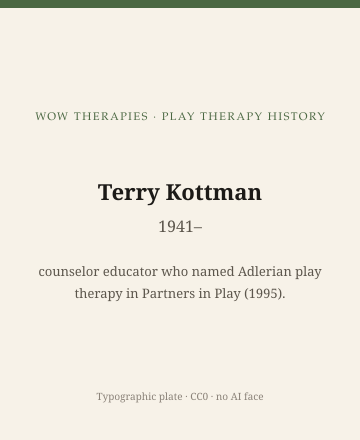

**Educational note.** This is history for a general reader. It is not a diagnosis, not a treatment plan, and not a substitute for care with a licensed clinician.

<!-- figure-id: terry-kottman-adlerian.lead-plate -->
<figure class="wow-figure wow-figure--portrait wow-figure--portrait-typographic">
  
  <figcaption>
    <strong>Terry Kottman</strong> (1941–) — counselor educator who named Adlerian play therapy in Partners in Play (1995).
    <em>Typographic plate — no likeness embedded.</em>
    Original editorial plate (CC0). See <code>plates/terry-kottman-adlerian/RIGHTS.md</code>.
  </figcaption>
</figure>

Terry Kottman is a living American counselor-educator. In 1995 the American Counseling Association published *Partners in Play: An Adlerian Approach to Play Therapy*. The book is the public object this page is allowed. No workshop gossip, no health speculation, no scraped headshot, no teaching of her four-phase language as a script.

Adler already has a life essay in the sister pack. This page will not retell Vienna, inferiority, or *Gemeinschaftsgefühl*. It will say that a 1995 ACA book made Adlerian ideas *orderable* as a play-therapy school for people who sit counseling exams, not only analytic ones.

## A late, teachable Adler

Adlerian family education and child-guidance work is older than 1995. Rudolf Dreikurs already had an American public. Kottman's contribution, as a publishing fact, is a play-therapy textbook that counseling programs could adopt next to Landreth. "Partners in play" is a title. It is not a 2026 homework assignment for a household.

Later editions and workbooks exist. Cite the edition you hold. Do not paste a lifestyle-assessment form. Forms are protocols.

## Living-person rule, applied

She was alive at last verification (2026-09-14). The sentence stops at the title page, the publisher, and the fact of later printings. If she lectures, the lecture is public only if you sit in the room or hold a published transcript. This website has done neither.

## What Adlerian play therapy is not, on this page

It is not CCPT. It is not Klein. It is not a reason to tell a child their "goal of misbehavior" from a blog. Dreikurs popularized four goals in a different literature. This series will not reprint them as a parenting key.

## Portrait

Type only: "Terry Kottman" and the 1995 title.

## Why 1995 belongs on a conference grid

APT's umbrella is wide enough for a 1995 Adlerian textbook. The Association did not have to invent Adler. It had to host a counseling-school translation. That translation is the historical event. Individual Psychology's older books are the weather.

If you want Adler the person, go next door. If you want the play-school name, 1995 is the date this pack will print.

## ACA 1995, and a counseling-school translation

*Partners in Play* (American Counseling Association, 1995) made Adlerian ideas orderable as a play-therapy school for people who sit counseling exams. Adlerian family education and Dreikurs's American public are older. Kottman's publishing fact is a textbook counseling programs could adopt next to Landreth.

Later editions and workbooks exist. Cite the edition you hold. Do not paste a lifestyle-assessment form. Forms are protocols. Do not reprint "goals of misbehavior" as a parenting key. That list lives in another literature and leaks too easily.

She is living (2026-09-14). The sentence stops at the title page, the publisher, and the fact of later printings. No speaker-bureau inventory. No scraped face. Sister slug `alfred-adler` has the Viennese life. This page has 1995 as the play-school date APT's grid could host without inventing Adler.

## Individual Psychology's older books, and a 1995 door into counseling exams

Adler and Dreikurs already had publics. 1995 is the ACA door into play-therapy syllabi. This pack will not reprint a lifestyle form or a four-goals list. Living author: title page only. Sister slug for the Viennese life. APT's grid could host 1995 without inventing Adler. That hosting is the event.

## Counseling exams, and a school that needed a play textbook

Counselor education already had Adlerian family courses. It did not, until 1995, have a widely assigned Adlerian *play* textbook from ACA. That is the publishing event. Later editions thickened. Workbooks appeared. Workbooks are protocols if you paste them. We will not. Living author, public title page, sister-pack Adler for Vienna. No scraped face. No lifestyle form. 1995 is the door. Individual Psychology's older books are the weather.

## What a 1995 ACA spine made possible

Counselor-education programs could now order an Adlerian play text from the same association that already sold ethics and career books. That logistics fact is why 1995 belongs on this calendar. Adler's 1927 *Menschenkenntnis* did not need a playroom to be Adlerian. A 1995 playroom needed a textbook to be exam-visible.

Later printings added research chapters and classroom aids. Classroom aids are how a book starts to look like a coursepack. A coursepack pasted onto a history URL is a protocol. We will cite the edition and leave the aids on the shelf.

She remains living at last verification. The living-person essay applies. Title page, publisher, year. No workshop aside. No face. Sister pack for Vienna. This pack for the counseling-exam door.

1995 is an ACA spine, not a Viennese founding. Living author. Title page only. No four-goals reprint. No lifestyle form. Sister slug for Adler. This pack for the counseling-exam door and the later editions you should cite if you hold them.

A play-therapy history that skipped 1995 would pretend counseling exams never needed an Adlerian door. They did. The door is a spine. The life is next door. The forms stay on the shelf. Living author, public documents, no face.

## Claims box

This essay is educational history for a general reader. It is not medical advice, not a diagnosis, and not a treatment plan. It does not teach Adlerian play sessions or a lifestyle form. Reading it is not therapy and is not a substitute for care with a licensed clinician. WOW Therapies does not claim, by publishing this history, to offer Adlerian play therapy or any named play protocol as a service.

If you are in danger, call local emergency services.

## Sources

Kottman 1995; Adler as sister-pack weather. Later editions as later objects.

*WOW Therapies educational series. Complementary to `content/wowtherapies-therapy-history/` and to the SLPWOW speech-pathology history pack. This lane is play-therapy history only. Staged: do not write these files onto the live wowtherapies.com sitemap from this folder.*
