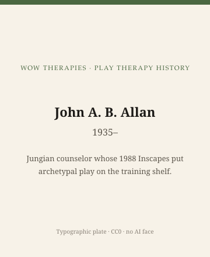

**Educational note.** This is history for a general reader. It is not a diagnosis, not a treatment plan, and not a substitute for care with a licensed clinician.

<!-- figure-id: john-allan-jungian.lead-plate -->
<figure class="wow-figure wow-figure--portrait wow-figure--portrait-typographic">
  
  <figcaption>
    <strong>John A. B. Allan</strong> (1935–) — Jungian counselor whose 1988 Inscapes put archetypal play on the training shelf.
    <em>Typographic plate — no likeness embedded.</em>
    Original editorial plate (CC0). See <code>plates/john-allan-jungian/RIGHTS.md</code>.
  </figcaption>
</figure>

In 1988 Spring Publications issued John Allan's *Inscapes of the Child's World: Jungian Counseling in Schools and Clinics*. The subtitle is the historical claim. Jungian work with children did not have to wait for a private institute in Zürich. It could be written as a school-and-clinic book for English-speaking counselors.

Jung already has a life essay next door, including the 1933–1939 controversy that essay refuses to flatten. This page will not retry Jung. It will not offer a symbol key. It will keep 1988 as a date when a Jungian *play and image* practice became a Spring catalog object.

## Inscapes, schools, and a publisher

Spring is a Jungian and archetypal house. Publishing there is a signal. Allan wrote for people who already believed images matter and for school counselors who had to work in a building with a bell schedule. That double audience is why the book shows up in play-therapy bibliographies and in school-counseling ones.

Sandplay is a cousin, not a synonym. Kalff's 1980 English book is a tray-and-society object. Allan 1988 is a counseling-in-schools object. A person can use both. A history page should not merge them to save a heading.

## What not to do with a Jungian children's book

Do not publish an image-interpretation. Do not tell a parent what a dragon "means." Do not treat 1988 as a substitute for analytic training. Do not skip the sister pack's Jung caution because a school book feels kinder.

If Allan is living or recently dead at the moment you edit, apply the living-person rule until a public death notice is in the bibliography. This draft treats the *book* as the subject.

## Portrait

Type only: "John Allan" and the 1988 title.

## Why 1988 matters on an APT grid

The late 1980s were busy: Landreth 1991 is about to arrive; APT is already seven years old; sandplay societies are forming. A 1988 Jungian school book is a reminder that not every play-adjacent American text ran through Denton or Fresno. Spring Publications is a different capital.

The next two essays are the men who *did* run through the Association's letterhead: Schaefer and O'Connor.

## Spring Publications, 1988, and a bell schedule

*Inscapes of the Child's World* (Spring, 1988) announced Jungian counseling in schools and clinics. Spring is an archetypal house. Publishing there is a signal. Allan wrote for people who already believed images matter and for school counselors who work with a bell.

Sandplay is a cousin (Kalff 1980), not a synonym. A person can use both. A history page should not merge them. Jung's life and the 1933–1939 controversy stay in the sister pack. This page will not offer a symbol key or tell a parent what a dragon means.

1988 sits in a busy American window: APT is seven, Landreth 1991 is coming, sandplay societies are forming. A Jungian school book from Spring is a reminder that not every play-adjacent American text ran through Denton or Fresno. Type only. If vital status is uncertain at edit time, write as if he can read the page.

## Images under a bell, not a Zürich commute

1988 made a Jungian school book orderable in English counseling. Spring is the signal. A bell schedule is the constraint. Kalff 1980 is the tray cousin. Sister-pack Jung is the controversy and the life. This pack will not publish a symbol dictionary. Type the 1988 title. If you do not know whether Allan can read the page, write as if he can.

## Why 1988 is not a sandplay founding

Readers who see "Jungian" and "child" reach for Kalff. Allan 1988 is a school-and-clinic Spring book. Different publisher, different patron (a bell), different object. This pack will keep the split. Sister-pack Jung includes a controversy this page will not retry. No symbol key. No dragon meaning. Type the title. Write as if the author can read the page until a death notice is filed.

## School counselors as a patron Jungian institutes did not design

A school counselor has a caseload, a bell, and a building that is not an institute. Allan 1988 wrote into that constraint. That is why play-therapy bibliographies and school-counseling bibliographies both list the book. Shared listing is not a merger with Kalff, not a merger with Landreth, and not a license to publish a symbol key.

Spring Publications placed the book in an archetypal catalog. Catalog placement is a historical signal. It tells you who the publisher thought the reader was. This pack will keep the signal and refuse the dictionary. Type the 1988 title. Do not generate a Jungian child.

1988 is Spring, schools, and clinics. 1980 is Kalff's English tray book. They are cousins. Write as if Allan can read the page. No symbol key. No generated child. No retry of the sister-pack Jung controversy on this URL.

A play-therapy history that skipped 1988 would pretend Jungian child work waited for a tray society or a Denton course. It did not. Spring printed a school book. The bell was the patron. The dictionary stays unpublished here.

## Claims box

This essay is educational history for a general reader. It is not medical advice, not a diagnosis, and not a treatment plan. It does not teach Jungian image-reading or a session. Reading it is not therapy and is not a substitute for care with a licensed clinician. WOW Therapies does not claim, by publishing this history, to offer Jungian play therapy, sandplay, or any named play protocol as a service.

If you are in danger, call local emergency services.

## Sources

Allan 1988; Kalff 1980 as cousin; sister slug `carl-jung`.

*WOW Therapies educational series. Complementary to `content/wowtherapies-therapy-history/` and to the SLPWOW speech-pathology history pack. This lane is play-therapy history only. Staged: do not write these files onto the live wowtherapies.com sitemap from this folder.*
