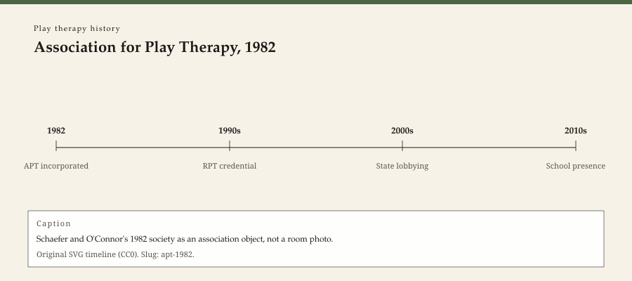

**Educational note.** This is history for a general reader. It is not a diagnosis, not a treatment plan, and not a substitute for care with a licensed clinician.

<!-- figure-id: apt-1982.lead-timeline -->
<figure class="wow-figure wow-figure--era">
  
  <figcaption>
    <strong>Association for Play Therapy, 1982</strong> — Schaefer and O'Connor's 1982 society as an association object, not a room photo.
    Original editorial timeline (CC0). No AI-generated faces.
  </figcaption>
</figure>

In 1982 Charles E. Schaefer enlisted Kevin J. O'Connor and formed the Association for Play Therapy. The Association's own pages still use that year. A first board, in later handbook histories, included Louise Guerney, Eleanor Irwin, Ann Jernberg, Garry Landreth, Henry Maier, Borislava Mandich, and E. T. Nickerson, among names a reader should confirm on the page they open. Two years later the offices moved to California and sat at the California School of Professional Psychology, where O'Connor was on faculty.

This essay is about a society. It is not about a technique. It is not year zero for play. It is year one for an American membership organization that wanted play therapists to be able to find each other without a British Society vote.

## What a society can and cannot do

A society can collect dues, run a conference, print a newsletter, later print a journal (1992), and later sell a credential (the RPT essay). It cannot issue a state license. It cannot settle the Controversial Discussions. It cannot make Axline and Klein the same hour. It can put their descendants in adjacent breakout rooms.

That last power is the one to watch. An umbrella organization creates the appearance of a single field. The appearance is useful for insurance conversations and for a student who needs a career noun. The appearance is misleading for a parent who thinks "APT" means one method.

Schaefer coordinated early conferences. O'Connor ran the early newsletter. Those divisions of labor are in the handbook lore. They are ordinary. They are how a field gets a hotel contract.

## Why 1982, and not 1947 or 1921

Axline's book was thirty-five years old. Hug-Hellmuth's paper was sixty-one. The 1970s had already seen a UNT international conference (1973) and a shelf of edited books. Schaefer's public rationale, in later tellings, was revitalization: a field that needed a network, training standards, and a place to argue. Whether the field was dying or merely scattered is a judgment. The Association is a fact.

1982 is also late enough that the American counseling profession was already a license-and-exam culture. Play therapy arrived as a *specialty noun* inside that culture, not as a replacement for it. A person still needed, in most states, an LPC, LCSW, LMFT, psychologist license, or school-counselor credential. APT sat on top. The RPT essay stays with that sitting.

## Capitals: Teaneck, Denton, Fresno

Fairleigh Dickinson, UNT, CSPP Fresno: three campuses in the origin decade. Later the Association could look like a California office with a Texas pilgrimage site and a New Jersey editorial past. Maps are better than myths.

International members came. International in a society's brochure is not the same as a British registration fight (BAPT, 1992) or a hospital-play union. Sister organizations are later essays.

## What not to do with 1982

Do not print "founded play therapy in 1982." Do not treat a membership logo as a treatment. Do not auto-link this URL to a booking form. Do not use the Association's conference smile photos as if they were free.

## Why a small-city clinician still meets a 1982 noun

A job ad that says "play therapy experience preferred" is speaking Association English even when it does not know it. A parent who searches the term will find a4pt.org. A Southeast Arkansas practice that hosts a *history* of that noun is not, by hosting, becoming a chapter. If it ever becomes a service, that is a different page and a license on the wall.

The next essay is the 1992 journal: when the society decided it needed pages a library could bind.

## A first board that was already a coalition

Later handbook prefaces list Louise Guerney, Eleanor Irwin, Ann Jernberg, Garry Landreth, Henry Maier, Borislava Mandich, and E. T. Nickerson among early directors. Confirm names on the page you open. The list is the point: 1982 was a coalition, not a solo invention. Schaefer coordinated early conferences. O'Connor ran the early newsletter. Two years later the offices sat at CSPP in California.

A society can collect dues, run a hotel contract, print a newsletter, later a journal (1992), later a credential. It cannot issue a state license. It cannot settle London 1941–45. It can put descendants of Klein and Axline in adjacent breakout rooms. That last power creates the appearance of a single field. Useful for a career noun. Misleading for a parent.

1982 is late: Axline was thirty-five years old; Hug-Hellmuth sixty-one; UNT had already hosted a 1973 international conference. The Association organized a specialty noun inside an already licensed American counseling culture. Play therapist sat on top of LPC, LCSW, LMFT, psychologist, or school counselor. The RPT essay stays with that sitting.

## Hotel contracts, and a specialty noun on top of a license

A conference is a hotel. A society that can sign a hotel can look national. 1982 is that signature, plus a board that was already a coalition. The specialty noun sat on top of existing licenses. International members came; international is a brochure word until it meets a statute. Teaneck, Denton, Fresno remain the map. Do not print "founded play therapy in 1982." Do not treat a logo as a treatment.

## Revitalization as a judgment, organization as a fact

Later tellings say the field needed revitalizing. Whether it was dying or scattered is a judgment. The Association is a fact: dues, board, hotel, newsletter, later journal, later credential. 1973 UNT conference was already international on a campus. 1947 was already a trade book. 1921 was already a technique paper. 1982 organized a noun. Do not let the noun backdate the method. A small-city job ad that says "play therapy experience preferred" is speaking 1982 English even when it does not know it.

O'Connor's newsletter and Schaefer's early conferences are ordinary labor. Ordinary labor is how a field gets a hotel contract. Confirm first-board names on the handbook page you open. Two years later, California offices. Later, a journal. Later, a credential. Sequence matters. Year zero does not. 1921, 1932, 1935, 1947, 1964, 1973 remain on the shelf.

A hotel contract is a national look. A license is still a state object. The specialty noun sat on top. Sequence: 1921 paper, 1947 book, 1973 campus conference, 1982 society, 1992 journal, later credential. Do not backdate the method to the society.

## Claims box

This essay is educational history for a general reader. It is not medical advice, not a diagnosis, and not a treatment plan. It does not teach a session or a credential path. Reading it is not therapy and is not a substitute for care with a licensed clinician. WOW Therapies does not claim, by publishing this history, to offer play therapy or any named play protocol as a service.

If you are in danger, call local emergency services.

## Sources

APT history and emeritus pages; Schaefer and O'Connor 1983; later handbook preface histories (confirm names on the page you open). UNT 1973 conference as an institutional prior.

*WOW Therapies educational series. Complementary to `content/wowtherapies-therapy-history/` and to the SLPWOW speech-pathology history pack. This lane is play-therapy history only. Staged: do not write these files onto the live wowtherapies.com sitemap from this folder.*
