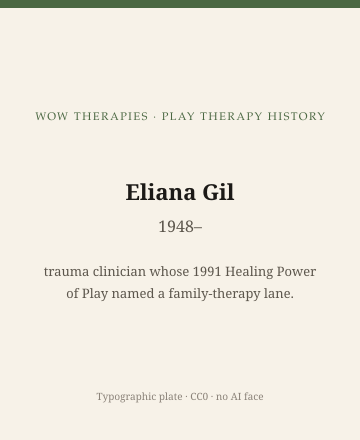

**Educational note.** This is history for a general reader. It is not a diagnosis, not a treatment plan, and not a substitute for care with a licensed clinician.

<!-- figure-id: eliana-gil-trauma-lane.lead-plate -->
<figure class="wow-figure wow-figure--portrait wow-figure--portrait-typographic">
  
  <figcaption>
    <strong>Eliana Gil</strong> (1948–) — trauma clinician whose 1991 Healing Power of Play named a family-therapy lane.
    <em>Typographic plate — no likeness embedded.</em>
    Original editorial plate (CC0). See <code>plates/eliana-gil-trauma-lane/RIGHTS.md</code>.
  </figcaption>
</figure>

Eliana Gil is a living clinician and writer. In 1991 Guilford published *The Healing Power of Play: Working with Abused Children*. In 1994 Guilford published *Play in Family Therapy*. Those two title pages are the public objects this page is allowed. No workshop stories, no health speculation, no scraped photographs, no teaching of a trauma hour.

The sister pack already has a trauma-lineages era and a Judith Herman figure essay. Herman 1992 (*Trauma and Recovery*) is the adult-and-profession weather. Gil 1991 is a play-and-child Guilford object in the same early-1990s American moment. Same decade, different room. Do not merge them to save a heading.

## Why 1991 is a lane, not a synonym

APT's umbrella could host child-centered hours that never named abuse and hours that named little else. Gil's 1991 book made the second lane visible as a *book* a library could order. Family play (1994) made a third visibility: the child is not the only body in the method.

Later trauma manuals — including ones that use play as a delivery device for cognitive-behavioral tasks — are other objects. They have other authors, many living. This pack will not smuggle a TF-CBT worksheet into a Gil essay. If a later writer wants that object, they can open a folder that is willing to be about CBT-for-children as history. This folder is not.

## Living-person rule, applied

She was alive at last verification (2026-09-14). The sentence stops at Guilford, the years, and the fact that later printings and related titles exist. Cite the edition you hold. Do not inventory her career from a speaker bureau.

## What not to do with a trauma-and-play book

Do not retell an abused child's play as color. Do not publish a "trauma toy list." Do not pair this URL with a PTSD booking CTA. Do not use atrocity photographs. Do not imply that reading 1991 is treatment.

Refrigerator-mother and other parent-blaming stories belong in the refuse list. If they appear in older literature, they appear as harm.

## Why a small-city clinic inherited a 1991 noun

"Trauma" became a waiting-room word. Play became a waiting-room hope. The pair is why a parent Googles both and lands on a Guilford title. A history site can put the title in 1991 and then refuse the how-to. That refusal is the job.

The next stage of the series leaves founders and asks who was never in the photograph: race, class, toys, gender, and the worksheet temptation.

## Guilford 1991, Guilford 1994, and a lane inside an umbrella

*The Healing Power of Play* (1991) made abuse-and-play visible as a library book. *Play in Family Therapy* (1994) made a third visibility: the child is not the only body in the method. Herman's *Trauma and Recovery* (1992) is sister-pack weather — same American moment, different room.

Later trauma manuals that use play as a delivery device for cognitive-behavioral tasks are other objects, other living authors. This pack will not smuggle a worksheet. If someone wants child-CBT-with-play as history, they can open a folder willing to be about that. This one is not.

She is living (2026-09-14). Title pages only. No speaker-bureau inventory. No scraped face. No retelling of an abused child's play as color. No trauma toy list. No PTSD booking CTA. Refrigerator-mother stories, if they appear in older literature, appear as harm.

"Trauma" and "play" became waiting-room words together. A history site can put 1991 on the table and refuse the how-to. That refusal is the job.

## Early 1990s American weather, two rooms

Herman 1992 and Gil 1991/1994 share a decade and split a room. This pack will not merge them. Guilford is the imprint. Living author: title pages only. No worksheet from a later CBT-with-play manual. No booking CTA. The waiting-room pair "trauma" and "play" is why a parent lands on a 1991 title. Put the title in 1991. Refuse the how-to.

## Family play as a third visibility

1994 made the child not the only body in the method. That is a publishing fact, not a session. 1991 made abuse-and-play a Guilford object. Later CBT-with-play manuals are other living authors and another folder's problem. This pack will not smuggle their worksheets. Herman 1992 stays next door. No atrocity headers. No child retellings. Living author, title pages, refuse the CTA.

Guilford 1991 and 1994 are enough spine. Later related titles exist; cite if you hold them. Living author. No speaker bureau. No trauma toy list. The sister-pack trauma era owns shell shock to complex PTSD. This lane owns a play-and-child Guilford moment in the same early 1990s. Same decade. Different room. Do not merge to save a heading.

Guilford 1991, Guilford 1994. Living. Title pages. Herman 1992 next door. No worksheet, no CTA, no atrocity header, no child retelling. Same decade, different room. Refuse the merge.

## Claims box

This essay is educational history for a general reader. It is not medical advice, not a diagnosis, and not a treatment plan. It does not teach a trauma session or a family-play session. Reading it is not therapy and is not a substitute for care with a licensed clinician. WOW Therapies does not claim, by publishing this history, to offer trauma therapy, play therapy, or any named play protocol as a service.

If you are in danger, call local emergency services.

## Sources

Gil 1991, 1994; Herman 1992 as sister-pack weather. Later trauma-play manuals as *other* objects.

*WOW Therapies educational series. Complementary to `content/wowtherapies-therapy-history/` and to the SLPWOW speech-pathology history pack. This lane is play-therapy history only. Staged: do not write these files onto the live wowtherapies.com sitemap from this folder.*
