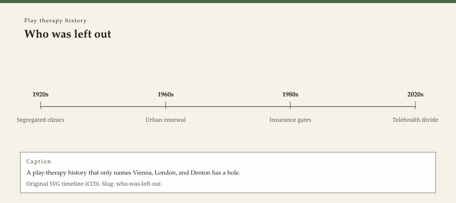

**Educational note.** This is history for a general reader. It is not a diagnosis, not a treatment plan, and not a substitute for care with a licensed clinician.

<!-- figure-id: who-was-left-out.lead-timeline -->
<figure class="wow-figure wow-figure--era">
  
  <figcaption>
    <strong>Who was left out</strong> — A play-therapy history that only names Vienna, London, and Denton has a hole.
    Original editorial timeline (CC0). No AI-generated faces.
  </figcaption>
</figure>

A timeline that runs Hug-Hellmuth–Klein–Axline–Landreth–APT is already a census. It is a true census of the books American counseling programs kept. It is a false census of childhood. This essay is about the false part. It will not repair the falsehood with a closing paragraph titled "diversity." It will not add one non-European name as garnish. It will say who the room was built for, and who paid for standing outside it.

## Which children counted as cases

Child-guidance clinics in the 1920s saw the children philanthropy and courts delivered. Those children were not a random sample of a city. They were the children a Commonwealth Fund board could stand to fund. Black children in the Jim Crow United States, Indigenous children in boarding-school systems, and immigrant children in language programs often met other institutions first: the school, the church, the police, the asylum. Play therapy's later American story inherits that intake.

Mamie Phipps Clark already has a sister-pack essay because the doll studies were psychology's public race document. Those photographs are not free decoration and not a play-therapy origin. They are a reminder that a doll can be a research instrument in a fight about schools, not only a toy on a Landreth shelf.

Colonial psychiatry — Fanon, later liberation psychologies — belongs next door as a clinical-political history. It belongs here as a warning. A playroom that treats every child's symbol as universal is doing what the catalog wants. Miniatures have a culture. A tray stocked from a U.S. hobby shop is not a world. It is a shop.

## Which adults got to be the profession

The next essay is gender. This paragraph is race and class inside the workforce. APT conference photographs, like most American specialty-society photographs, have a documented paleness in the early decades. That is not an insult to the people in the room. It is a fact about who could afford the hours, the dues, the flights to Denton, and the unpaid internships. A credential with a toll will reproduce a class.

Non-U.S. associations — BAPT, later Latin American and East Asian play-therapy groups — are not "international color" for an American journal. They are other file cabinets. This pack named Britain because the Lowenfeld debt required it. A later writer who opens a Japanese or Mexican society history should open a new essay, not a sentence at the end of this one.

## Which languages were allowed

Axline's hour assumes a child who will eventually use words the adult shares, or toys the adult can narrate in English. School-based work in a bilingual district knows this is a fantasy. SLPWOW's lane owns language as a profession. This pack owns the quieter theft: a play therapist who "just reflects" is still reflecting in a language. The reflection is not neutral.

Indigenous play, kinship, and land are not a preface to Freud and not a preface to APT. If they appear in a clinic, they appear because a specific community built a specific program. This website does not have that program's consent to summarize it as heritage flavor.

## What not to do with an exclusion essay

Do not add a stock photograph of "diverse children playing." Do not write a competence checklist. Do not treat this page as a CE diversity hour. Do not imply WOW Therapies has solved a census by publishing a complaint.

## Why a Southeast Arkansas reader is already in this essay

Arkansas is not Vienna. It is not Denton. A child in a Delta county meets a different toy store, a different school closet, and a different history of who was a case. If this series only names European and Texas objects, it has described the books on a syllabus, not the waiting room. The next essay takes the toys themselves as class objects. This one only opens the door and refuses to close it with a slogan.

## Intake as a census, and dolls that were not Landreth's

Child-guidance intake was never a random sample. Commonwealth Fund boards saw the children a court and a philanthropy delivered. Black children under Jim Crow, Indigenous children in boarding schools, immigrant children in language programs often met the police, the church, or the asylum first. Play therapy's American story inherits that intake.

Mamie Phipps Clark's doll studies (sister pack) are psychology's public race document. They are not a play-therapy origin and not free decoration. They are a reminder that a doll can be an instrument in a fight about schools.

APT conference photographs in the early decades have a documented paleness. That is a fact about who could afford hours, dues, and Denton flights. A credential with a toll reproduces a class. Non-U.S. societies are other file cabinets, not color for an American journal. This pack named Britain because Lowenfeld required it. A Japanese or Mexican society history deserves its own essay, not a garnish sentence.

Axline's hour assumes a shared language or toys the adult can narrate. A bilingual district knows that is a fantasy. Indigenous play and land are not a preface to Freud. If they appear in a clinic, they appear because a community built a program this website does not have consent to flavor.

## A Delta county is already a census

Arkansas is not Vienna and not Denton. A child in a Delta county meets a different store, closet, and history of who was a case. If this series only names European and Texas objects, it has described a syllabus. The toys essay takes the receipt. This essay only refuses to close with a slogan or a stock photograph of "diverse children playing." No CE checklist. No implication that publishing a complaint solved a census.

## Language is not a neutral reflection

A play therapist who "just reflects" still reflects in a language. The reflection is not neutral. SLPWOW owns language as a profession. This pack owns the quieter theft. A tray stocked from a U.S. hobby shop is a shop, not a world. Colonial psychiatry belongs next door as politics; here it is a warning against universal symbols. No garnish name at the end. No stock diversity photograph.

## Claims box

This essay is educational history for a general reader. It is not medical advice, not a diagnosis, and not a treatment plan. It does not teach a session or a competence protocol. Reading it is not therapy and is not a substitute for care with a licensed clinician. WOW Therapies does not claim, by publishing this history, to offer play therapy or any named play protocol as a service.

If you are in danger, call local emergency services.

## Sources

Guthrie 1998 as psychology-census weather; sister slugs `mamie-phipps-clark`, `frantz-fanon`; APT programs as dated membership objects; BAPT as a separate file cabinet.

*WOW Therapies educational series. Complementary to `content/wowtherapies-therapy-history/` and to the SLPWOW speech-pathology history pack. This lane is play-therapy history only. Staged: do not write these files onto the live wowtherapies.com sitemap from this folder.*
