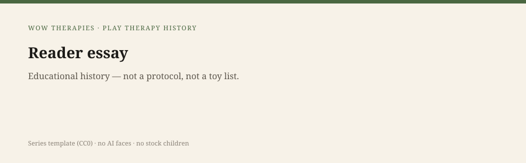

**Educational note.** This is history for a general reader. It is not a diagnosis, not a treatment plan, and not a substitute for care with a licensed clinician.

<!-- figure-id: map-to-sister-packs.reader-series -->
<figure class="wow-figure wow-figure--reader">
  
  <figcaption>
    <strong>Map to the sister packs</strong> — Where to send a reader who wanted Freud, Rogers, Van Riper, or ACT — not a playroom history.
    Original series template (CC0). No AI-generated faces or children.
  </figcaption>
</figure>

If you read forty-four drafts and still wanted a different history, the failure may be the folder, not you. This page is a map. It is not a merger.

## Counseling and clinical heritage

`content/wowtherapies-therapy-history/` — Pinel to Berg, asylums, Freud, Jung, Rogers, Beck, Linehan, Bowlby, Fanon. Use it when the reader wants the house, not the playroom.

Specific slugs this pack already pointed at and will not paste:

- `anna-freud` — life; here we only kept 1927 technique
- `melanie-klein` — life; here we only kept 1932 play technique
- `donald-winnicott` — life; here we only kept 1953/1971 play
- `carl-rogers` — life; here he is Axline's weather
- `carl-jung` — life and the 1930s controversy; here he is Kalff and Allan weather
- `alfred-adler` — life; here he is Kottman 1995 weather
- `judith-herman` — trauma lineages; here Gil 1991 is the play-lane cousin
- `mamie-phipps-clark` — dolls as a race-and-schools document, not a play-therapy origin

## ACT and mindfulness

`content/act-mindfulness-therapy-history/` — Hayes, Kabat-Zinn, MBCT, the 2004 wave nickname. A cushion is not a tray. Linehan lives there as a mindfulness staffing pattern. She does not live here.

## CBT deepen

`content/cbt-history-deep/` — Beck, Ellis, manuals, IAPT, EST lists. A child CBT that uses play as a delivery device is *their* later problem, not a worksheet we will smuggle.

## SLPWOW speech-pathology heritage

Van Riper, fluency, school SLP, dysphagia, AAC. A child in a playroom may also be a child on an IEP for language. That does not merge the professions. Do not import speech graphics. Do not import this pack onto a speech URL.

## This folder, in one sentence

Play as a clinical object: 1921 technique paper to 1982 society to 2005 graph, with rooms, trays, and refusals.

If that is not the sentence you wanted, walk. We will not duct-tape the walk into one post.

## Walk, do not merge

Counseling house: `content/wowtherapies-therapy-history/` — Pinel to Berg. This pack pointed at `anna-freud`, `melanie-klein`, `donald-winnicott`, `carl-rogers`, `carl-jung`, `alfred-adler`, `judith-herman`, `mamie-phipps-clark` and refused to paste the lives.

ACT/mindfulness: `content/act-mindfulness-therapy-history/` — a cushion is not a tray. Linehan lives there. Not here.

CBT deepen: `content/cbt-history-deep/` — Beck, Ellis, EST lists. Child CBT that uses play as a delivery device is their later problem.

SLPWOW: Van Riper, fluency, school SLP, dysphagia, AAC. A child may be in both hallways. The professions do not merge. Do not import speech graphics or this pack onto a speech URL.

This folder, in one sentence: play as a clinical object from a 1921 technique paper to a 1982 society to a 2005 graph, with rooms, trays, and refusals. If that is not the sentence you wanted, the other folders exist. A hub page may list both calendars. A single URL should not pretend to be both.

## A hub may list; a post may not impersonate

A series hub can list the counseling calendar, the ACT stages, the CBT deepen, the SLPWOW lane, and this play calendar. A single post that pretends to be all five has failed the sister-pack test. If you can delete the word *play* and the essay still works as general therapy history, it belongs next door. If you can delete the claims box and nothing feels missing, the box was never working. Walk.

## Delete-a-word tests

If you can delete *play* and the essay still works as general therapy history, it belongs next door. If you can delete *child* and the essay becomes sand-tray mysticism, it failed the fence. If you can delete the claims box and nothing feels missing, the box was decoration. Decoration fails this pack. A hub may list five calendars. A post may not impersonate them.

This folder's one-sentence job remains: play as a clinical object from a 1921 technique paper to a 1982 society to a 2005 graph, with rooms, trays, and refusals. If you wanted Freud's life, Rogers's life, Van Riper, Hayes, or Beck's manuals, the other folders exist. Walk. Do not ask this URL to impersonate them.

## Claims box

This essay is educational history for a general reader. It is not medical advice, not a diagnosis, and not a treatment plan. It does not teach a session. Reading it is not therapy and is not a substitute for care with a licensed clinician. WOW Therapies does not claim, by publishing this history, to offer play therapy or any named play protocol as a service.

If you are in danger, call local emergency services.

## Sources

Sister-pack README files and INDEX calendars. This pack's `INDEX.md`.

*WOW Therapies educational series. Complementary to `content/wowtherapies-therapy-history/` and to the SLPWOW speech-pathology history pack. This lane is play-therapy history only. Staged: do not write these files onto the live wowtherapies.com sitemap from this folder.*
